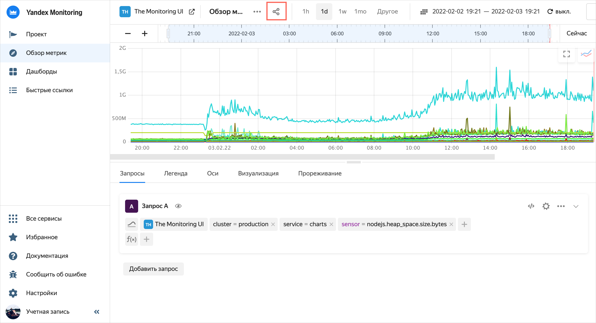
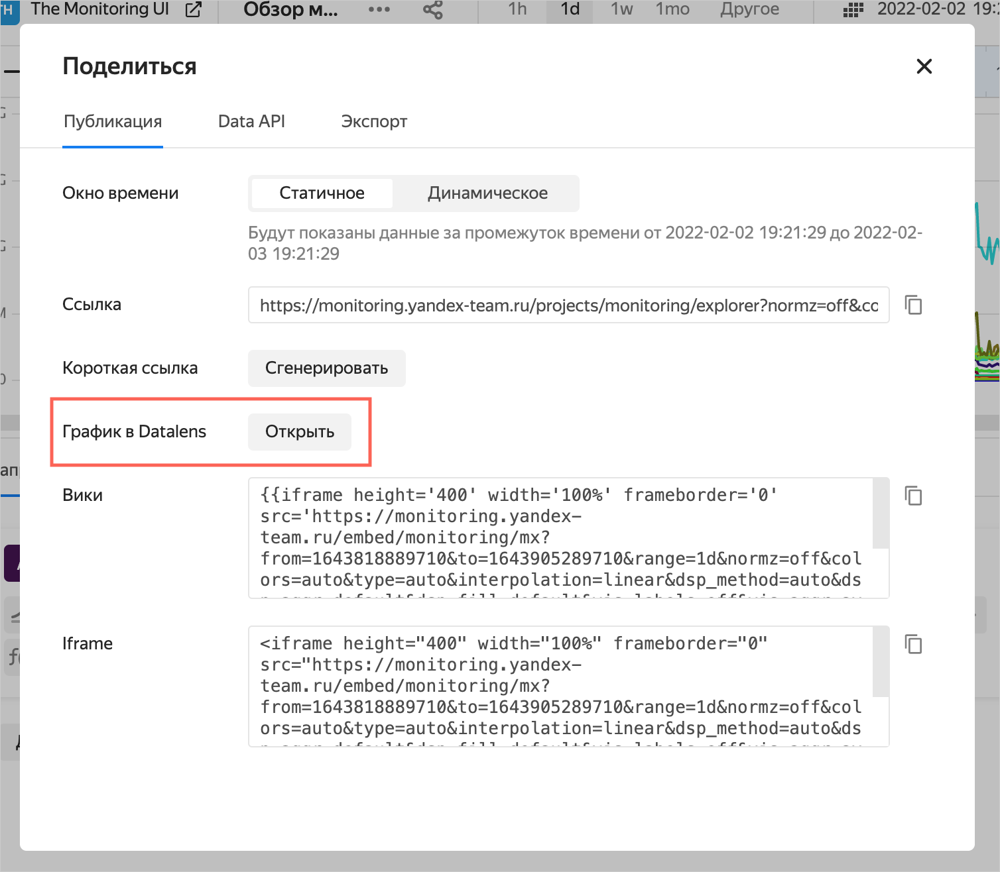

# Экспорт чарта из {{ monitoring-full-name }} в {{ datalens-short-name }}



Управление правами для QL-чартов по данным {{ monitoring-short-name }} выполняется не только на стороне DataLens, но и в самом сервисе {{ monitoring-short-name }}.

Для просмотра графика в {{ datalens-short-name }} пользователю необходимы права на чарт и подключение, а также на чтение данных из конкретного проекта в {{ monitoring-short-name }}.



Чтобы экспортировать чарт из {{ monitoring-full-name }} в {{ datalens-short-name }}:

1. Откройте чарт в {{ monitoring-short-name }} и нажмите значок .

   

   

   

1. В открывшемся окне в разделе **График в {{ datalens-short-name }}** нажмите **Открыть**.

   

   

   

   Откроется новая вкладка браузера с графиком, построенным в {{ datalens-short-name }}. Вы можете редактировать, сохранить и разместить на дашборде этот график.
