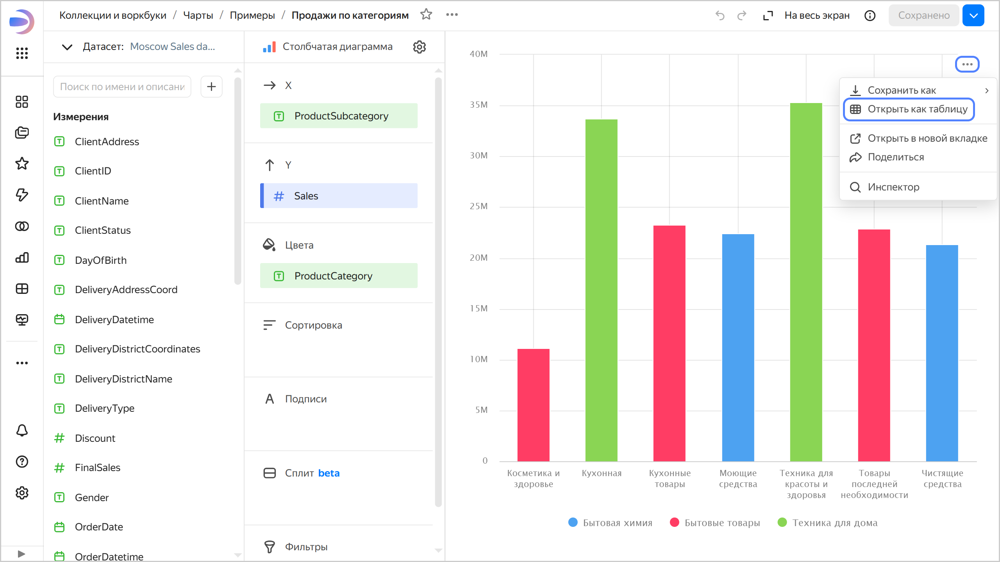
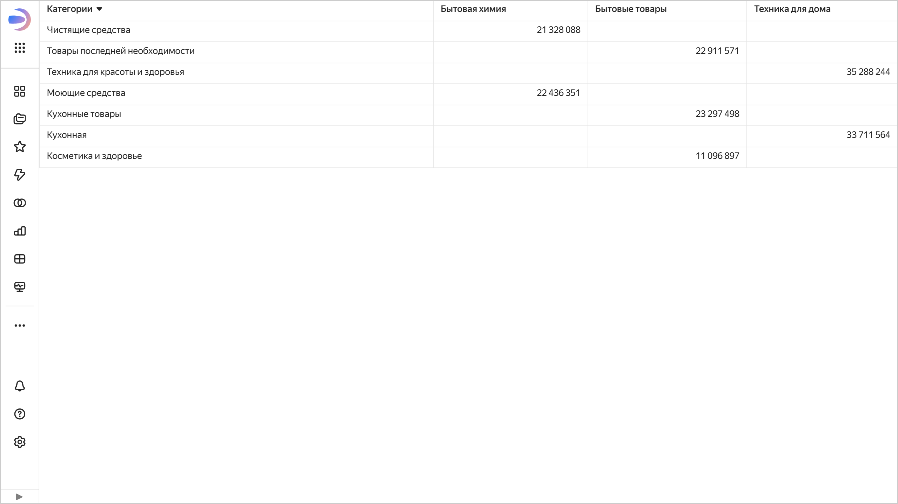

# Открыть чарт как таблицу в {{ datalens-full-name }}

Вы можете отобразить данные, использованные для построения чарта, в табличном виде.

Возможность недоступна для следующих типов чартов:

* [{#T}](../../visualization-ref/indicator-chart.md)
* [{#T}](../../visualization-ref/table-chart.md)
* [{#T}](../../visualization-ref/pivot-table-chart.md)
* [{#T}](../../visualization-ref/map-chart.md)

Чтобы открыть чарт в виде таблицы, воспользуйтесь одним из способов:

* Откройте чарт и в правом верхнем углу чарта нажмите  →  **Открыть как таблицу**.
* На дашборде у чарта вверху справа нажмите  →  **Открыть как таблицу**.





На странице появится таблица с измерениями и показателями, которые использовались для построения чарта.



