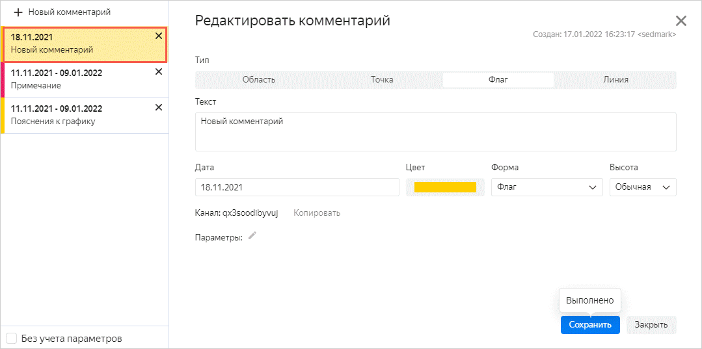

# Добавление комментариев



Комментарии доступны для следующих типов чартов при условии, что в секции **X** (для линейчатой диаграммы — в секции **Y**) находится поле с типом [Дата](../../concepts/data-types.md#date) или [Дата и время](../../concepts/data-types.md#datetime):

* Линейная диаграмма
* Диаграмма с областями
* Нормированная диаграмма с областями
* Столбчатая диаграмма
* Нормированная столбчатая диаграмма
* Линейчатая диаграмма
* Нормированная линейчатая диаграмма

Если тип поля не соответствует типу `Дата` или `Дата и время` (например, дата хранится как [строка](../../concepts/data-types.md#string) вида `2021-01-01`), то комментарии недоступны.



Чтобы добавить комментарий:

1. Откройте чарт, в который нужно добавить комментарий.
1. В правом верхнем углу чарта нажмите значок  и выберите **Комментарии**.
1. В открывшемся окне нажмите **Новый комментарий**.
1. Выберите тип комментария и укажите его свойства: 

	

	- Область

	  * **Текст**. Текст комментария.
	  * **Интервал**. Период, определяющий расположение области на графике.
	  * **Цвет**. Цвет области комментария на графике.
	  * **Видимый**. Опция видимости комментария на графике.
	  * **Приоритет**. Приоритет показа комментария на графике. Область с более высоким приоритетом показывается на графике в верхнем слое.
	  * **Параметры**. Набор параметров, формирующих срез. Подробнее см. [{#T}](../../editor/widgets/chart/comments.md#params).
	  
	- Точка

	  * **Текст**. Текст комментария.
	  * **Дата**. Дата на графике, к которой привязан комментарий.
	  * **Линия**. Линия на графике, к которой привязан комментарий.
	  * **Цвет**. Цвет точки на графике.
	  * **Видимый**. Опция видимости комментария на графике.
	  * **Тултип**. Сочетание цветов для всплывающей подсказки с комментарием.
	  * **Параметры**. Набор параметров, формирующих срез. Подробнее см. [{#T}](../../editor/widgets/chart/comments.md#params).

	- Флаг

	  * **Текст**. Текст комментария.
	  * **Дата**. Дата на графике, к которой привязан комментарий.
	  * **Цвет**. Цвет флага на графике.
	  * **Форма**. Форма флага с комментарием на графике.
	  * **Высота**. Высота размещения флага на графике.
	  * **Параметры**. Набор параметров, формирующих срез. Подробнее см. [{#T}](../../editor/widgets/chart/comments.md#params).

	- Линия

	  * **Текст**. Текст комментария.
	  * **Дата**. Дата на графике, к которой привязан комментарий.
	  * **Цвет**. Цвет линии графике.
	  * **Форма**. Форма линии на графике.
	  * **Тип линии**. Тип линии на графике.
	  * **Ширина линии**. Ширина линии на графике.
	  * **Параметры**. Набор параметров, формирующих срез. Подробнее см. [{#T}](../../editor/widgets/chart/comments.md#params).

	

1. Нажмите **Добавить**. Ссылка на новый комментарий появится в левой части окна с комментариями.

   

## Добавление комментария в фид {#feed-comment}

1. Откройте чарт с исходными комментариями.
1. Нажмите кнопку **Копировать** рядом с полем **Канал**.
1. Откройте чарт, в котором нужно продублировать комментарии. 
1. В верхней части экрана над чартом нажмите значок .
1. Вставьте скопированный id в поле **Фид комментариев**.
1. Нажмите кнопку **Применить**. Комментарии из канала с указанным id добавятся в чарт.

Подробнее о комментариях в чартах читайте в [инструкции](../../editor/widgets/chart/comments.md).
