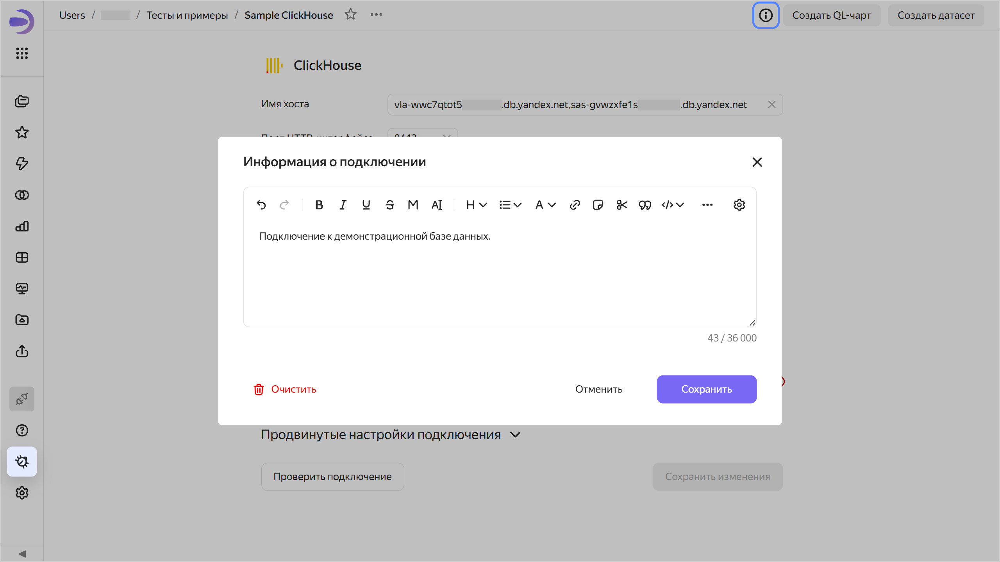
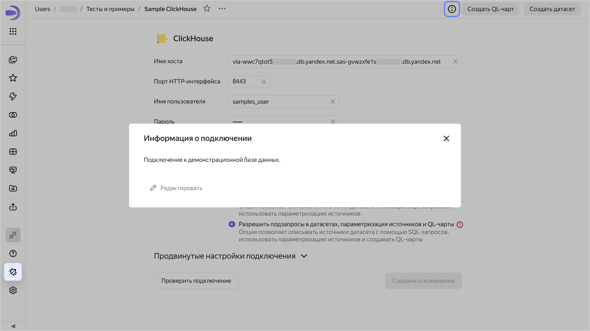

# Добавление информации о подключении в {{ datalens-full-name }}

Чтобы добавить информацию о подключении:

1. Откройте подключение, для которого необходимо добавить информацию.
1. В верхней части экрана нажмите значок .
1. Введите информацию и нажмите **Сохранить**.

   

   

   

1. Внизу нажмите кнопку **Сохранить изменения**.

Теперь в правом верхнем углу подключения для всех пользователей появится значок . При нажатии на него откроется окно **Информация о подключении** с информацией.





Чтобы удалить информацию о подключении, сохраните пустое поле в окне **Информация о подключении**. После этого у всех пользователей значок  отображаться не будет.
