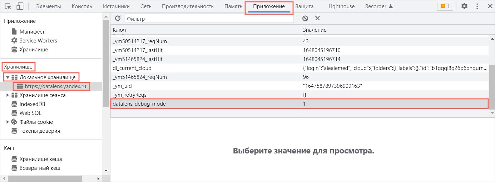
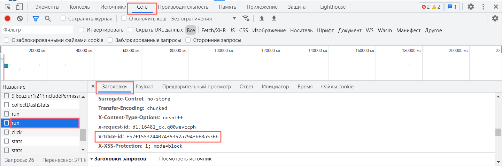
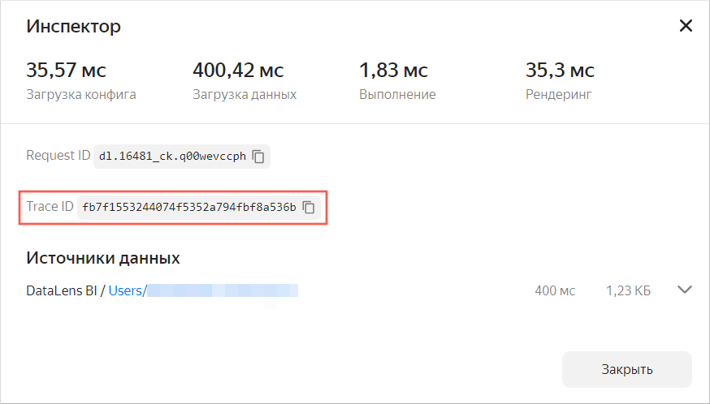
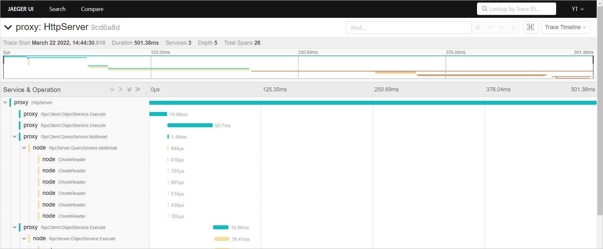

# Трассировка запроса из {{ datalens-short-name }} в YT

Посмотреть трассировку запроса к YT, который был отправлен из {{ datalens-short-name }}, можно с помощью специального инструмента [jaeger](https://jaeger.yt.yandex-team.ru/yt/). Описанный способ трассировки работает только для датасетов, чартов и дашбордов, построенных на основе подключения к CHYT и не поддерживает трассировку запросов, сделанных на основе других подключений.

Чтобы посмотреть трассировку запроса к YT, который был отправлен из {{ datalens-short-name }}:

1. Включите режим отладки {{ datalens-short-name }} на странице дашборда в браузере:

   

   - Яндекс Браузер

     1. Включите веб-инспектор: в правом верхнем углу панели браузера нажмите кнопку с тремя горизонтальными полосками **Настройки Яндекс Браузера** и выберите **Дополнительно** → **Дополнительные инструменты** → **Инструменты веб-разработчика**. Также, чтобы включить веб-инспектор, вы можете нажать комбинацию клавиш **Ctrl + Shift + I**.
     1. В веб-инспекторе браузера перейдите на вкладку **Приложение**.
     1. В навигаторе слева перейдите в **Хранилище** → **Локальное хранилище** и выберите адрес сервиса {{ datalens-short-name }}. На рабочей области отобразится таблица с колонками **Ключ** и **Значение**.
     1. Дважды щелкните по пустой строке таблицы и введите: в колонке **Ключ** значение `datalens-debug-mode`, в колонке **Значение** — `1`.

   - Google Chrome

     1. Включите веб-инспектор: в правом верхнем углу панели браузера нажмите кнопку с тремя вертикальными точками **Настройка и управление Google Chrome** и выберите **Дополнительные инструменты** → **Инструменты разработчика**. Также, чтобы включить веб-инспектор, вы можете нажать комбинацию клавиш **Ctrl + Shift + I**.
     1. В веб-инспекторе браузера перейдите на вкладку **Приложение**.
     1. В навигаторе слева перейдите в **Хранилище** → **Локальное хранилище** и выберите адрес сервиса {{ datalens-short-name }}. На рабочей области отобразится таблица с колонками **Ключ** и **Значение**.
     1. Дважды щелкните по пустой строке таблицы и введите: в колонке **Ключ** значение `datalens-debug-mode`, в колонке **Значение** — `1`.

   - Opera

     1. Включите веб-инспектор: нажмите правой клавишей мыши по рабочей области браузера и выберите **Просмотреть код элемента**. Также, чтобы включить веб-инспектор, вы можете нажать комбинацию клавиш **Ctrl + Shift + I**.
     1. В веб-инспекторе браузера перейдите на вкладку **Приложение**.
     1. В навигаторе слева перейдите в **Хранилище** → **Локальное хранилище** и выберите адрес сервиса {{ datalens-short-name }}. На рабочей области отобразится таблица с колонками **Ключ** и **Значение**.
     1. Дважды щелкните по пустой строке таблицы и введите: в колонке **Ключ** значение `datalens-debug-mode`, в колонке **Значение** — `1`.

   - Microsoft Edge

     1. Включите веб-инспектор: в правом верхнем углу панели браузера нажмите кнопку с тремя горизонтальными полосками **Настройки и прочее (ALT + F)** и выберите **Другие инструменты** → **Средства разработчика**. Также, чтобы включить веб-инспектор, вы можете нажать комбинацию клавиш **Ctrl + Shift + I**.
     1. В веб-инспекторе браузера перейдите на вкладку **Приложение**.
     1. В навигаторе слева перейдите в **Хранилище** → **Локальное хранилище** и выберите адрес сервиса {{ datalens-short-name }}. На рабочей области отобразится таблица с колонками **Ключ** и **Значение**.
     1. Дважды щелкните по пустой строке таблицы и введите: в колонке **Ключ** значение `datalens-debug-mode`, в колонке **Значение** — `1`.

   - Firefox

     1. Включите веб-инспектор: в правом верхнем углу панели браузера нажмите кнопку с тремя горизонтальными полосками **Открыть меню приложения** и выберите **Другие инструменты** → **Инструменты разработчика**. Также, чтобы включить веб-инспектор, вы можете нажать комбинацию клавиш **Ctrl + Shift + I**.
     1. В веб-инспекторе браузера перейдите на вкладку **Хранилище**. В навигаторе слева перейдите в **Локальное хранилище** и выберите адрес сервиса {{ datalens-short-name }}. На рабочей области отобразится таблица с колонками **Ключ** и **Значение**.
     1. Дважды щелкните по пустой строке таблицы и введите: в колонке **Ключ** значение `datalens-debug-mode`, в колонке **Значение** — `1`.

   - Safari

     1. Включите веб-инспектор: в верхнем меню браузера нажмите **Разработка** и выберите **Показать веб-инспектор**.
     1. В веб-инспекторе браузера перейдите на вкладку **Хранилище**.
     1. В навигаторе слева перейдите в **Все хранилище** → **Локальное хранилище** и выберите адрес сервиса {{ datalens-short-name }}. На рабочей области отобразится таблица с колонками **Ключ** и **Значение**.
     1. Дважды щелкните по пустой строке таблицы и введите: в колонке **Ключ** значение `datalens-debug-mode`, в колонке **Значение** — `1`.

   - Другие
     
     1. Если у вас другой браузер попробуйте нажать комбинацию клавиш **Ctrl + Shift + I** или воспользуйтесь справкой, чтобы включить веб-инспектор.
     1. В веб-инспекторе браузера перейдите на вкладку **Хранилище**.
     1. В навигаторе слева перейдите в **Все хранилище** → **Локальное хранилище** и выберите адрес сервиса {{ datalens-short-name }}. На рабочей области отобразится таблица с колонками **Ключ** и **Значение**.
     1. Дважды щелкните по пустой строке таблицы и введите: в колонке **Ключ** значение `datalens-debug-mode`, в колонке **Значение** — `1`.

   

   

1. Обновите чарт и найдите идентификатор трассировки запроса одним из способов: 

   
   
   - В веб-инспекторе
   
     1. Перейдите на вкладку **Сеть**.
     1. Слева в списке запросов в столбце **Название** найдите запрос **run** (для дашборда их будет несколько, потому что для каждого чарта и селектора генерируется отдельный запрос).
     1. В найденном запросе перейдите на вкладку **Заголовки**.
     1. Найдите и скопируйте значение параметра **x-trace-id**.

        

   - В инспекторе чарта 
    
     1. На дашборде в правом верхнем углу чарта нажмите значок  и выберите **Инспектор**.
     1. Найдите и скопируйте значение параметра **Trace ID**.

        

   

1. Полученное значение добавьте после слеша в строку `https://jaeger.yt.yandex-team.ru/yt/trace/` без пробелов. Вставьте полученный адрес в адресную строку браузера и перейдите по ссылке на страницу трассировщика запросов [jaeger](https://jaeger.yt.yandex-team.ru/yt/).

   
