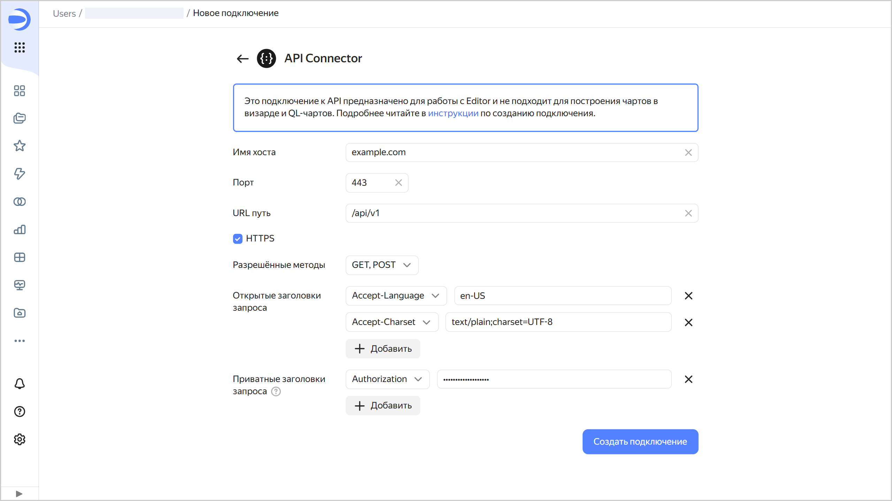

# Создание подключения API Connector



API Connector в {{ datalens-full-name }} позволяет отправлять HTTP-запросы к произвольному API в интернете. Подключение можно использовать только в [Editor](../../charts/editor/index.md), оно не поддерживается в [QL-чартах](../../concepts/chart/ql-charts.md), а также в [чартах на основе датасета](../../concepts/chart/dataset-based-charts.md).

Чтобы создать подключение API Connector:

1. Перейдите на [страницу создания нового подключения API Connector]({{ link-datalens-main }}/connections/new/json_api).
1. Укажите параметры подключения:

   * **Имя хоста**. Укажите путь до хоста, к которому будет сделан запрос.
   * **Порт**. Укажите порт подключения к API.
   * **URL путь**. (опционально) Укажите путь к API (часть [URL-адреса](https://developer.mozilla.org/ru/docs/Learn/Common_questions/Web_mechanics/What_is_a_URL) без протокола, имени хоста и порта).
   * **HTTPS**. Активируйте опцию безопасного подключения, если ваш сервер поддерживает протокол HTTPS.
   * **Разрешённые методы**. Выберите метод для HTTP-запроса к API. Доступны методы `GET` и `POST`.
   * **Открытые заголовки запроса** и **Приватные заголовки запроса**. Добавьте заголовки к HTTP-запросу в виде пар ключ-значение. Для этого нажмите кнопку **Добавить**, выберите заголовок и введите его значение. Приватные заголовки хранятся в настройках подключения в закрытом виде. Их нельзя просматривать, но можно заменять новыми значениями.

   

1. Нажмите кнопку **Создать подключение**.

1. Выберите [воркбук](../../workbooks-collections/index.md), в котором сохранится подключение, или создайте новый. Если вы пользуетесь старой навигацией по папкам, выберите папку для сохранения подключения. Нажмите кнопку **Создать**.

1. Укажите название подключения и нажмите кнопку **Создать**.
