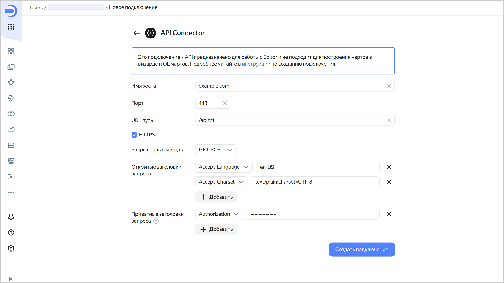

# Создание подключения API Connector

API Connector в {{ datalens-full-name }} позволяет отправлять HTTP-запросы к произвольному API в интернете. Подключение можно использовать только в [Editor](../../charts/editor/index.md), оно не поддерживается в [QL-чартах](../../concepts/chart/ql-charts.md), а также в [чартах на основе датасета](../../concepts/chart/dataset-based-charts.md).

Чтобы создать подключение API Connector:

1. Перейдите на [страницу создания нового подключения]({{ link-datalens-main }}/connections/new).
1. В разделе **Файлы и сервисы** выберите подключение **API Connector**.
1. Укажите параметры подключения:

   * **Имя хоста**. Укажите путь до хоста, к которому будет сделан запрос.
   * **Порт**. Укажите порт подключения к API.
   * **URL путь**. (опционально) Укажите путь к API (часть [URL-адреса](https://developer.mozilla.org/ru/docs/Learn/Common_questions/Web_mechanics/What_is_a_URL) без протокола, имени хоста и порта).
   * **HTTPS**. Активируйте опцию безопасного подключения, если ваш сервер поддерживает протокол HTTPS.
   * **Разрешённые методы**. Выберите метод для HTTP-запроса к API. Доступны методы `GET` и `POST`.
   * Добавьте открытые и приватные заголовки к HTTP-запросу в виде пар ключ-значение. Для этого нажмите кнопку **Добавить**, выберите заголовок и введите его значение.

     * **Открытые заголовки запроса** не содержат чувствительных данных. Значения открытых заголовков можно свободно просматривать в настройках подключения. Доступны следующие открытые заголовки:
     
       * `Accept-Charset` — перечень поддерживаемых кодировок для ответа.
       * `Accept-Encoding` — перечень поддерживаемых способов кодирования содержимого для ответа.
       * `Accept-Language` — список поддерживаемых естественных языков.
       * `Prefer` — код состояния HTTP, который следует отправить в ответ.
       * `X-Org-ID` — идентификатор организации {{ ya-360 }}.
       * `X-Cloud-Org-ID` — идентификатор [облачной организации](../../../organization/concepts/organization.md).
     
     * **Приватные заголовки запроса** предназначены для передачи чувствительных данных. Значения приватных заголовков хранятся в зашифрованном виде, их нельзя просматривать в настройках подключения, но можно заменять новыми значениями. Доступны следующие приватные заголовки:

       * `Authorization` — данные для аутентификации в API.
       * `X-Api-Key` — API-ключ для аутентификации в {{ CH }}.
       * `X-ClickHouse-User` — имя пользователя для аутентификации в {{ CH }}.
       * `X-ClickHouse-Key` — пароль пользователя для аутентификации в {{ CH }}.

   

1. Нажмите кнопку **Создать подключение**.
1. Выберите [воркбук](../../workbooks-collections/index.md), в котором сохранится подключение, или создайте новый. Если вы пользуетесь старой навигацией по папкам, выберите папку для сохранения подключения. Нажмите кнопку **Создать**.
1. Укажите название подключения и нажмите кнопку **Создать**.


