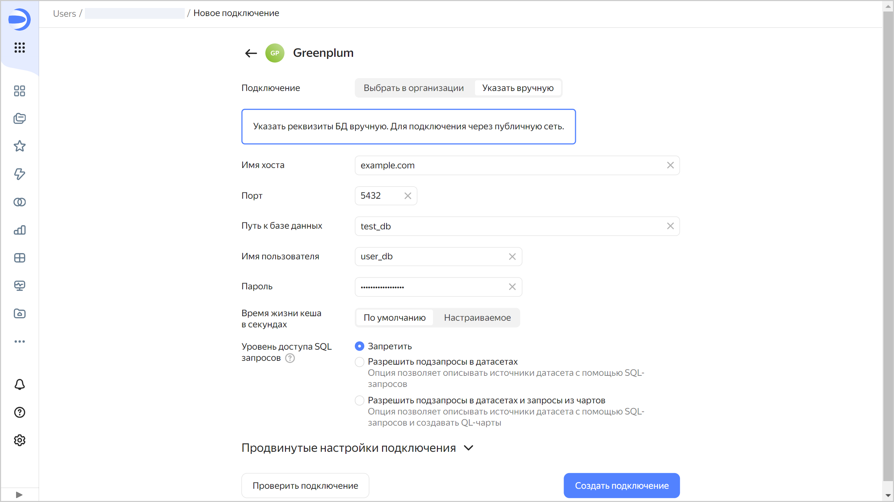

# Создание подключения к {{ GP }}







Чтобы создать подключение к {{ GP }}:

1. Перейдите на [страницу создания нового подключения]({{ link-datalens-main }}/connections/new).
1. В разделе **Базы данных** выберите подключение **Greenplum**.

1. Выберите тип подключения:

   

   - Выбрать в организации {#organization}

     

     * **Облако и каталог**. Выберите каталог, в котором находится кластер.
     * **Кластер**. Укажите кластер из списка доступных кластеров {{ GP }}. В настройках кластера должна быть активирована опция **Доступ из {{ datalens-short-name }}**. Если у вас нет доступного кластера, нажмите кнопку **Создать новый**.

       

     * **Тип хоста**. Выберите тип хоста:
       
       * **Обычный** (по умолчанию) — позволяет выбрать обычные хосты для подключения.
       * **Особые FQDN**  — позволяет выбрать для подключения [особый FQDN](../../../managed-greenplum/operations/connect.md#fqdn-master), который всегда указывает на первичный хост-мастер {{ GP }}.

     * **Имя хоста**. Выберите имя хоста из списка доступных в кластере {{ GP }}. Вы можете выбрать несколько хостов. Если к первому хосту подключиться не получится, {{ datalens-short-name }} выберет следующий из списка.
     * **Порт**. Укажите порт подключения к {{ GP }}. Порт по умолчанию — {{ port-mgp }}.
     * **Путь к базе данных**. Укажите имя подключаемой базы данных.
     * **Имя пользователя**. Укажите имя пользователя для подключения к {{ GP }}.
     * **Пароль**. Укажите пароль для пользователя.
     * **Время жизни кеша в секундах**. Укажите время жизни кеша или оставьте значение по умолчанию. Рекомендованное значение — 300 секунд (5 минут).
     * **Уровень доступа SQL запросов**. Позволяет использовать произвольный SQL-запрос для [формирования датасета](../../dataset/settings.md#sql-request-in-datatset).

   - Указать вручную {#manual}

     

      * **Имя хоста**. Укажите путь до хоста-мастера или IP-адрес хоста-мастера {{ GP }}. Вы можете указать несколько хостов через запятую. Если к первому хосту подключиться не получится, {{ datalens-short-name }} выберет следующий из списка.
      * **Порт**. Укажите порт подключения к {{ GP }}. Порт по умолчанию — 5432.
      * **Путь к базе данных**. Укажите имя подключаемой базы данных.
      * **Имя пользователя**. Укажите имя пользователя для подключения к {{ GP }}.
      * **Пароль**. Укажите пароль для пользователя.
      * **Время жизни кеша в секундах**. Укажите время жизни кеша или оставьте значение по умолчанию. Рекомендованное значение — 300 секунд (5 минут).
      * **Уровень доступа SQL запросов**. Позволяет использовать произвольный SQL-запрос для [формирования датасета](../../dataset/settings.md#sql-request-in-datatset).

      

   

1. (опционально) Проверьте работоспособность подключения. Для этого нажмите кнопку **Проверить подключение**.
1. Нажмите кнопку **Создать подключение**.

1. Выберите [воркбук](../../workbooks-collections/index.md), в котором сохранится подключение, или создайте новый. Если вы пользуетесь старой навигацией по папкам, выберите папку для сохранения подключения. Нажмите кнопку **Создать**.

1. Укажите название подключения и нажмите кнопку **Создать**.

## Дополнительные настройки {#additional-settings}


