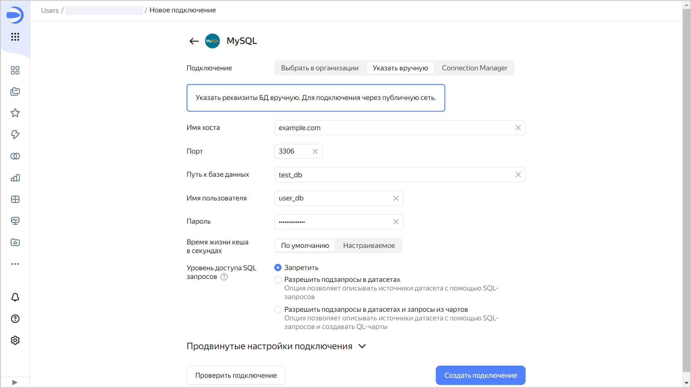

# Создание подключения к {{ MY }}







Чтобы создать подключение к {{ MY }}:

1. Перейдите на [страницу создания нового подключения]({{ link-datalens-main }}/connections/new).
1. В разделе **Базы данных** выберите подключение **MySQL**.

1. Выберите тип подключения:

   

   - Выбрать в организации {#organization}

     

     * **Облако и каталог**. Выберите каталог, в котором находится кластер.
     * **Кластер**. Укажите кластер из списка доступных кластеров {{ MY }}. В настройках кластера должна быть активирована опция **Доступ из {{ datalens-short-name }}**. Если у вас нет доступного кластера, нажмите кнопку **Создать новый**.

       

     * **Тип хоста**. Выберите тип хоста:

       * **Обычный** (по умолчанию) — позволяет выбрать обычные хосты для подключения.
       * **Особые FQDN** — позволяет выбрать для подключения [особые FQDN](../../../managed-mysql/operations/connect.md#special-fqdns), которые всегда указывают на текущий хост-мастер или на наименее отстающую от мастера реплику в кластере {{ MY }}.

     * **Имя хоста**. Выберите имя хоста из списка доступных в кластере {{ MY }}. Вы можете выбрать несколько хостов. Если к первому хосту подключиться не получится, {{ datalens-short-name }} выберет следующий из списка.
     * **Порт**. Укажите порт подключения к {{ MY }}. Порт по умолчанию — 3306.
     * **Путь к базе данных**. Укажите имя подключаемой базы данных.
     * **Имя пользователя**. Укажите имя пользователя для подключения к {{ MY }}.
     * **Пароль**. Укажите пароль для пользователя.
     * **Время жизни кеша в секундах**. Укажите время жизни кеша или оставьте значение по умолчанию. Рекомендованное значение — 300 секунд (5 минут).
     * **Уровень доступа SQL запросов**. Позволяет использовать произвольный SQL-запрос для [формирования датасета](../../dataset/settings.md#sql-request-in-datatset).

       Чтобы проверить корректность введенных параметров, нажмите кнопку **Проверить подключение**.

   - Указать вручную {#manual}

     

     

     

     Чтобы проверить корректность введенных параметров, нажмите кнопку **Проверить подключение**.

   - {{ connection-manager-name }} {#conn-man}

     

     Выберите [подключение](../../../metadata-hub/concepts/connection-manager.md) к кластеру с управляемой БД {{ MY }}, созданное в сервисе {{ connection-manager-full-name }}:

     * **Облако и каталог**. Выберите каталог, в котором создано подключение к кластеру.
     * **Идентификатор подключения**. Выберите одно из доступных подключений в {{ connection-manager-name }} или [создайте новое](../../../metadata-hub/operations/create-connection.md).
     * **Хост**. Выберите хост из списка доступных в кластере {{ MY }}.
     * **Порт**. Заполняется автоматически в зависимости от выбранного хоста.
     * **База данных**. Выберите имя подключаемой базы данных.
     * **Имя пользователя**. Заполняется автоматически из данных выбранного подключения.
     * **Время жизни кеша в секундах**. Укажите время жизни кеша или оставьте значение по умолчанию. Рекомендованное значение — 300 секунд (5 минут).
     * **Уровень доступа SQL запросов**. Позволяет использовать произвольный SQL-запрос для [формирования датасета](../../dataset/settings.md#sql-request-in-datatset).

   

1. Нажмите кнопку **Создать подключение**.

1. Выберите [воркбук](../../workbooks-collections/index.md), в котором сохранится подключение, или создайте новый. Если вы пользуетесь старой навигацией по папкам, выберите папку для сохранения подключения. Нажмите кнопку **Создать**.

1. Укажите название подключения и нажмите кнопку **Создать**.

## Дополнительные настройки {#additional-settings}


