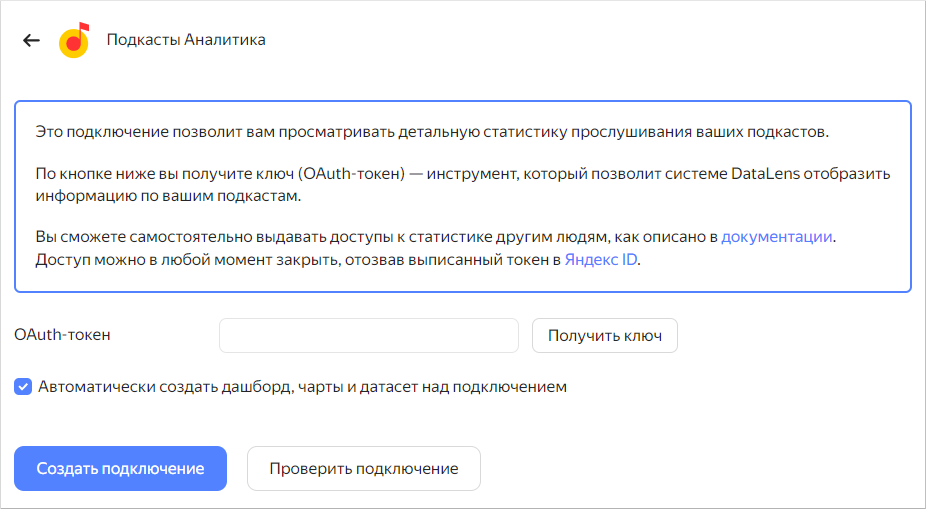

# Создание подключения к подкастам Яндекс Музыки



 Создание подключения и работа с данными по аналитике подкастов возможна для пользователей, у которых есть права на какой-либо подкаст в Яндекс Музыке. Если у вас нет доступа к подкасту, то данные не отобразятся на дашборде.
 
 Вы получите доступ, загрузив подкаст на Яндекс Музыку. К подкасту привязана почта на Яндексе, указанная при загрузке.
 


1. Перейдите на [страницу подключений]({{ link-datalens-main }}/connections).
1. Нажмите кнопку **Создать подключение**.
1. Выберите подключение **Подкасты Аналитика**.

   

1. Нажмите кнопку **Получить ключ**. Если вы в первый раз создаете подключение к подкастам Яндекс Музыки, предоставьте сервису необходимые разрешения.
1. Нажмите кнопку **Проверить подключение**.
1. После успешной проверки подключения нажмите кнопку **Создать подключение**.
1. Введите название подключения и нажмите **Создать подключение**. Подключение появится в списке.
1. Перейдите в меню **Дашборды** и откройте дашборд **Аналитика подкастов на Яндекс Музыке**. Если данных нет, убедитесь, что у вашего текущего аккаунта есть доступ к подкастам, написав в [службу поддержки](https://yandex.ru/support/music/podcast-authors/statistics.html).
