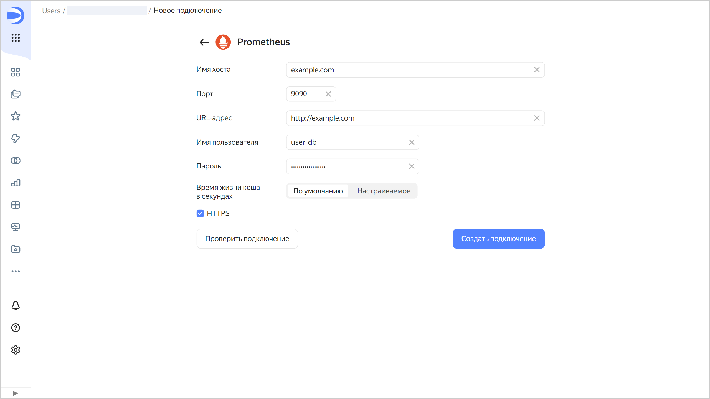

# Создание подключения к {{ prometheus-name }}

Чтобы создать подключение к {{ prometheus-name }}:

1. Перейдите на [страницу создания нового подключения]({{ link-datalens-main }}/connections/new).
1. В разделе **Базы данных** выберите подключение **{{ prometheus-name }}**.
1. Укажите параметры подключения:

   * **Имя хоста**. Укажите путь до хоста {{ prometheus-name }}. Вы можете указать несколько хостов через запятую. Если к первому хосту подключиться не получится, {{ datalens-short-name }} выберет следующий из списка.
   * **Порт**. Укажите порт подключения к {{ prometheus-name }}.
   * **URL-адрес**. Укажите URL-адрес API {{ prometheus-name }}. 
   * **Имя пользователя**. Укажите имя пользователя для подключения к {{ prometheus-name }}.
   * **Пароль**. Укажите пароль для пользователя.
   * **Время жизни кеша в секундах**. Укажите время жизни кеша или оставьте значение по умолчанию. Рекомендованное значение — 300 секунд (5 минут).
   * **HTTPS**. Активируйте опцию безопасного подключения, если ваш сервер поддерживает протокол HTTPS.

   

1. (опционально) Проверьте работоспособность подключения. Для этого нажмите кнопку **Проверить подключение**.
1. Нажмите кнопку **Создать подключение**.

1. Выберите [воркбук](../../workbooks-collections/index.md), в котором сохранится подключение, или создайте новый. Если вы пользуетесь старой навигацией по папкам, выберите папку для сохранения подключения. Нажмите кнопку **Создать**.

1. Укажите название подключения и нажмите кнопку **Создать**.
