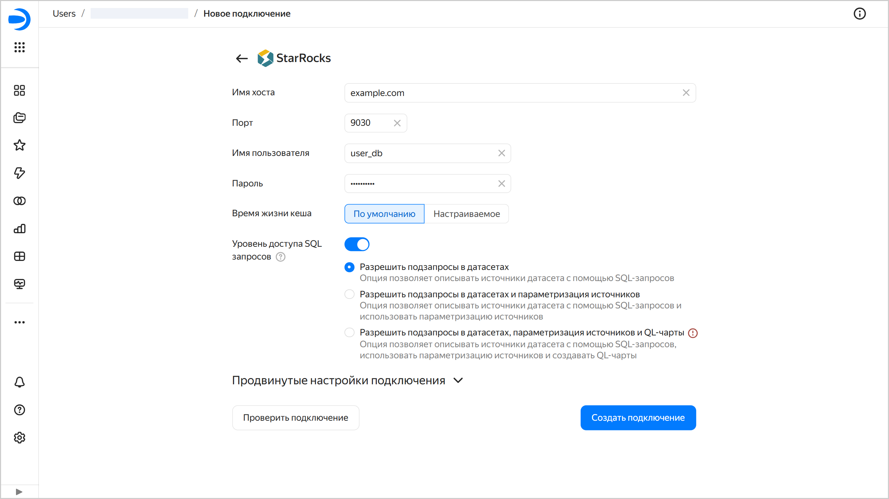
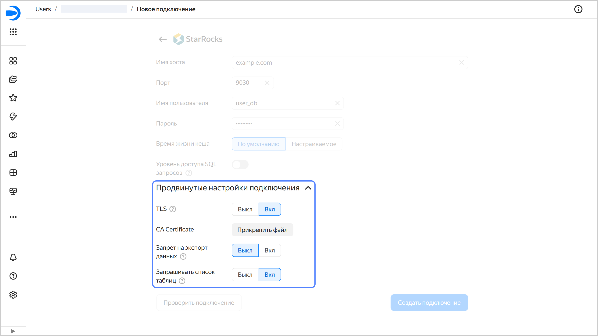

# Создание подключения к {{ SR }} в {{ datalens-full-name }}







Чтобы создать подключение к {{ SR }}:

1. Перейдите на [страницу создания нового подключения]({{ link-datalens-main }}/connections/new).
1. В разделе **Базы данных** выберите подключение **{{ SR }}**.
1. Укажите параметры подключения для БД {{ SR }}:

   * **Имя хоста**. Укажите путь до хоста {{ SR }}. Вы можете указать несколько хостов через запятую. Если к первому хосту подключиться не получится, {{ datalens-short-name }} выберет следующий из списка.
   * **Порт**. Укажите порт подключения к {{ SR }}. Порт по умолчанию — 9030.
   * **Имя пользователя**. Укажите имя пользователя для подключения к {{ SR }}.
   * **Пароль**. Укажите пароль для пользователя.
   * **Время жизни кеша в секундах**. Укажите время жизни кеша или оставьте значение по умолчанию. Рекомендованное значение — 300 секунд (5 минут).
   
   

   

1. (опционально) Проверьте работоспособность подключения. Для этого нажмите кнопку **Проверить подключение**.
1. Нажмите кнопку **Создать подключение**.

1. Выберите [воркбук](../../workbooks-collections/index.md), в котором сохранится подключение, или создайте новый. Если вы пользуетесь старой навигацией по папкам, выберите папку для сохранения подключения. Нажмите кнопку **Создать**.

1. Укажите название подключения и нажмите кнопку **Создать**.

## Дополнительные настройки {#additional-settings}

Вы можете указать дополнительные параметры подключения в разделе **Продвинутые настройки подключения**:

* **TLS** — опция определяет необходимость использования протокола TLS. Когда опция включена, использование SSL для подключения становится обязательным.
* **CA Certificate** — чтобы загрузить сертификат, нажмите кнопку **Прикрепить файл** и укажите файл сертификата. Когда сертификат загружен, поле отображает название файла.
* 
* 

