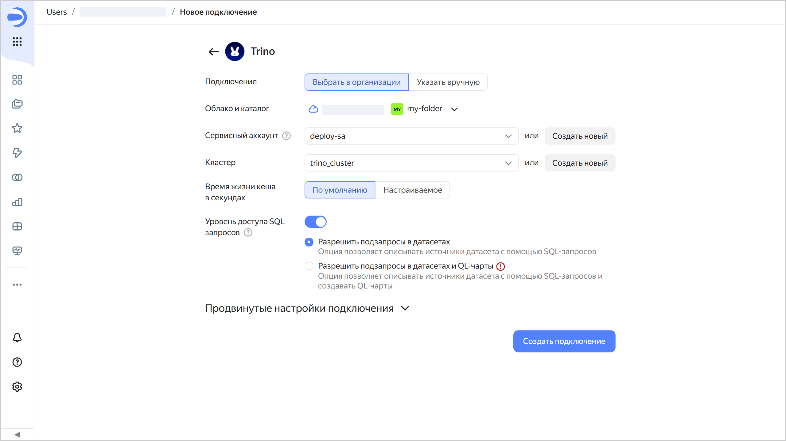
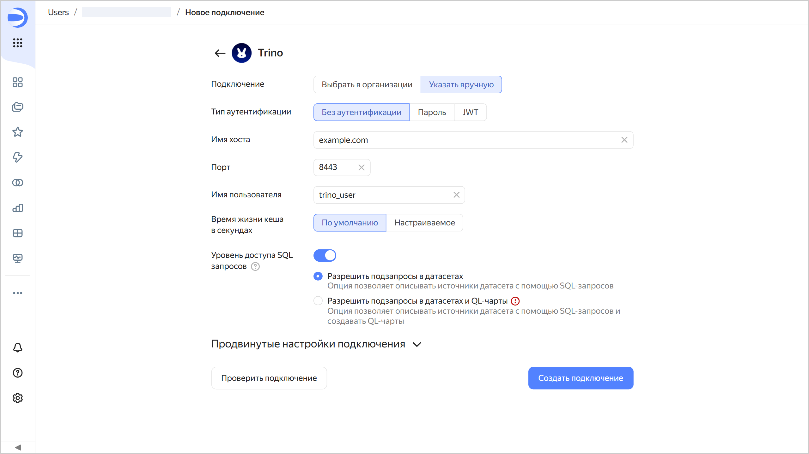
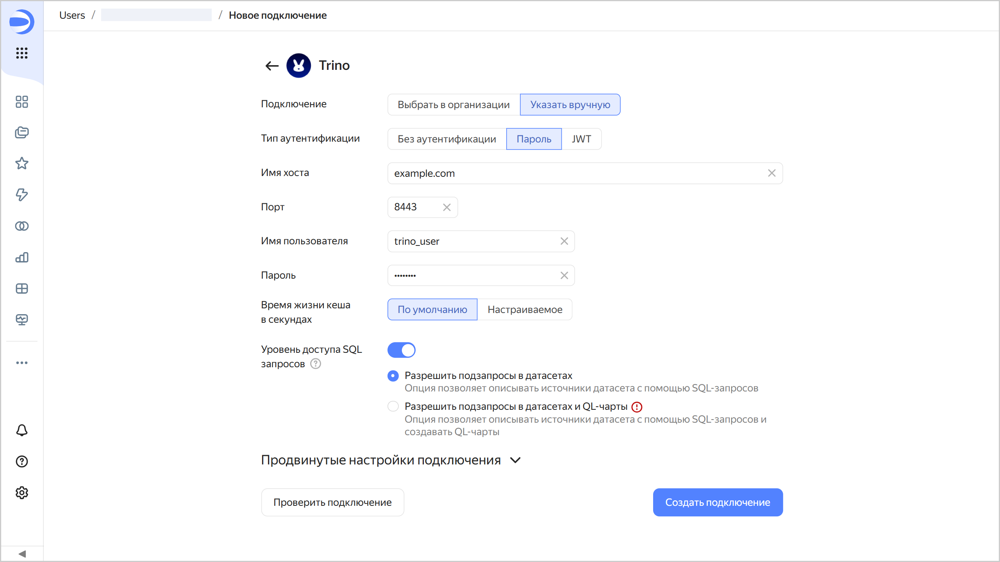
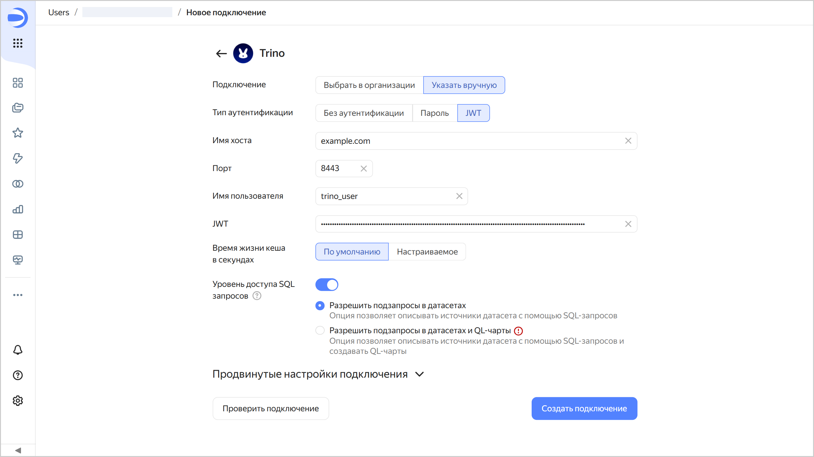
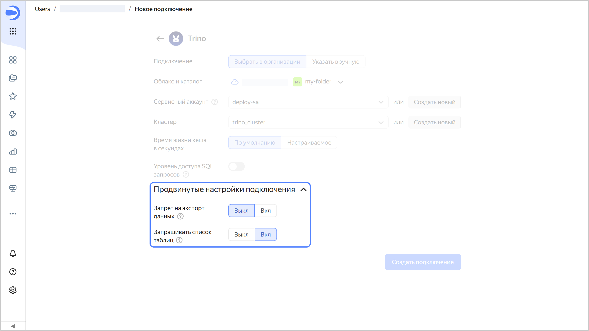

# Создание подключения к {{ TR }}

Чтобы создать подключение к {{ TR }}:

1. Перейдите на [страницу создания нового подключения]({{ link-datalens-main }}/connections/new).
1. В разделе **Базы данных** выберите подключение **{{ TR }}**.
1. Выберите тип подключения:

   

   - Выбрать в организации {#organization}

     

     * **Облако и каталог**. Выберите каталог, в котором будет находиться ваш сервисный аккаунт.
     * **Сервисный аккаунт**. Выберите существующий сервисный аккаунт или создайте новый.
     * **Кластер**. Укажите кластер из списка доступных кластеров {{ TR }} или создайте новый.
     * **Время жизни кеша в секундах**. Укажите время жизни кеша или оставьте значение по умолчанию. Рекомендованное значение — 300 секунд (5 минут).

     

     

   - Указать вручную {#manual}

     Выберите режим аутентификации и вручную укажите реквизиты внешней БД, чтобы подключиться через публичную сеть:

     

     - Без аутентификации {#noauth}

       * **Имя хоста**. Укажите путь до координатора или IP-адрес координатора {{ TR }}.
       * **Порт**. Укажите порт подключения к {{ TR }}. Порт по умолчанию — 8443.
       * **Имя пользователя**. Укажите имя пользователя для подключения к {{ TR }}. (Если аутентификация отключена, имя пользователя может быть любым, на подключение это не влияет. Значение поля будет отправляться с запросами к источнику.)
       * **Время жизни кеша в секундах**. Укажите время жизни кеша или оставьте значение по умолчанию. Рекомендованное значение — 300 секунд (5 минут).

       

       

     - Пароль {#password}

       * **Имя хоста**. Укажите путь до координатора или IP-адрес координатора {{ TR }}.
       * **Порт**. Укажите порт подключения к {{ TR }}. Порт по умолчанию — 8443.
       * **Имя пользователя**. Укажите имя пользователя для подключения к {{ TR }}.
       * **Пароль**. Укажите пароль для указанного пользователя.
       * **Время жизни кеша в секундах**. Укажите время жизни кеша или оставьте значение по умолчанию. Рекомендованное значение — 300 секунд (5 минут).

       

       

     - JWT {#jwt}

       * **Имя хоста**. Укажите путь до координатора или IP-адрес координатора {{ TR }}.
       * **Порт**. Укажите порт подключения к {{ TR }}. Порт по умолчанию — 8443.
       * **Имя пользователя**. Укажите имя пользователя для подключения к {{ TR }}.
       * **JWT**. Укажите JWT-токен.
       * **Время жизни кеша в секундах**. Укажите время жизни кеша или оставьте значение по умолчанию. Рекомендованное значение — 300 секунд (5 минут).

       

       

     

     (опционально) Проверьте работоспособность подключения. Для этого нажмите кнопку **Проверить подключение**.
     
   

1. Нажмите кнопку **Создать подключение**.
1. Выберите [воркбук](../../workbooks-collections/index.md), в котором сохранится подключение, или создайте новый. Если вы пользуетесь старой навигацией по папкам, выберите папку для сохранения подключения. Нажмите кнопку **Создать**.
1. Укажите название подключения и нажмите кнопку **Создать**.

## Дополнительные настройки {#additional-settings}

Вы можете указать дополнительные параметры подключения в разделе **Продвинутые настройки подключения**:



- Выбрать в организации {#organization}

  * 
  * 

     

- Указать вручную {#manual}

  * **TLS** — когда опция включена, при взаимодействии с {{ TR }} используется протокол `HTTPS`, когда выключена — `HTTP`.
  * **CA Certificate** — чтобы загрузить сертификат, нажмите кнопку **Прикрепить файл** и укажите файл сертификата. Когда сертификат загружен, поле отображает название файла.
  * 
  * 

  


