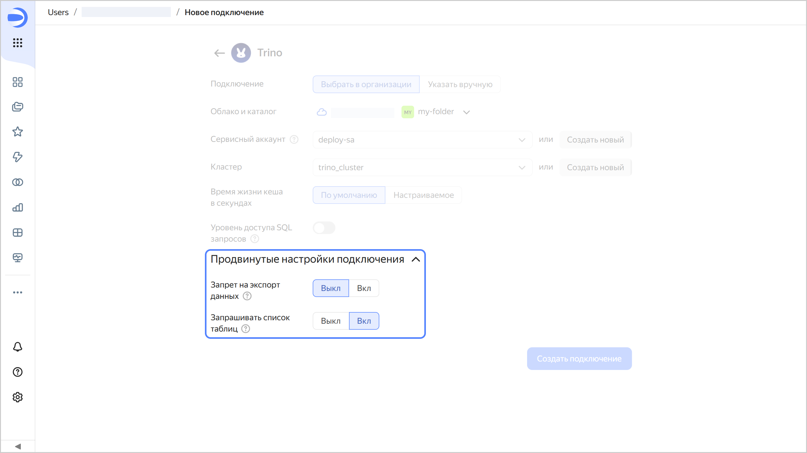
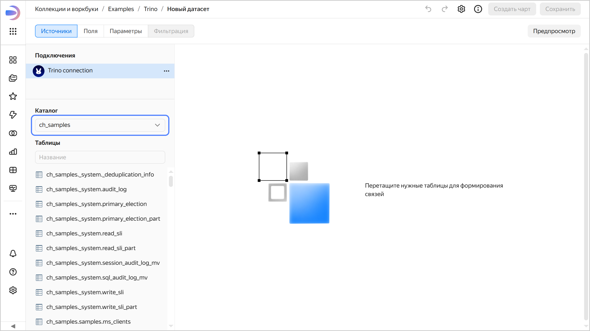

# Создание подключения к {{ TR }} в {{ datalens-full-name }}

Чтобы создать подключение к {{ TR }}:

1. Перейдите на [страницу создания нового подключения]({{ link-datalens-main }}/connections/new).
1. В разделе **Базы данных** выберите подключение **{{ TR }}**.

1. Выберите тип подключения:

    

    - Выбрать в организации {#organization}

      1. 

          * **Облако и каталог**. Выберите каталог, в котором будет находиться ваш сервисный аккаунт.
          * **Сервисный аккаунт**. Выберите существующий сервисный аккаунт или [создайте](../../../iam/operations/sa/create.md) новый.
          * **Кластер**. Укажите кластер из списка доступных кластеров {{ TR }} или [создайте](../../../managed-trino/operations/cluster-create.md) новый.

          

      1. 
      1. 

    - Указать вручную {#manual}

      1. Выберите **Тип аутентификации**:
          * `Без аутентификации`
          * `Пароль`
          * `JWT`

      1. 
      1. 
      1. 
      1. (Опционально) Проверьте работоспособность подключения. Для этого нажмите кнопку **Проверить подключение**.

    

1. Нажмите кнопку **Создать подключение**.
1. Выберите [воркбук](../../workbooks-collections/index.md), в котором сохранится подключение, или создайте новый. Если вы пользуетесь старой навигацией по папкам, выберите папку для сохранения подключения.
1. Укажите название подключения и нажмите кнопку **Создать**.

## Дополнительные настройки {#additional-settings}

Вы можете указать дополнительные параметры подключения в разделе **Продвинутые настройки подключения**:



- Выбрать в организации {#organization}

  * 
  * 

  

- Указать вручную {#manual}

  



## Подключение внешней БД {#external-db-connection}



## Создание датасета {#create-dataset}

Область поиска таблиц при подключении к {{ TR }} ограничена конкретным каталогом.

При [создании датасета](../../dataset/create-dataset.md) на основе подключения к {{ TR }}:

1. На странице подключения в правом верхнем углу нажмите кнопку **Создать датасет**.
1. Выберите каталог в источнике. На панели ниже отобразятся размещенные в нем таблицы.

   

   

   

1. Продолжайте [инструкцию](../../dataset/create-dataset.md#add-data) с шага 4.