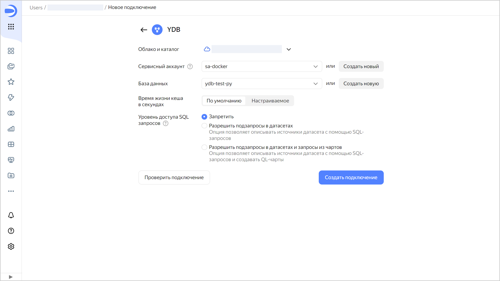

# Создание подключения к {{ ydb-name }}



Для создания подключения вам потребуется [сервисный аккаунт](../../../iam/concepts/users/service-accounts.md) с [ролью](../../../iam/operations/sa/assign-role-for-sa.md) **ydb.viewer** (или **viewer**).

Для написания подзапросов в датасетах и запросов в QL-чартах используйте [синтаксис YQL]({{ ydb.docs }}/yql/reference/syntax/).



Чтобы создать подключение к {{ ydb-name }}:

1. Перейдите на [страницу создания нового подключения]({{ link-datalens-main }}/connections/new).
1. В разделе **Файлы и сервисы** выберите подключение **{{ ydb-short-name }}**.

1. Укажите параметры подключения:

   * **Облако и каталог**. Выберите каталог, в котором будет находиться ваш сервисный аккаунт.
   * **Сервисный аккаунт**. Выберите существующий сервисный аккаунт или создайте новый.
   * **База данных**. Выберите подключаемую базу данных или создайте новую.

   

   В именах столбцов базы данных {{ ydb-short-name }} не допускается использование заглавных букв.

   

   * **Время жизни кеша в секундах**. Укажите время жизни кеша или оставьте значение по умолчанию. Рекомендованное значение — 300 секунд (5 минут).
   * **Уровень доступа SQL запросов**. Позволяет использовать произвольный SQL-запрос для [формирования датасета](../../dataset/settings.md#sql-request-in-datatset).

   

1. (опционально) Проверьте работоспособность подключения. Для этого нажмите кнопку **Проверить подключение**.
1. Нажмите кнопку **Создать подключение**.

1. Выберите [воркбук](../../workbooks-collections/index.md), в котором сохранится подключение, или создайте новый. Если вы пользуетесь старой навигацией по папкам, выберите папку для сохранения подключения. Нажмите кнопку **Создать**.

1. Укажите название подключения и нажмите кнопку **Создать**.



При превышении [квот и лимитов](../../../ydb/concepts/limits.md) {{ ydb-name }} может появиться сообщение об ошибке [`RESOURCE_EXHAUSTED`](../../../ydb/faq.md#resource-exhausted). Чтобы избежать появления ошибки, придерживайтесь следующих рекомендаций:

* Снизьте интенсивность запросов. Например, используйте фильтры, указывайте в чартах только необходимые поля для ограничения количества получаемых данных.
* Выполните [рекомендации по оптимизации](../../concepts/optimization_recommendations.md) запросов к базе данных.
* Проанализируйте время загрузки и объем данных с помощью [инспектора чартов](../../concepts/chart/inspector.md) в {{ datalens-short-name }}.
* Проверьте графики мониторинга {{ ydb-name }} на предмет превышения квот и лимитов. При необходимости немного [увеличьте](../../../ydb/operations/manage-databases.md#update-db-serverless) только [пропускную способность](../../../ydb/concepts/serverless-and-dedicated.md#capacity) (Request Units) в блоке **{{ ui-key.yacloud.ydb.overview.label_serverless-limits }}**.



Увеличение пропускной способности в настройках Serverless БД может привести к значительному увеличению стоимости ее использования. Так как ресурсы Serverless БД неопределенно большие, то и максимальное потребление Request Units за промежуток времени также может составить любое значение, приведя к нежелательным начислениям. При изменении повышайте значение на совсем небольшое количество, например, на дополнительные 10 RU/с.




