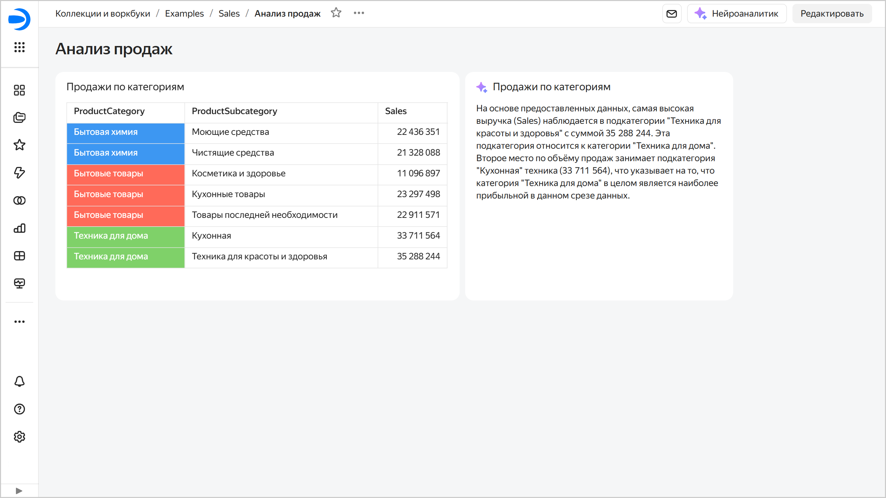

# Добавление Нейроаналитика на дашборд в {{ datalens-full-name }}

Для добавления Нейроаналитика на дашборд выполните следующее:



1. На панели слева нажмите  **Дашборды** и выберите нужный дашборд.
1. В верхней части страницы нажмите кнопку **Редактировать**.
1. На панели в нижней части страницы зажмите  **Нейроаналитик** и перетащите его в нужную область.

   

1. Укажите настройки виджета:

   * **Чарт для анализа**. Нажмите кнопку  **Выбрать чарт** и выберите чарт из списка чартов на текущей вкладке дашборда.
   * **Заголовок**. Задает имя виджета (по умолчанию — название выбранного чарта). Отображается в верхней части виджета, если опция **Заголовок** в блоке **Внешний вид** включена (по умолчанию).
   * **Промпт**. Введите вопрос, на который будет отвечать Нейроаналитик.

   
   * **Фон**. Задает цвет фона и прозрачность виджета отдельно для светлой и темной темы.
   * **Скругление**. Задает скругление виджета.

   

   
   
   

1. Нажмите кнопку **Добавить**. Виджет отобразится на дашборде.
1. В правом верхнем углу дашборда нажмите кнопку **Сохранить**. Нейроаналитик проанализирует указанный чарт и сформирует выводы на основе данных и пользовательского промпта. Результат будет обновляться каждый раз при открытии дашборда. Если после получения результата Нейроаналитика в чарте, с которым он связан, изменятся данные, в верхней части виджета появится кнопка  **Обновить**.

   

   
   
   
