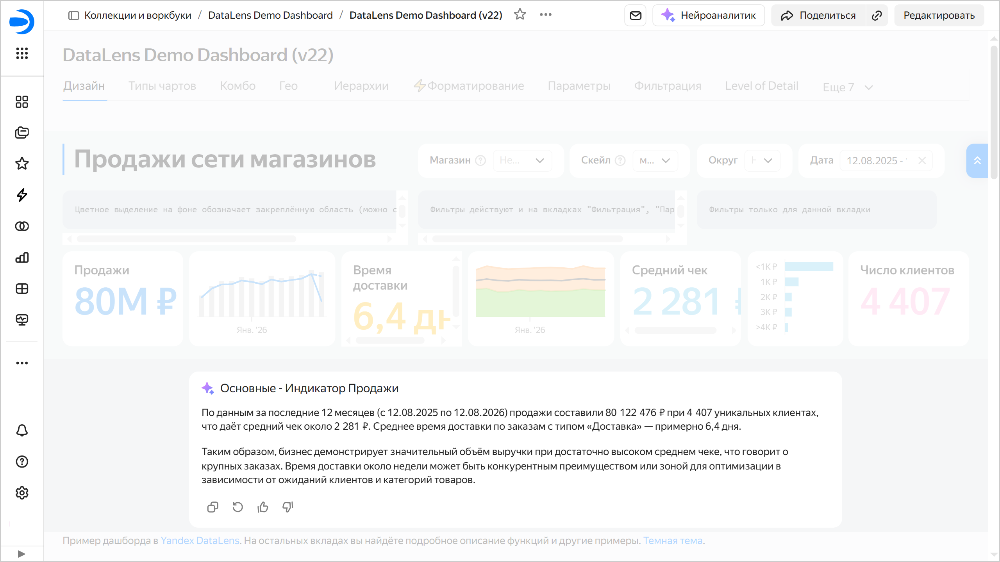

# Добавление виджета с инсайтом на дашборд в {{ datalens-full-name }}

Для добавления виджета с инсайтом от Нейроаналитика на дашборд выполните следующее:



1. На панели слева нажмите  **Дашборды** и выберите нужный дашборд.
1. В верхней части страницы нажмите кнопку **Редактировать**.
1. На панели в нижней части страницы зажмите  **Инсайт** и перетащите его в нужную область.

   

1. Укажите основные настройки виджета:

   * **Чарты для анализа**. Нажмите кнопку  **Добавить** и выберите чарт из списка чартов на текущей вкладке дашборда. В одном инсайте можно указать до пяти чартов с текущей вкладки дашборда.  С помощью Нейроаналитика можно обнаружить взаимосвязи в данных, которые не видны на отдельных графиках.
   * **Заголовок**. Задает имя виджета (по умолчанию — название выбранного чарта). Отображается в верхней части виджета, если опция **Заголовок** в блоке **Внешний вид** включена (по умолчанию).
   * **Промпт**. Введите вопрос, на который будет отвечать Нейроаналитик.

   Укажите настройки внешнего вида виджета:

   * **Заголовок**. Опция задает отображение заголовка инсайта.
   * **Действия с инсайтом**. Опция задает отображение внизу инсайта панели действий:

     *  **Копировать**. Копирует содержимое инсайта в буфер.
     *  **Ещё раз**. Обновляет ответ инсайта.
     *  **Хороший ответ**. Положительно оценивает ответ инсайта.
     *  **Плохой ответ**. Отрицательно оценивает ответ инсайта.

   * **Фон**. Задает цвет фона и прозрачность виджета отдельно для светлой и темной темы.
   * **Скругление**. Задает скругление виджета.

   

      
   
   

   

1. Нажмите кнопку **Добавить**. Виджет отобразится на дашборде.
1. В правом верхнем углу дашборда нажмите кнопку **Сохранить**. Нейроаналитик проанализирует указанный чарт и сформирует выводы на основе данных и пользовательского промпта. Результат в **Инсайте** будет обновляться каждый раз при открытии дашборда. Если в чарте, с которым связан виджет **Инсайт**, изменятся данные, в верхней части виджета появится кнопка  **Обновить**.

   

   

   
