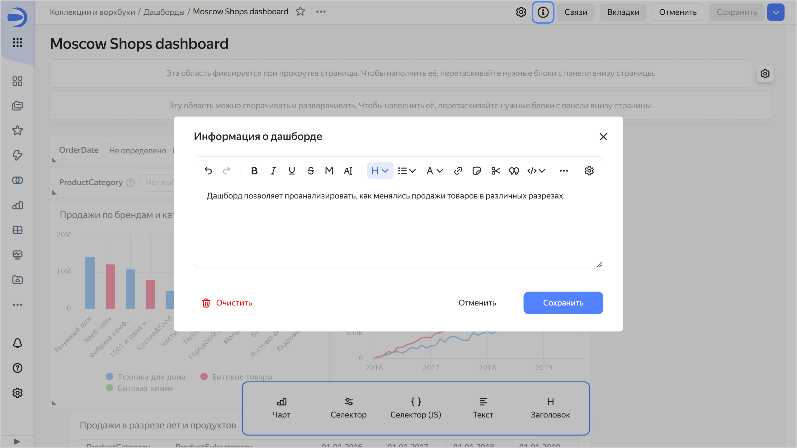
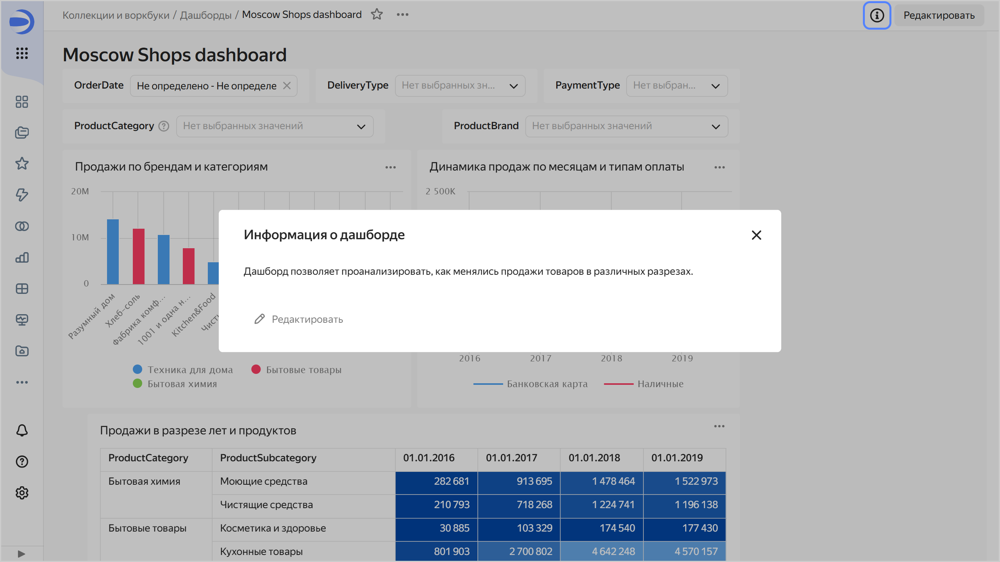

# Добавление описания к дашборду

Чтобы добавить описание к дашборду:



1. На панели слева нажмите  **Дашборды** и выберите нужный дашборд.
1. В правом верхнем углу нажмите кнопку **Редактировать**.
1. В верхней части экрана нажмите значок .
1. Введите описание и нажмите **Сохранить**.

   

   
   
   

1. В правом верхнем углу экрана нажмите **Сохранить**.

Теперь в правом верхнем углу дашборда для всех пользователей появится значок . При нажатии на него откроется окно **Информация о дашборде** с описанием.





Чтобы удалить описание к дашборду, сохраните пустое описание в окне **Информация о дашборде**. После этого у всех пользователей значок  отображаться не будет.
