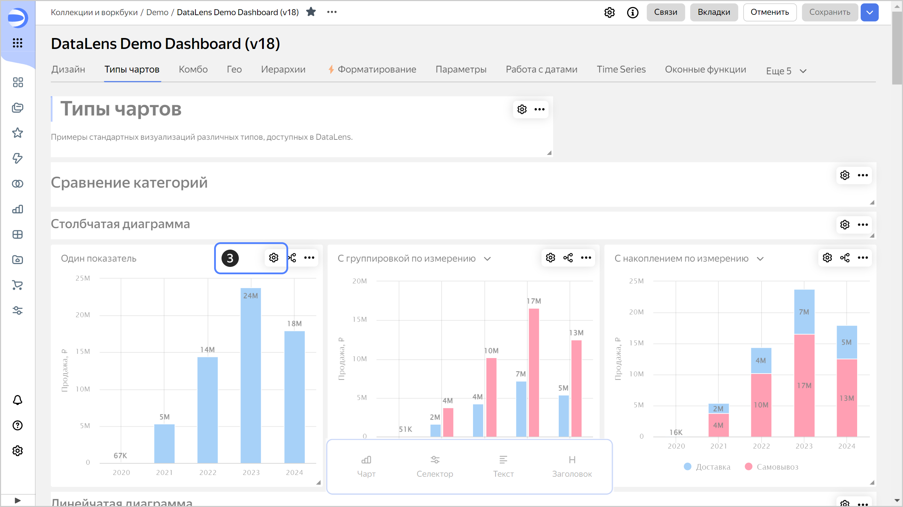

# Настройка фильтрации чартами

Чтобы настроить [фильтрацию чартов другими чартами](../../dashboard/chart-chart-filtration.md) на дашборде:

1. На панели слева нажмите  **Дашборды** и выберите нужный дашборд. Если у вас нет дашборда, [создайте его](../dashboard/create.md).
1. В правом верхнем углу дашборда нажмите кнопку **Редактировать**.
1. В правом верхнем углу чарта, для которого надо включить фильтрацию, нажмите значок .

   

1. Включите опцию **Фильтрация**.
1. Нажмите кнопку **Сохранить**.
1. (опционально) При необходимости настройте одностороннюю [связь](../../dashboard/link.md) или уберите связь с чартами, которые не хотите фильтровать.

   

   По умолчанию фильтрующий чарт связывается со всеми чартами текущей вкладки дашборда, которые построены по тому же датасету.

   

1. Нажмите кнопку **Сохранить**.
1. В правом верхнем углу редактирования дашборда нажмите кнопку **Сохранить**.
