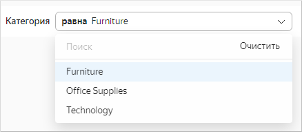
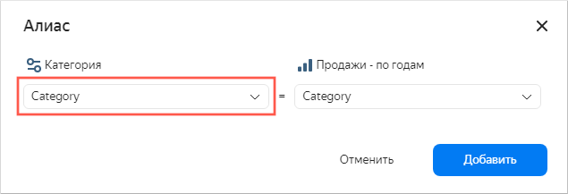
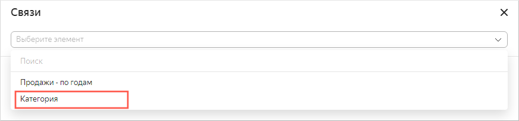

# Добавление селектора на дашборд

Перед добавлением селектора убедитесь, что у вас есть право доступа `{{ permission-write }}` или `{{ permission-admin }}` на дашборд. Подробнее см. [раздел](../../security/index.md).

Чтобы добавить [селектор](../../dashboard/selector.md) на дашборд:



1. На панели слева нажмите  **Дашборды** и выберите нужный дашборд.
1. В верхней части страницы нажмите кнопку **Редактировать**.
1. На панели в нижней части страницы выберите **Селектор**.

   

1. Выберите тип селектора:

   

   - На основе датасета

     Укажите параметры селектора:

     * В блоке **Общие настройки**:

       * **Датасет** — датасет с данными для селектора.
       * **Поле** — поле датасета со значениями селектора. Может быть как измерением, так и показателем (подробнее см. [{#T}](../../concepts/dataset/data-model.md#field)).
       * **Тип селектора** — выпадающий список, поле ввода, календарь или чекбокс.

         

         * **Календарь** доступен только для полей с типом `Дата` или `Дата и время`.
         * **Чекбокс** доступен только для полей с типом `Логический`.
         * Для показателей доступен только тип селектора **Поле ввода**.

         

       * **Операция** — операция сравнения, по которой селектор фильтрует значения чарта (например, **Равно**, **Больше** или **Меньше**). Если оставить поле пустым, селектор по умолчанию будет фильтровать по операции **Равно**. Список доступных операций зависит от типа поля. Не указывайте операцию, если селектор будет фильтровать QL-чарт.

       * **Множественный выбор** — опция позволяет выбирать несколько значений в селекторе. Доступно только для селекторов типа **Список**.
       * **Диапазон** — опция позволяет выбирать временной промежуток в селекторе. Доступно только для селекторов типа **Календарь**.
       * **Значение по умолчанию** — отображается изначально при открытии дашборда.

     * В блоке **Внешний вид**:

       * **Название** — используется для выбора селектора при установлении связи с другими виджетами. Опция позволяет управлять отображением названия на дашборде.
       * **Внутренний заголовок** — текст, который отображается в селекторе для обозначения операции сравнения. Вы можете изменить значение по умолчанию на свое. Например, для операции **Равно** можно указать значение `=` или `равно`. Параметр доступен только для селекторов типа **Список**.  

         

   - Ручной ввод

     Укажите параметры селектора:

     * В блоке **Общие настройки**:

       * **Имя поля или параметра** — имя поля, по которому можно установить связь селектора с другими виджетами в окне настройки [алиаса](../../dashboard/link.md#alias).

         

       * **Тип селектора** — выпадающий список, поле ввода, календарь или чекбокс.

         

         * **Календарь** доступен только для полей с типом `Дата` или `Дата и время`.
         * **Чекбокс** доступен только для полей с типом `Логический`.
         * Для показателей доступен только тип селектора **Поле ввода**.

         

       * **Операция** — операция сравнения, по которой селектор фильтрует значения чарта (например, **Равно**, **Больше** или **Меньше**). Если оставить поле пустым, селектор по умолчанию будет фильтровать по операции **Равно**. Список доступных операций зависит от типа поля. Не указывайте операцию, если селектор будет фильтровать QL-чарт.

       * **Множественный выбор** — опция позволяет выбирать несколько значений в селекторе. Доступно только для селекторов типа **Список**.
       * **Возможные значения** — список значений для выбора. Доступно только для селекторов типа **Список**.
       * **Диапазон** — опция позволяет выбирать временной промежуток в селекторе. Доступно только для селекторов типа **Календарь**.
       * **Время** — опция позволяет указывать время. Доступно только для селекторов типа **Календарь**.
       * **Значение по умолчанию** — отображается изначально при открытии дашборда. Обязательное поле для селектора типа **Список**: если его не заполнить, в селекторе не будет доступно ни одного значения.

     * В блоке **Внешний вид**:

       * **Название** — используется для выбора селектора при установлении связи с другими виджетами.

         

         Опция позволяет управлять отображением названия на дашборде.

       * **Внутренний заголовок** — текст, который отображается в селекторе для обозначения операции сравнения. Вы можете изменить значение по умолчанию на свое. Например, для операции **Равно** можно указать значение `=` или `равно`. Параметр доступен только для селекторов типа **Список**.

         

     

   Для [QL-чартов](../../concepts/chart/ql-charts.md) в области редактирования чарта на вкладке **Параметры** можно управлять [параметрами селектора](../chart/create-sql-chart.md#selector-parameters), а на вкладке **Запрос** указывать переменную в самом запросе в `not_var{{variable}}` формате.

1. Нажмите кнопку **Добавить**. Виджет отобразится на дашборде.



При добавлении селектора по полю на дашборд фильтры, добавленные на уровне чарта, перестают применяться к графику на дашборде.



## Ограничения {#restrictions}

* Для селекторов по показателям доступен только один тип селектора — **Поле ввода**.
* Селекторы по показателям рекомендуется делать только независимыми от других селекторов (необходимо для них задать тип [связи](../../dashboard/link.md) **Игнор** с другими селекторами в разделе **Связи** при редактировании дашборда).
