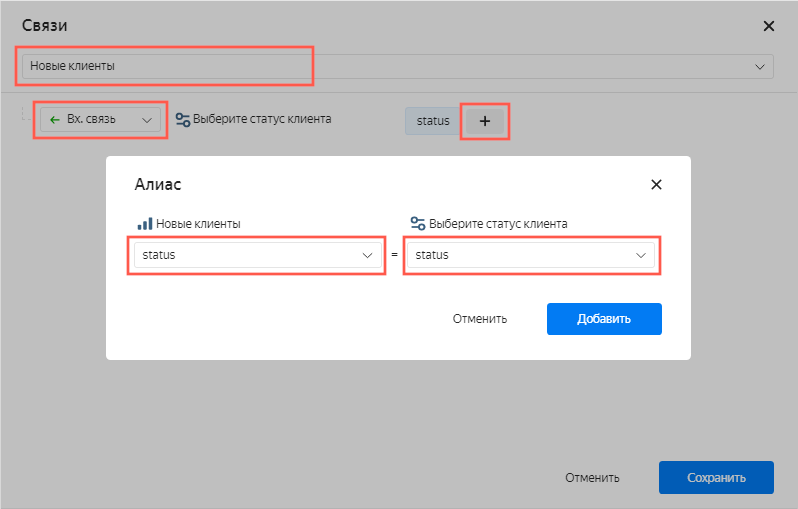
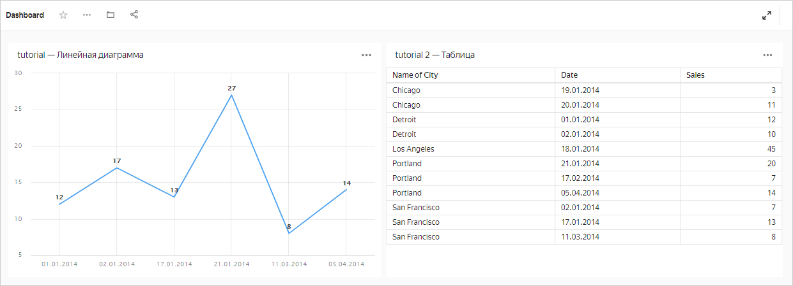
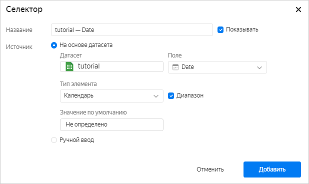
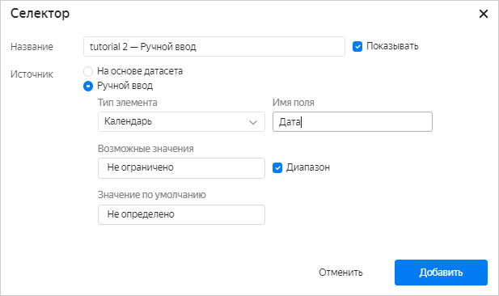
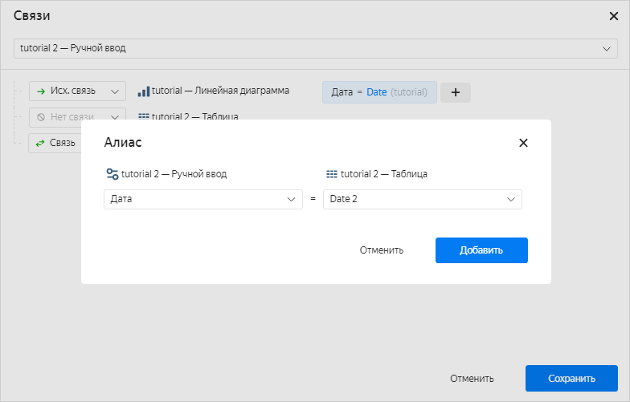
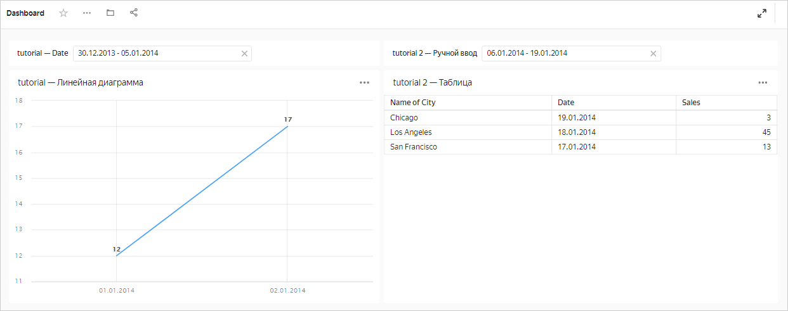
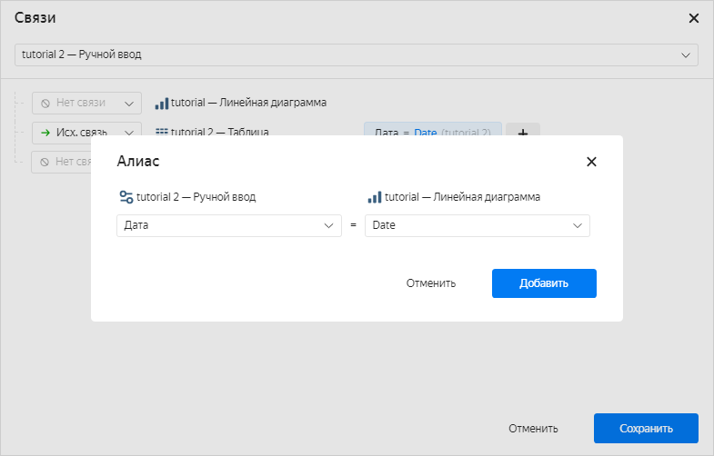

# Создание алиаса в {{ datalens-name }}

Чтобы добавить [алиас](../../concepts/dashboard.md#alias) для пары виджетов:



1. На панели слева нажмите  **Дашборды** и выберите нужный дашборд. Если у вас нет дашборда, [создайте его](create.md).
1. В верхней части страницы нажмите кнопку **Редактировать**.
1. Нажмите кнопку **Связи**.

   1. Выберите первый виджет из списка.
   1. Для второго виджета, с которым устанавливается связь, в выпадающем списке выберите тип связи.
   1. Напротив имени второго виджета нажмите .
   1. Настройте алиас:

      1. Выберите из обоих виджетов поля, для которых создается алиас. Поля в обоих виджетах должны быть одного и того же типа.

         

      1. Нажмите кнопку **Добавить**.

   1. Внизу окна **Связи** нажмите кнопку **Сохранить**.

1. Вверху дашборда нажмите кнопку **Сохранить**.



Чарт **tutorial — Линейная диаграмма** построен на основе датасета **tutorial**, а чарт **tutorial 2 — Таблица** — на основе датасета **tutorial 2**.

1\. Добавим на дашборд селектор **tutorial — Date** с типом **На основе датасета**. В параметрах селектора выберем датасет `tutorial` и поле `Date`. Связь между селектором и чартом **tutorial — Линейная диаграмма** установится автоматически, потому что они созданы на основе одного датасета.

   

2\. Добавим на дашборд селектор **tutorial 2 — Ручной ввод** с типом **Ручной ввод**. В параметрах селектора выберем тип элемента **Календарь** и имя поля `Дата`.

   

3\. Установим связь между селектором **tutorial 2 — Ручной ввод** и чартом **tutorial 2 — Таблица** с помощью алиаса. При создании алиаса выберем поле `Дата` в селекторе и поле `Date 2` в датасете `tutorial 2`.

   

Теперь селектор **tutorial — Date** фильтрует чарт **tutorial — Линейная диаграмма**, а селектор **tutorial 2 — Ручной ввод** — чарт **tutorial 2 — Таблица**.

   

4\. Установим связь между селектором **tutorial 2 — Ручной ввод** и чартом **tutorial — Линейная диаграмма** с помощью алиаса. При создании алиаса выберем поле `Дата` в селекторе и поле `Date` в датасете `tutorial`.

   

Установка связи между селектором **tutorial 2 — Ручной ввод** и чартом **tutorial — Линейная диаграмма** приводит к тому, что селекторы **tutorial 2 — Ручной ввод** и **tutorial — Date** связываются между собой. Это происходит потому, что чарт **tutorial — Линейная диаграмма** и селектор **tutorial — Date** построены на основе одного датасета. Теперь любой селектор приводит к автоматической установке соответствующих значений в другом селекторе и фильтрации обоих чартов. Чтобы отменить связь селекторов, нужно задать между ними тип связи **Игнор**.



При добавлении алиаса убедитесь, что поле, по которому фильтрует селектор, присутствует в датасете, по которому построен чарт. В противном случае связь работать не будет.





