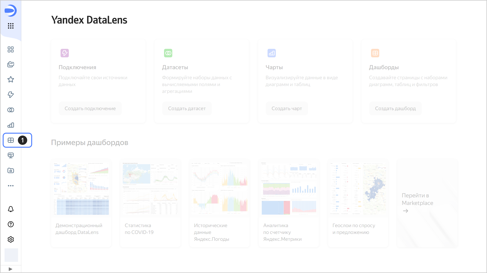
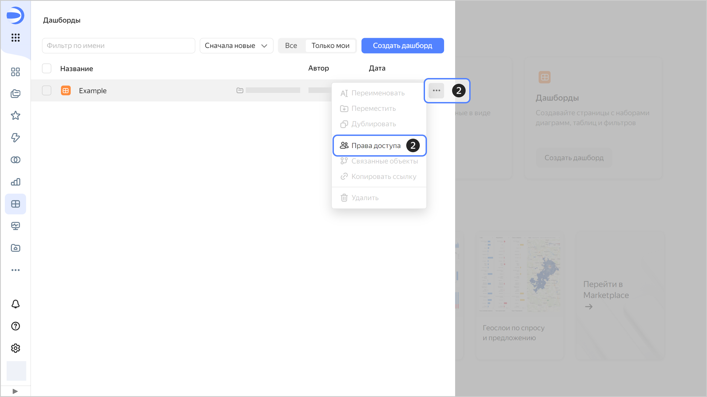
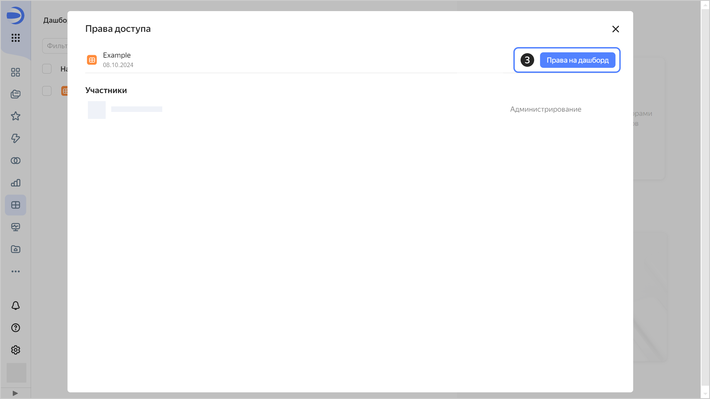

# Управление доступом к дашборду

Чтобы настроить права доступа к дашборду:

1. На панели слева нажмите  **{{ ui-key.datalens.component.aside-header.view.switch_dashboards }}**.
   
   

1. В строке с нужным дашбордом нажмите значок  и выберите **{{ ui-key.datalens.component.access-rights.view.section_main-title }}**.

   

1. Нажмите кнопку **{{ ui-key.datalens.component.access-rights.view.button_access-to-dash }}**.

   

1. Введите имя пользователя или группу **Все**.

   
   

1. (опционально) Напишите комментарий для пользователя, которому выдаете доступ.
1. Укажите права доступа и нажмите кнопку **{{ ui-key.datalens.component.access-rights.view.button_add }}**.

   



