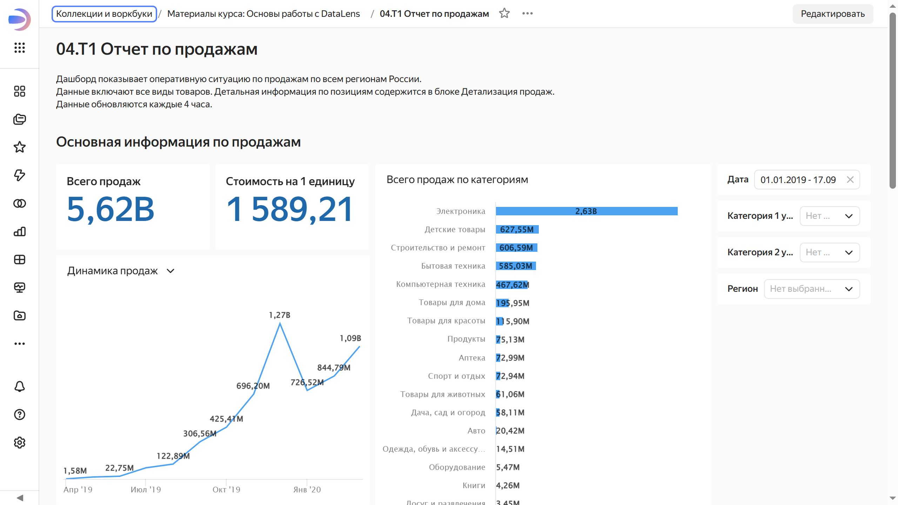

# Управление доступом к дашборду

Доступ к дашборду настраивается по-разному в зависимости от того, находится этот дашборд в [воркбуке](../../workbooks-collections/index.md#enable-workbooks) или в папке. Если дашборд хранится в воркбуке, то его путь начинается со слов **Коллекции и воркбуки**. Если таких слов нет, значит, ваш дашборд хранится в папке.





Чтобы настроить права доступа к дашборду:



- В воркбуке

  1. Убедитесь, что у пользователя есть [роль для доступа к сервису](../../security/roles.md#service-roles) {{ datalens-name }}, то есть открывается ли у него {{ datalens-name }}. Если это не так, обратитесь к администратору, чтобы он добавил пользователя [по инструкции](../../security/add-new-user.md).

  1. Назначьте пользователю роль на воркбук, в котором хранится дашборд. Для этого:

     1. Перейдите на страницу воркбука, нажмите рядом с ним  и выберите **Доступ**.

     1. Нажмите кнопку **Добавить пользователя**.

     1. В открывшемся окне выберите пользователя, укажите [роль](../../security/roles.md#workbook-roles) и нажмите кнопку **Сохранить**. Пользователю будут назначены права на воркбук и объекты внутри него.

- В папке

  1. На панели слева нажмите  **{{ ui-key.datalens.component.aside-header.view.switch_dashboards }}**.
   
     

  1. В строке с нужным дашбордом нажмите значок  и выберите **{{ ui-key.datalens.component.access-rights.view.section_main-title }}**.

     

  1. Нажмите кнопку **{{ ui-key.datalens.component.access-rights.view.button_access-to-dash }}**.

     

  1. Введите имя пользователя или группу **Все**.

  1. (опционально) Напишите комментарий для пользователя, которому выдаете доступ.

  1. Укажите права доступа и нажмите кнопку **{{ ui-key.datalens.component.access-rights.view.button_add }}**.

     

  



