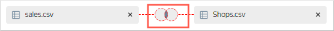
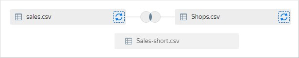
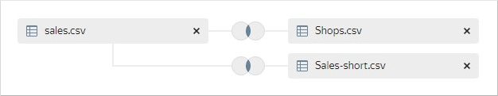
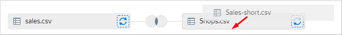
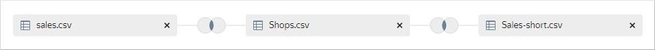
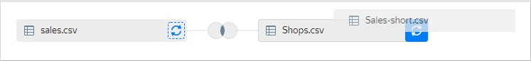

# Объединение данных из нескольких CSV-подключений



Для всех других типов подключений данные из разных источников на уровне одного датасета объединить нельзя.



Если датасет построен на основе подключения к CSV-файлу, в него можно добавить данные из подключения к другому CSV-файлу.

Чтобы объединить данные из нескольких CSV-файлов в одном датасете:

1. Откройте датасет на основе CSV-подключения. Если у вас нет такого датасета, [создайте его](create.md).
1. В левом верхнем углу переключитесь на вкладку **Источники**.
1. В блоке **Подключения** нажмите  **Добавить**.
1. Выберите подключение к другому CSV-файлу.
1. В блоке **Таблицы** отобразится таблица с данными из CSV-файла. Выберите ее и перетащите на рабочую область. Между таблицами автоматически установится связь по первому совпадению имени полей и типа данных полей.
1. Отредактируйте связь между таблицами:

   1. Нажмите на изображение связи между таблицами.

      

   1. Выберите тип связи: `inner`, `left`, `right` или `full`.
   1. Нажмите **Добавить связь**.
   1. Выберите поля для связи между таблицами. Установить связь можно только по полям с одним и тем же типом данных.
   1. Нажмите **Применить**.

1. Повторите пункты с 3 по 6 для добавления подключений к другим CSV-файлам.
1. При добавлении третьей и последующих таблиц автоматически установится связь с первой таблицей на рабочей области.

   
   
   Между таблицами автоматически установится связь по первому совпадению имени полей и типа данных полей.

   

   При перетаскивании новой таблицы на рабочую область вы можете явно указать к какой таблице добавить связь. Наведите новую таблицу на добавленную ранее так, чтобы вокруг последней появилась серая рамка, затем отпустите таблицу.

   

   Новая связь образуется с указанной таблицей.

   

   Вы можете заменить ранее добавленную таблицу. При перетаскивании новой таблицы наведите ее на иконку с круговыми стрелками справа от заменяемой таблицы так, чтобы фон иконки стал синим, затем отпустите таблицу.

   

1. Нажмите **Сохранить**.

#### См. также {#see-also}
- [{#T}](../../concepts/data-join.md#add-connection)
- [{#T}](join-data.md)
