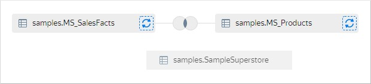
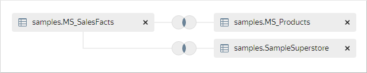
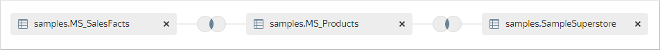
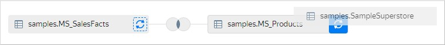

# Объединение данных из нескольких таблиц

Если в источнике доступно несколько таблиц, данные из них можно объединить:

1. Откройте датасет. Если у вас нет датасета, [создайте его](create.md).
1. В левом верхнем углу переключитесь на вкладку **Источники**.
1. В блоке **Таблицы** выберите таблицу и перетащите ее на рабочую область.
1. Выберите следующую таблицу и перетащите ее на рабочую область. Между таблицами автоматически установится связь по первому совпадению имени полей и типа данных полей.
1. Чтобы отредактировать связь между таблицами:

   1. Нажмите на изображение связи между таблицами.

      

   1. Выберите тип связи: `inner`, `left`, `right` или `full`.
   1. Выберите поля для связи между таблицами. Установить связь можно только по полям с одним и тем же типом данных.
   1. При необходимости добавьте связь между таблицами по другим полям. Для этого нажмите кнопку **Добавить связь**.
   1. Нажмите **Применить**.

1. Повторите пункты 4 и 5 для добавления таблиц.
1. При добавлении третьей и последующих таблиц автоматически установится связь с первой таблицей на рабочей области.

   
   
   Между таблицами автоматически установится связь по первому совпадению имени полей и типа данных полей.

   

   При перетаскивании новой таблицы на рабочую область вы можете явно указать к какой таблице добавить связь. Наведите новую таблицу на добавленную ранее так, чтобы вокруг последней появилась серая рамка, затем отпустите таблицу.

   

   Новая связь образуется с указанной таблицей.

   

   Вы можете заменить ранее добавленную таблицу. При перетаскивании новой таблицы наведите ее на иконку с круговыми стрелками справа от заменяемой таблицы так, чтобы фон иконки стал синим, затем отпустите таблицу.

   

1. Нажмите **Сохранить**.

Вы можете [добавить данные в датасет с помощью SQL-запроса](add-data.md) и объединить их с другими таблицами.

#### См. также {#see-also}
- [{#T}](../../concepts/data-join.md#ui-join)
