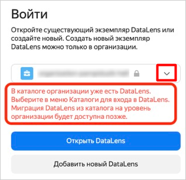
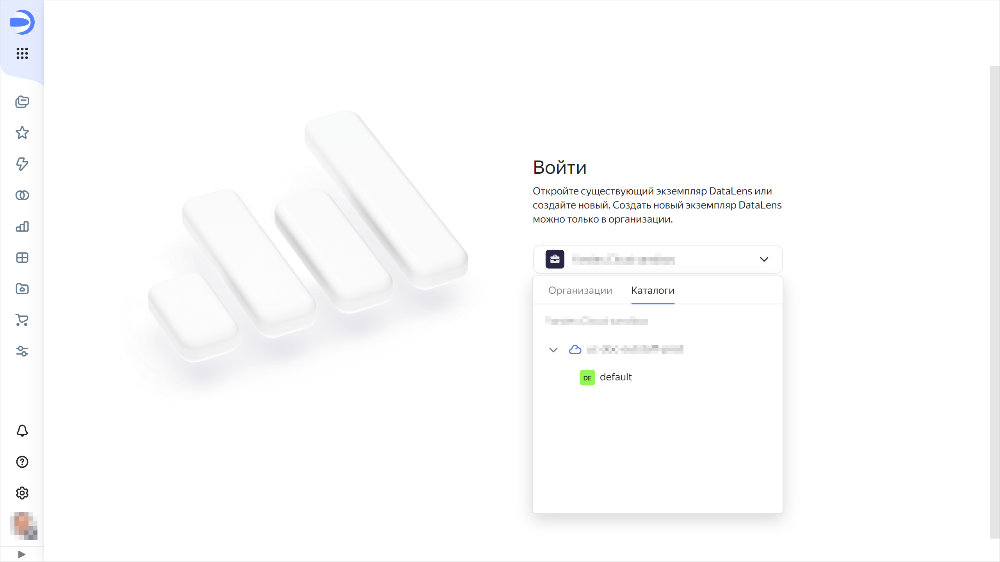

# Переключение между экземплярами {{ datalens-short-name }}

Если вы администратор или пользователь нескольких [организаций](../../concepts/organizations.md), вы можете переключаться между ними. Это позволит работать в нескольких экземплярах {{ datalens-short-name }}.

Вы также можете перейти в режим **Без организации** и работать с {{ datalens-short-name }} в каталоге облака.



Вы можете работать в каталоге облака, если {{ datalens-short-name }} был активирован ранее. Сейчас активация доступна только на уровне организаций.



Чтобы переключить экземпляр {{ datalens-short-name }}:

1. Перейдите на [главную страницу]({{ link-datalens-main }}) {{ datalens-short-name }}.
1. В левом нижнем углу нажмите фото вашего аккаунта. 
1. В списке выберите организацию, на которую хотите переключиться, или режим **Без организации**:

   

   - Организация
   
     Если вы выбрали организацию, в которой на уровне организации есть экземпляр {{ datalens-short-name }}, откроется его экземпляр.

     Если вы выбрали организацию, в которой на уровне организации нет экземпляра {{ datalens-short-name }}, но есть на уровне каталога облака, входящего в организацию:
     
     1. В выпадающем меню перейдите на вкладку **Каталоги**.
         
         

     1. Выберите каталог нужного облака, содержащий экземпляр {{ datalens-short-name }}. 

         

      1. Нажмите **Открыть DataLens**.

   - Без организации
     
     Если вы хотите использовать экземпляр {{ datalens-short-name }} в каталоге облака, но само облако не включено в организацию:

     1. В выпадающем меню перейдите на вкладку **Каталоги**.
     1. Раскройте список каталогов нужного облака и выберите один из них.
     1. Нажмите **Открыть DataLens**.

   