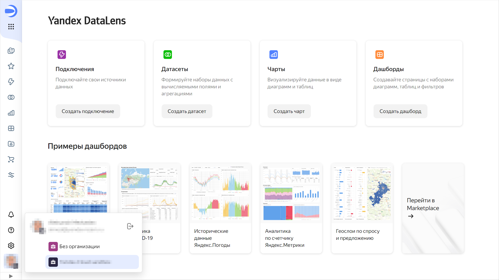

# Переключение между экземплярами {{ datalens-short-name }}

Если вы администратор или пользователь нескольких [организаций](../../concepts/organizations.md), вы можете переключаться между ними. Это позволит работать в нескольких экземплярах {{ datalens-short-name }}.

Чтобы переключить экземпляр {{ datalens-short-name }}:

1. Перейдите на [главную страницу]({{ link-datalens-main }}) {{ datalens-short-name }}.
1. В левом нижнем углу нажмите фото вашего аккаунта.

   

1. В списке выберите организацию, на которую хотите переключиться:

   * Если вы выбрали организацию, в которой активирован экземпляр {{ datalens-short-name }}, откроется его экземпляр.
   * Если вы выбрали организацию, в которой не активирован экземпляр {{ datalens-short-name }}, [активируйте](../../quickstart.md#before-you-begin) его.