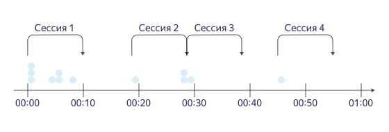

# Правила тарификации для {{ datalens-full-name }}

В рамках сервиса {{ datalens-short-name }} тарифицируются:
* Количество десятиминутных сессий к источнику данных. Учитываются запросы, которые отправляются из чартов и дашбордов.
* Объем БД для материализованных данных.
* Дополнительные возможности сервиса {{ datalens-short-name }}.

Количество доступных сессий, объем БД материализации и список доступных возможностей определяются ежемесячной подпиской на тариф.
Вы можете выбрать один из следующих тарифов: **Бесплатный** или **Стандарт**.

Подписка действует на [каталог облака](../resource-manager/concepts/resources-hierarchy.md#folder), в котором находится экземпляр сервиса {{ datalens-short-name }}.



Дополнения для сервиса {{ datalens-short-name }}, которые доступны в {{ marketplace-short-name }}, не влияют на выбранный тариф и оплачиваются отдельно.



## Цены и возможности {#prices}



\* Функции геокодирования — [GEOCODE](function-ref/GEOCODE.md) и [GEOINFO](function-ref/GEOINFO.md).

Уточнить период тарификации сервиса своего экземпляра {{ datalens-short-name }} можно в вашем [платежном аккаунте](https://datalens.yandex.ru/billing).

## Сессия {#sessions}

Сессия — промежуток времени в десять минут, в течение которого пользователь делает запросы к источнику данных. Например, обновляет графики и дашборды, строит произвольные запросы из визарда.

Сессия начинается с запроса к данным и заканчивается, когда в течение десяти и более минут не было новых запросов.
Разница во времени между первым и последним запросами округляется до десяти минут в большую сторону.

Сессия считается по активностям пользователя в каталоге. Если несколько пользователей работают одновременно в одном экземпляре {{ datalens-short-name }}, то сервис засчитает несколько сессий.
Если один пользователь работает одновременно в нескольких экземплярах {{ datalens-short-name }}, то расчет сессий в этих экземплярах производится независимо друг от друга.

### Типы сессий {#session-types}
Сессии в {{ datalens-short-name }} делятся на внутренние и внешние:

Тип сессии | Источники данных
-----  | -----
Внутренняя | Материализованные датасеты CSV-подключения Metrica Metrica Logs API AppMetrica AppMetrica Logs API Управляемые базы данных {{ yandex-cloud }}:  - [Managed Service for ClickHouse](../managed-clickhouse)  - [Managed Service for PostgreSQL](../managed-postgresql)  - [Managed Service for MySQL®](../managed-mysql)
Внешняя | Любой внешний источник данных, который не относится к Яндексу и {{ yandex-cloud }}.

### Как считаются сессии {#how-sessions-counted}

Каждый тариф определяет количество доступных внешних сессий. При этом количество внутренних сессий и запросов не ограничено вне зависимости от тарифа.
Если в сессии есть хотя бы одно обращение к внешнему источнику данных, тогда сессия считается внешней.

> Например, на дашборде размещены чарты, которые обращаются к материализованному датасету и один чарт, который обращается к внешнему источник данных.
> 
> При обновлении такого дашборда, сессия будет считаться внешней.

В сессии не учитываются запросы из:
* окна предпросмотра в датасетах;
* публичных дашбордов и чартов.

## Материализованные данные {#materialized-data}

Для каждого экземпляра {{ datalens-short-name }} доступна квота материализованных данных.

Квота включает:
* Данные для предпросмотра датасетов.
* Данные материализованных датасетов.
* Данные материализованных подключений.
* Данные кэширования результатов геокодирования.

  

  Время хранения кэша результатов геокодирования — 30 дней.

  

## Подключение тарифа {#enable-the-plan}

По умолчанию {{ datalens-short-name }} активируется с тарифом **Бесплатный**. 

Перейти на платный тариф **Стандарт** можно на странице [выбора тарифа](https://datalens.yandex.ru/billing). Началом периода тарификации сервиса будет считаться дата перехода на тариф **Стандарт**. При подключении тарифа **Стандарт** списание средств происходит в первый день периода тарификации сервиса. При продлении тарифа **Стандарт** средства списываются накануне первого дня нового периода тарификации сервиса. 

Тарифы являются невозвратными.

Пример:

> 10 января вы активировали экземпляр {{ datalens-short-name }} с тарифом **Бесплатный**.
>
> 15 января вы перешли на тариф **Стандарт**, в этот же день произойдет списание средств — 1900 ₽.
>
> 14 февраля произойдет списание за следующий период тарификации сервиса (с 15 февраля по 14 марта) по тарифу **Стандарт**.
>
> 14 марта произойдет списание за следующий период тарификации сервиса (с 15 марта по 14 апреля) по тарифу **Стандарт**.
>
> 18 марта вы решаете отменить подписку на тариф **Стандарт**, этот тариф будет доступен до конца периода тарификации — до 14 апреля.
>
> 15 апреля будет активирован тариф **Бесплатный**.

### Правила смены тарифа {#change-the-plan}

Переход с тарифа **Бесплатный** на **Стандарт** возможен в любое время. При этом началом периода тарификации сервиса станет дата перехода на новый тариф.

Переход с тарифа **Стандарт** на **Бесплатный** произойдет после того, как закончится оплаченный период тарификации сервиса тарифа Стандарт.

### Автоматическая оплата дополнительных сессий {#autoprolongation}

Автоматическая оплата дополнительных сессий недоступна для тарифа **Бесплатный**. Если вы достигли лимита сессий или объема БД для материализации на тарифе **Бесплатный**, вы можете самостоятельно перейти на тариф **Стандарт**. Переход с тарифа **Бесплатный** на тариф **Стандарт** не происходит автоматически. 

Для тарифа **Стандарт** вы можете выбрать автоматическую оплату дополнительных сессий в [настройках лимита автопродления](https://datalens.yandex.ru/billing).

## Блокировки {#locks}

### Блокировка при достижении лимита внешних сессий {#locks-sessions}

Если вы достигли лимита на количество внешних сессий, {{ datalens-short-name }} автоматически заблокирует выполнение запросов из чартов и дашбордов ко внешним источникам. Остальные функции {{ datalens-short-name }} останутся доступными.
На главной странице сервиса {{ datalens-short-name }} появится сообщение о достижении лимита.

Для выхода из блокировки выполните одно из условий:
* Перейдите с тарифа **Бесплатный** на **Стандарт**.
* Включите [автоматическую доплату дополнительных сессий](#autoprolongation) для тарифа **Стандарт**.
* Дождитесь начала нового периода тарификации сервиса (для любых тарифов).

### Блокировка облака {#locks-cloud}

Ваше облако может быть заблокировано при наличии задолженности, при завершении пробного периода или при нарушении [условий использования {{ yandex-cloud }}](https://yandex.ru/legal/cloud_termsofuse/). 

После блокировки облака ваш экземпляр {{ datalens-short-name }} будет недоступен. Работа с {{ datalens-short-name }} будет невозможна до восстановления облака.

Подробнее о блокировке можно прочитать в разделе [Автоматическая блокировка облака](../overview/concepts/data-deletion.md#block).