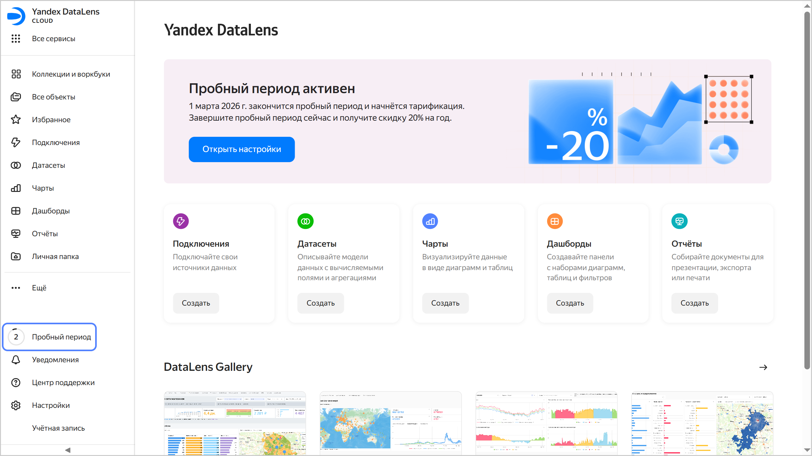

# Правила тарификации для {{ datalens-full-name }}

{{ datalens-full-name }} предоставляется **бесплатно для индивидуального использования**, а для **командной работы оплата рассчитывается исходя из количества рабочих мест**. Новым клиентам доступен [пробный период](#trial): до 30 дней бесплатного использования сервиса, независимо от количества рабочих мест. {#seats}

* Каждому пользователю {{ datalens-full-name }} требуется рабочее место, даже если он только просматривает или редактирует дашборды.
* Рабочие места выдаются автоматически при первом входе в сервис новых пользователей.
* Администратор [управляет рабочими местами](./settings/seats.md).

Порядок оказания технической поддержки определяется в соответствии с выбранным [тарифным планом поддержки {{ yandex-cloud }}]({{ link-docs }}/support/overview).

## Цены для региона Россия {#prices}

Цены на ресурсы {{ yandex-cloud }} в разных [регионах]({{ link-docs }}/overview/concepts/region) различаются. Валюта плательщика зависит от [юридического лица]({{ link-docs }}/billing/quickstart/), с которым был заключен договор. Все цены в рублях и тенге указаны с НДС.



- Цены в рублях {#prices-rub}

  

- Цены в тенге {#prices-kzt}

  



Стоимость использования {{ datalens-name }} зависит от количества рабочих мест. Если рабочих мест больше одного, **общая стоимость получается путем умножения их количества на стоимость одного рабочего места**.

Подсчет рабочих мест ведется в рамках месяца, независимо от активности пользователей. Сокращение количества рабочих мест можно запланировать в любой день, но изменение вступит в силу только в первый день следующего календарного месяца.



Рассмотрим на примере мая 2026 года. В экземпляре {{ datalens-name }} по состоянию на 1 мая 2026 года куплено 10 рабочих мест.

12 мая приобрели 5 рабочих мест, а 20 мая — еще 3 рабочих места.

Общая стоимость за май составит (10 + 5 + 3) × {{ sku|RUB|datalens.users.v1|string }} = 





## Пробный период {#trial}

Для новых клиентов {{ datalens-name }} действует _пробный период_ — 15 дней бесплатной командной работы. Когда он закончится, нужно либо привязать платежный аккаунт для оплаты рабочих мест, либо оставить только одно рабочее место.

* Если привязать платежный аккаунт до конца пробного периода, он продлится еще на 15 дней — всего получится 30 дней.
* Если не привязать платежный аккаунт, все рабочие места, кроме одного, станут неактивными. Сокращение до одного места автоматически запланируют на дату окончания пробного периода — изменить это до привязки аккаунта нельзя.
* После привязки платежного аккаунта по окончании пробного периода начнется платная работа: сумма будет зависеть от [числа рабочих мест](./settings/seats.md#number-of-seats), указанного в настройках сервиса. При этом автоматическое сокращение до одного рабочего места отменится.

Пробный период можно использовать только один раз для одного {{ datalens-name }} — он запускается автоматически при активации {{ datalens-name }} в организации. После окончания пробного периода цена за первый месяц будет посчитана пропорционально количеству оставшихся в месяце дней.

Отсчет дней до окончания пробного периода отображается в индикаторе на боковой панели.





От количества рабочих мест зависит лимит на количество запросов из [непублично встроенных чартов](./security/private-embedded-objects.md) (чартов в визарде, Editor, QL-чартов) в {{ datalens-name }}. Для непублично встроенных дашбордов суммируются запросы из добавленных на него чартов. При этом обычные запросы, производимые пользователями в интерфейсе {{ datalens-name }}, а также запросы из [публично встроенных чартов](./concepts/datalens-public.md) не ограничены. {#packet-queries}



* Ограничение на число запросов из непублично встроенных чартов: 2 000 запросов в месяц на одно рабочее место. Это ограничение действует не для каждого отдельно взятого рабочего места, а для всего {{ datalens-name }} из расчета: {#packet-queries}

   > 2 000 запросов × Количество рабочих мест

* Считаются только успешно выполненные запросы на получение данных для отрисовки чартов. Если для отрисовки одного чарта выполняется несколько запросов, это учитывается как один запрос.

* Рабочие места не связываются со встроенными чартами напрямую, их необязательно назначать внешним пользователям, которые просматривают эти чарты. Значение имеет только общее количество мест, купленное в {{ datalens-name }}, как свободных, так и назначенных пользователям.

   Таким образом, чем активнее используется {{ datalens-name }} (чем больше в нем куплено рабочих мест), тем выше будет лимит на непубличные встраивания.

* Если с {{ datalens-name }} работают несколько пользователей, но при этом производится много запросов из непубличных встраиваний, потребуется докупить рабочие места, исходя из расчета выше.

* Учитывается каждый запрос за данными из непублично встроенного чарта. Например, у вас встроен дашборд с 10 чартами и 5 селекторами. Тогда при обновлении страницы с дашбордом будет учитываться 10 запросов.
   
   [Оценить количество запросов из непублично встроенных чартов](./settings/seats.md#embedded-queries-count) можно с помощью подключения [Usage Analytics](./operations/connection/create-usage-tracking.md). Если общее количество таких запросов в {{ datalens-name }} будет превышать ограничение, может потребоваться покупка дополнительных рабочих мест.
   
   При превышении лимита на количество запросов из непублично встроенных чартов и включенной [автоматической покупкой](./settings/seats.md#purchase-automatically) рабочих мест автоматическая докупка новых рабочих мест не происходит.



#### Полезные ссылки {#see-also}
* [Вопросы про тарификацию и оплату](./qa/pricing.md)
* [Управление рабочими местами в {{ datalens-name }}](./settings/seats.md)

