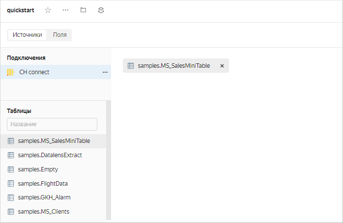
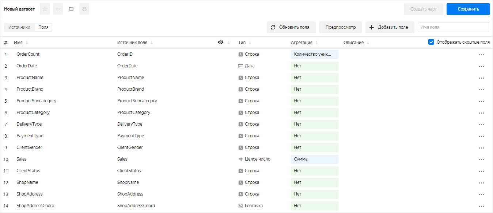
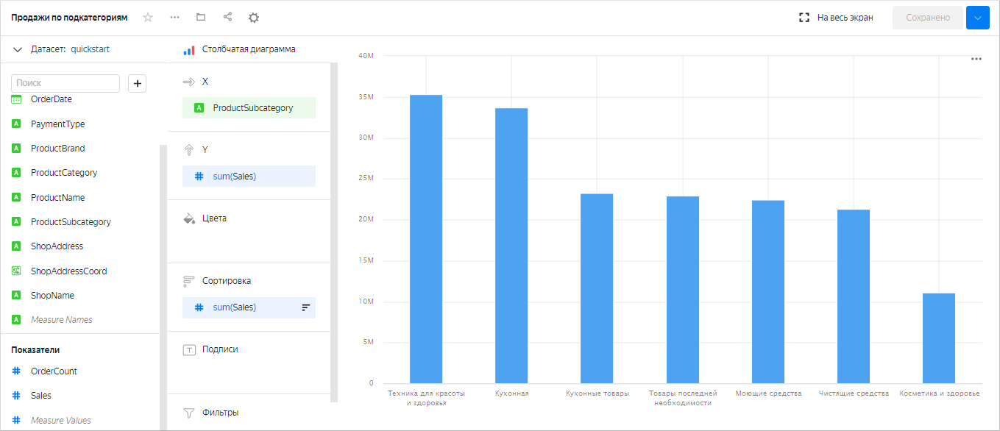
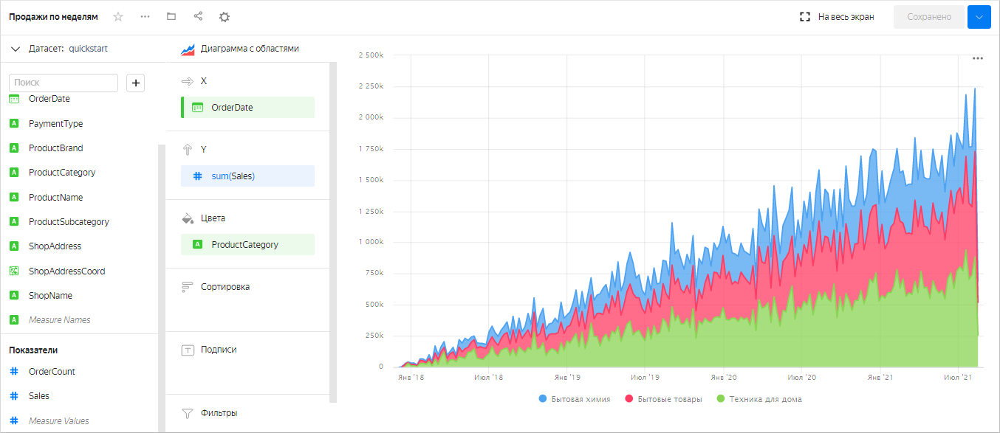
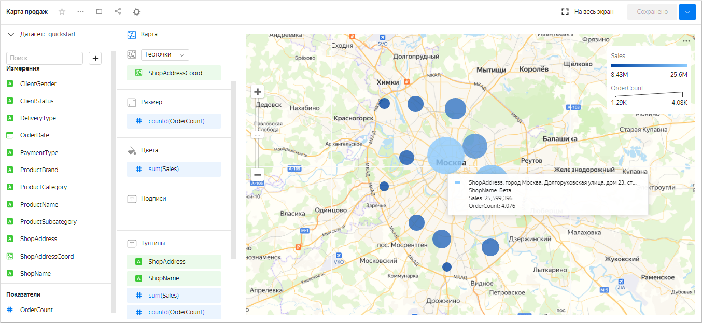
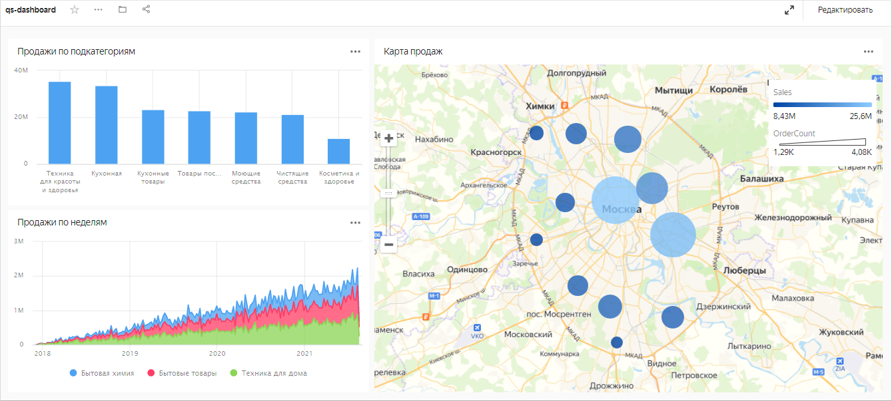
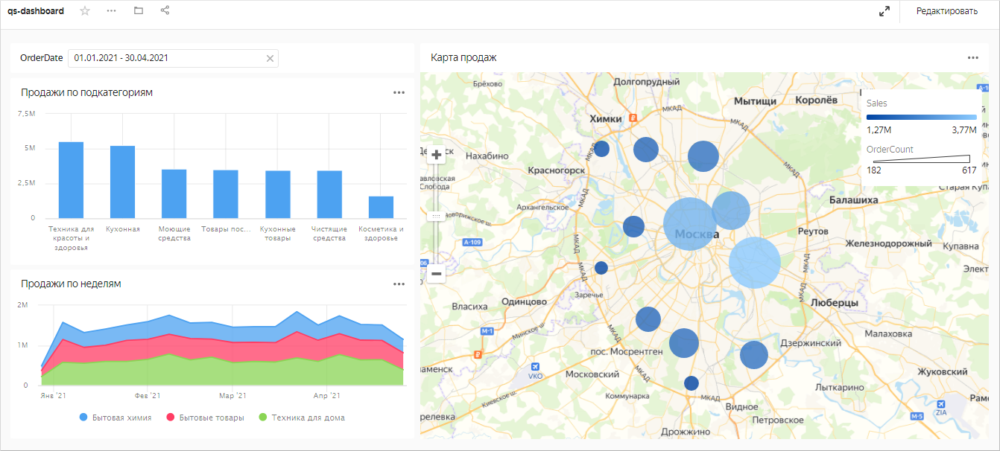

# Как начать работать с {{ datalens-short-name }}

В этой инструкции вы создадите свой первый [датасет](concepts/dataset/index.md), для визуализации данных построите несколько [чартов](concepts/chart/index.md) и разместите их на [дашборде](concepts/dashboard.md).



## Создайте подключение {#create-connection}



## Создайте датасет {#create-dataset}

1. В правом верхнем углу нажмите кнопку **Создать датасет**.

1. Перенесите на рабочую область таблицу `MS_SalesMiniTable`.

   

1. Перейдите на вкладку **Поля**.

1. В столбце **Агрегация** для поля `Sales` выберите **Сумма**.
1. Создайте показатель с количеством заказов:

   1. Переименуйте поле `OrderID` в `OrderCount`.
   1. Измените тип агрегации на **Количество уникальных**.
1. Для поля `ShopAddressCoord` измените тип данных на **Геоточка**.
1. Сохраните датасет:

   1. В правом верхнем углу нажмите кнопку **Сохранить**.
   1. Введите имя датасета и нажмите кнопку **Создать**.

   

## Создайте чарт — столбчатая диаграмма {#create-column-chart}

1. В правом верхнем углу нажмите кнопку **Создать чарт**.
1. Выберите тип визуализации **Столбчатая диаграмма**.
1. Добавьте на чарт подкатегорию товаров. Для этого из раздела **Измерения** перетащите поле `ProductSubcategory` в секцию **X**.
1. Добавьте на чарт показатель продаж. Для этого из раздела **Показатели** перетащите поле `Sales` в секцию **Y**.
1. Отсортируйте чарт по убыванию по показателю продаж — из раздела **Показатели** перетащите поле `Sales` в секцию **Сортировка**.
1. Сохраните чарт:

   1. В правом верхнем углу нажмите кнопку **Сохранить**.
   1. В открывшемся окне введите название чарта **Продажи по подкатегориям** и нажмите кнопку **Сохранить**.

   

## Создайте чарт — накопительная диаграмма с областями {#create-area-chart}

1. В созданном на предыдущем шаге чарте выберите тип визуализации **Накопительная диаграмма с областями**.
1. Замените подкатегории товаров на дату заказа на оси X. Для этого из раздела **Измерения** перетащите поле `OrderDate` в секцию **X** и наведите его над полем `ProductSubcategory`, пока то не станет красным.
1. Добавьте на чарт категорию товаров. Для этого из раздела **Измерения** перетащите поле `ProductCategory` в секцию **Цвета**.
1. Отобразите чарт по неделям:

   1. В секции **X** нажмите на иконку с календарем у поля `OrderDate`.
   1. В поле **Группировка** выберите **Округление** → **Неделя**.
   1. Нажмите кнопку **Применить**.

1. Сохраните чарт:

   1. В правом верхнем углу нажмите значок  → **Сохранить как копию**.
   1. В открывшемся окне введите название нового чарта **Продажи по неделям** и нажмите кнопку **Сохранить**.

   

## Создайте чарт — карта {#create-map-chart}

1. В созданном на предыдущем шаге чарте выберите тип визуализации **Карта**.
1. Добавьте на карту координаты точек продаж. Для этого из раздела **Измерения** перетащите поле `ShopAddressCoord` в секцию **Точки (Геоточки)**.
1. Измените размер точек относительно показателя количества заказов. Для этого из раздела **Показатели** перетащите поле `OrderCount` в секцию **Размер точек**.
1. Измените цвет точек относительно показателя продаж. Для этого из раздела **Показатели** перетащите поле `Sales` в секцию **Цвета**.
1. Добавьте в секцию **Тултипы** поля:

    * `ShopAddress`
    * `ShopName`
    * `Sales`
    * `OrderCount`
1. Сохраните чарт:

    1. В правом верхнем углу нажмите значок  → **Сохранить как копию**.
    1. В открывшемся окне введите название нового чарта **Карта продаж** и нажмите кнопку **Сохранить**.

    

## Создайте дашборд и добавьте на него чарты {#dashboard-create}

1. Перейдите на главную страницу [{{ datalens-short-name }}]({{ link-datalens-main }}).
1. На панели слева нажмите  **Дашборды**.
1. Нажмите кнопку **Создать дашборд**.
1. На панели в нижней части страницы выберите **Чарт**.
1. В открывшемся окне нажмите кнопку **Выбрать**.
1. Выберите чарт **Карта продаж**. После этого автоматически заполнится поле **Название**.
1. Нажмите кнопку **Добавить**.
1. Аналогичным способом добавьте чарты **Продажи по подкатегориям** и **Продажи по неделям**.
1. Расположите чарты на дашборде в удобном для вас порядке.

   

## Добавьте селектор на дашборд {#add-selectors}

1. На панели в нижней части страницы выберите **Селектор**.
1. Добавьте селектор с календарем по датам заказа:

   1. Выберите созданный датасет.
   1. Выберите поле `OrderDate`. После этого автоматически заполнится поле **Название**.
   1. Включите опцию **Диапазон**.
   1. Нажмите кнопку **Добавить**.

1. Расположите селектор на дашборде в удобном для вас месте.
1. Сохраните дашборд:

   1. В правом верхнем углу дашборда нажмите кнопку **Сохранить**.
   1. Введите название дашборда и нажмите **Создать**.

   

## Что дальше {#whats-next}

* Изучите [руководства](tutorials/index.md) с примерами использования сервиса.
* Ознакомьтесь с [концепциями сервиса](./concepts/index.md).
* Посмотрите [пример готового дашборда](https://datalens.yandex/9fms9uae7ip02).


