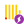
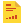
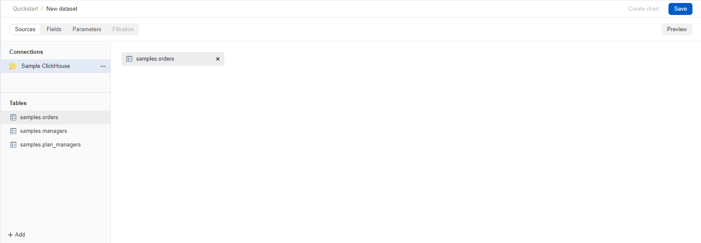
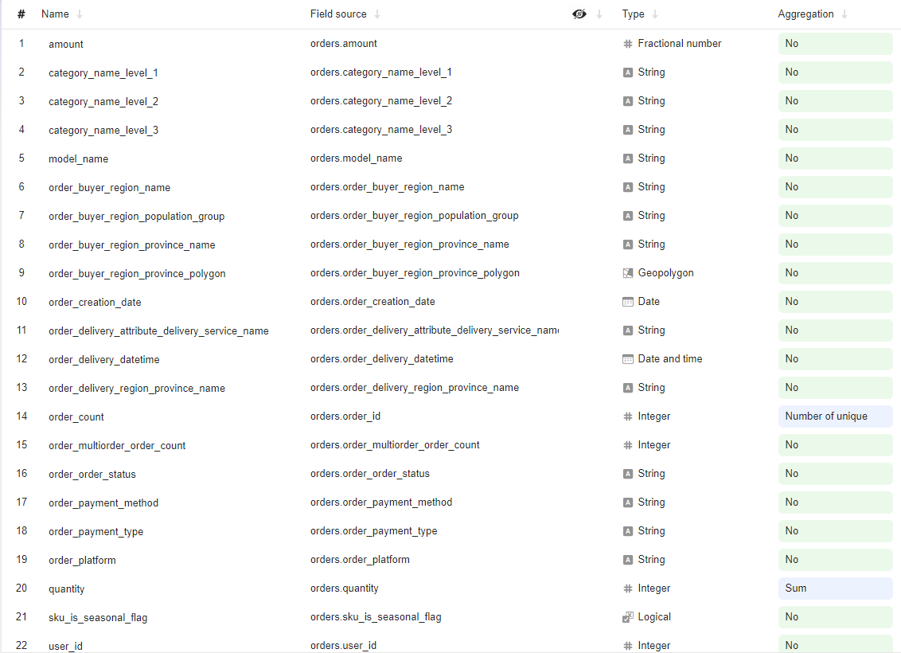
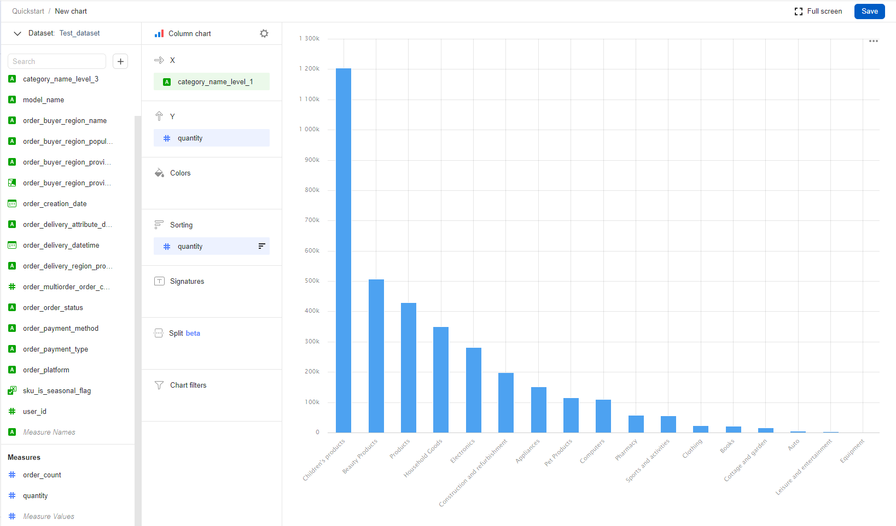
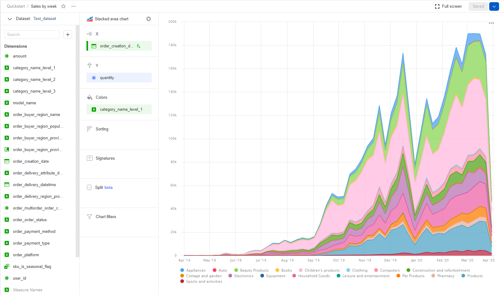
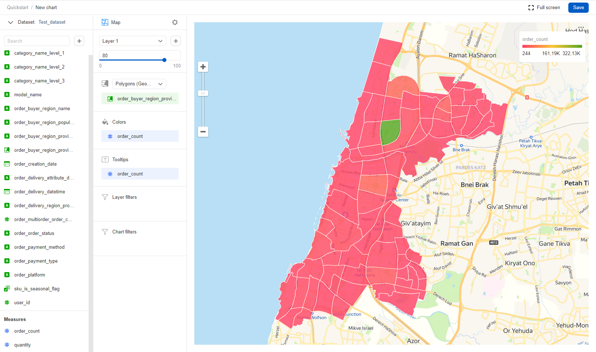
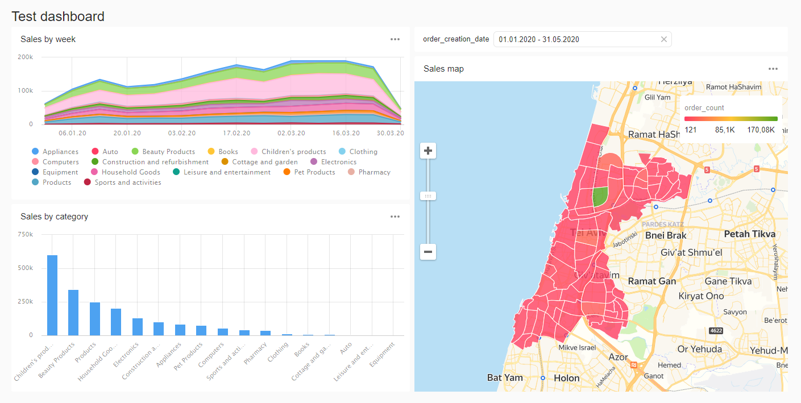

# Как начать работать c {{ datalens-short-name }}



В этой инструкции вы создадите свой первый [датасет](concepts/dataset/index.md), для визуализации данных построите несколько [чартов](concepts/chart/index.md) и разместите их на [дашборде](concepts/dashboard.md).













## Создайте подключение {#create-connection}



## Создайте датасет {#create-dataset}

1. В правом верхнем углу нажмите кнопку **Создать датасет**.
1. Перенесите на рабочую область таблицу **MS_SalesMiniTable**.

    

1. Перейдите на вкладку **Поля**.
1. В столбце **Агрегация** для поля **Sales** выберите **Сумма**.
1. Создайте показатель с количеством заказов.
    1. Переименуйте поле **OrderID** в **OrderCount**. 
    1. Измените тип агрегации на **Количество уникальных**.
1. Для поля **ShopAddressCoord** измените тип данных на **Геоточка**.
1. Нажмите кнопку **Сохранить** в верхнем правом углу и сохраните датасет.
1. Введите имя датасета и нажмите **Создать**.

    

## Создайте чарт — столбчатая диаграмма {#create-column-chart}

1. В правом верхнем углу нажмите кнопку **Создать чарт**.
1. Выберите тип визуализации **Столбчатая диаграмма**.
1. Добавьте на чарт подкатегорию товаров. Для этого из раздела **Измерения** перетащите поле **ProductSubcategory** в секцию **X**.
1. Добавьте на чарт показатель продаж. Для этого из раздела **Показатели** перетащите поле **Sales** в секцию **Y**.
1. Отсортируйте чарт по убыванию по показателю продаж. Из раздела **Показатели** перетащите поле **Sales** в секцию **Сортировка**.
1. Сохраните чарт.
    1. В правом верхнем углу нажмите кнопку **Сохранить**.
    1. В открывшемся окне введите название чарта **Продажи по подкатегориям** и нажмите кнопку **Сохранить**.

    

## Создайте чарт — накопительная диаграмма с областями {#create-area-chart}

1. В созданном на предыдущем шаге чарте выберите тип визуализации **Накопительная диаграмма с областями**.
1. Замените подкатегории товаров на дату заказа на оси X. Для этого из раздела **Измерения** перетащите поле **OrderDate** в секцию **X** и наведите его над полем **ProductSubcategory**, пока то не станет красным.
1. Добавьте на чарт категорию товаров. Для этого из раздела **Измерения** перетащите поле **ProductCategory** в секцию **Цвет**.
1. Отобразите чарт по неделям.
    1. Нажмите на иконку с календарем у поля **OrderDate** в секции **X**.
    1. В выпадающем списке типов группировок в разделе **Группировка** выберите **Неделя**.
    1. Нажмите **Применить**.
1. Сохраните чарт.
    1. Нажмите значок галочки рядом с кнопкой **Сохранить** в верхнем правом углу.
    1. Выберите **Сохранить как**.
    1. В открывшемся окне введите название нового чарта **Продажи по неделям** и нажмите кнопку **Сохранить**.

    

## Создайте чарт — карта {#create-map-chart}

1. В созданном на предыдущем шаге чарте выберите тип визуализации **Карта**.
1. Добавьте на карту координаты точек продаж. Для этого из раздела **Измерения** перетащите поле **ShopAddressCoord** в секцию **Геоточки**.
1. Измените размер точек относительно показателя количества заказов. Для этого из раздела **Показатели** перетащите поле **OrderCount** в секцию **Размер**.
1. Измените цвет точек относительно показателя продаж. Для этого из раздела **Показатели** перетащите поле **Sales** в секцию **Цвета**.
1. Добавьте в секцию **Тултипы** поля:
    * ShopAddress
    * ShopName
    * Sales
    * OrderCount
1. Сохраните чарт.
    1. Нажмите значок галочки рядом с кнопкой **Сохранить** в верхнем правом углу.
    1. Выберите **Сохранить как**.
    1. В открывшемся окне введите название нового чарта **Карта продаж** и нажмите кнопку **Сохранить**.

    

## Создайте дашборд {#create-dashboard}

1. Перейдите на главную страницу [{{ datalens-short-name }}]({{ link-datalens-main }}).
1. Нажмите кнопку **Создать дашборд**.
1. Введите название дашборда и нажмите кнопку **Создать**.

## Добавьте чарты на дашборд {#add-charts}

1. В правом верхнем углу нажмите кнопку **Добавить** и выберите **Чарт**.
1. В открывшемся окне нажмите кнопку **Выбрать**.
1. Выберите чарт **Карта продаж**. После этого автоматически заполнится поле **Название**.
1. Нажмите кнопку **Добавить**.
1. Аналогичным способом добавьте чарты **Продажи по подкатегориям** и **Продажи по неделям**.
1. Расположите чарты на дашборде в удобном для вас порядке.

    

## Добавьте селектор на дашборд {#add-selectors}

1. Нажмите кнопку **Добавить** и выберите **Селектор**.
1. Добавьте селектор с календарем по датам заказа.
    1. Выберите созданный датасет.
    1. Выберите поле **OrderDate**. 
    1. После этого автоматически заполнится поле **Название**. Нажмите галочку **Показывать** напротив заголовка селектора.
    1. Выберите тип **Календарь**.
    1. Включите опцию **Диапазон**.
    1. Нажмите кнопку **Добавить**.
1. Расположите селектор на дашборде в удобном для вас месте.
1. Сохраните дашборд. Для этого в правом верхнем углу нажмите кнопку **Сохранить**.

    





В этой инструкции вы изучите готовый пример [воркбука](concepts/index.md#workbooks-and-collections) и познакомитесь с основными сущностями {{ datalens-short-name }}: [датасетом](concepts/dataset/index.md), [чартами](concepts/chart/index.md) и [дашбордом](concepts/dashboard.md). Также на основе тестовой базы данных в этом воркбуке вы создадите датасет, несколько чартов и построите дашборд.

1. Перейдите в [консоль управления]({{ link-console-main }}) и войдите в {{ yandex-cloud }}.
1. Откройте [главную страницу]({{ link-datalens-main }}) {{ datalens-short-name }}.
1. Нажмите **Создать** → **Add sample workbook**.
1. Укажите название воркбука.
1. Нажмите **Добавить**. Воркбук появится в списке.

Если у вас возник технический вопрос по работе сервиса, обратитесь в [службу поддержки]({{ link-console-support }}) {{ yandex-cloud }}.

## Изучите содержимое воркбука {#about-workbook}

Откройте воркбук. В нем содержатся элементы:
*  [Подключение](concepts/connection.md) к тестовой базе данных {{ CH }}.
*  [Датасет](concepts/dataset/index.md) — описывает, с какими именно данными из базы необходимо поработать.
*  [Чарт](concepts/chart/index.md) — визуализация данных из датасета в виде таблицы, диаграммы или карты.
*  [Дашборд](concepts/dashboard.md) — страница, на которой можно собрать несколько чартов и оформить их в виде наглядного отчета.

Вы можете открыть каждый из элементов и посмотреть, как они выглядят.

## Создайте датасет {#create-dataset}

1. В воркбуке, в правом верхнем углу, нажмите **Создать** → **Датасет**.
1. На вкладке **Sources** в разделе **Connections** нажмите **+ Add** и выберите подключение к тестовой базе данных **Sample ClickHouse**.
1. Перенесите на рабочую область таблицу **samples.orders**.

   

1. Перейдите на вкладку **Поля**.
1. В столбце **Агрегация** для поля **quantity** выберите **Сумма**.
1. Создайте показатель с количеством заказов.
   1. Переименуйте поле **order_id** в **order_count**.
   1. Измените тип агрегации на **Количество уникальных**.
1. Для поля **order_buyer_region_province_polygon** измените тип данных на **Геополигон**.
1. Нажмите кнопку **Сохранить** в верхнем правом углу и сохраните датасет.
1. Введите имя датасета и нажмите **Создать**.

   

## Создайте чарт — столбчатая диаграмма {#create-column-chart}

1. С помощью панели навигации вернитесь в воркбук и в правом верхнем углу нажмите **Create** → **Wizard chart**.
1. Нажмите **Select dataset** и выберите из списка датасет, который создали на предыдущем шаге.
1. Выберите тип визуализации **Столбчатая диаграмма**.
1. Добавьте на чарт подкатегорию товаров. Для этого из раздела **Измерения** перетащите поле **category_name_level_1** в секцию **X**.
1. Добавьте на чарт показатель продаж. Для этого из раздела **Показатели** перетащите поле **quantity** в секцию **Y**.
1. Отсортируйте чарт по убыванию показателя продаж. Из раздела **Показатели** перетащите поле **quantity** в секцию **Сортировка**.
1. Сохраните чарт.
   1. В правом верхнем углу нажмите кнопку **Сохранить**.
   1. В открывшемся окне введите название чарта **Sales by category** и нажмите кнопку **Сохранить**.

   

## Создайте чарт — накопительная диаграмма с областями {#create-area-chart}

1. В созданном на предыдущем шаге чарте выберите тип визуализации **Накопительная диаграмма с областями**.
1. Замените подкатегории товаров на дату заказа на оси X. Для этого из раздела **Измерения** перетащите поле **order_creation_date** в секцию **X** и наведите его над полем **category_name_level_1**, пока то не станет красным.
1. Добавьте на чарт категорию товаров. Для этого из раздела **Измерения** перетащите поле **category_name_level_1** в секцию **Цвет**.
1. Отобразите чарт по неделям.
   1. Нажмите на иконку с календарем у поля **order_creation_date** в секции **X**.
   1. В выпадающем списке типов группировок в разделе **Группировка** выберите **Неделя**.
   1. Нажмите **Применить**.
1. Сохраните чарт.
   1. Нажмите значок галочки рядом с кнопкой **Сохранить** в верхнем правом углу.
   1. Выберите **Сохранить как**.
   1. В открывшемся окне введите название нового чарта **Sales by week** и нажмите кнопку **Сохранить**.

   

## Создайте чарт — карта {#create-map-chart}

1. В созданном на предыдущем шаге чарте выберите тип визуализации **Карта**.
1. Добавьте на карту разбиение по областям. Для этого:
   1. В визарде выберите из списка тип **Polygons (Geopolygons)**.
   1. Из раздела **Измерения** перетащите поле **order_buyer_region_province_polygon** в секцию **Polygons (Geopolygons)**.
1. Чтобы оценить число заказов в каждой области, из раздела **Показатели** перетащите поле **order_count** в секцию **Colors**. При необходимости настройте цветовую схему.
1. Чтобы при наведении курсора на область отображалось количестов заказов, перетащите поле **order_count** в секцию **Tooltips**.
1. Сохраните чарт.
   1. Нажмите значок галочки рядом с кнопкой **Сохранить** в верхнем правом углу.
   1. Выберите **Сохранить как**.
   1. В открывшемся окне введите название нового чарта **Sales map** и нажмите кнопку **Сохранить**.

   

## Создайте дашборд {#create-dashboard}

1. С помощью панели навигации вернитесь в воркбук и в правом верхнем углу нажмите **Create** → **Dashboard**.
1. Введите название дашборда и нажмите кнопку **Создать**.

## Добавьте чарты на дашборд {#add-charts}

1. В правом верхнем углу дашборда нажмите кнопку **Добавить** и выберите **Чарт**.
1. В открывшемся окне нажмите кнопку **Выбрать**.
1. Выберите чарт **Sales map**. После этого автоматически заполнится поле **Название**.
1. Нажмите кнопку **Добавить**.
1. Аналогичным способом добавьте чарты **Sales by category** и **Sales by week**.
1. Расположите чарты на дашборде в удобном для вас порядке.

## Добавьте селектор на дашборд {#add-selectors}

[Селектор](concepts/dashboard.md#selector) — фильтр, который применяется к чартам на дашборде. Добавим селектор, который позволит выбирать период отображения заказов.

1. Нажмите кнопку **Добавить** и выберите **Селектор**.
1. Добавьте селектор с календарем по датам заказа.
   1. Выберите созданный датасет.
   1. Выберите поле **order_creation_date**.
   1. После этого автоматически заполнится поле **Название**. Чтобы название селектора отображалось на дашборде, активируйте опцию напротив заголовка селектора в блоке **Appearance**.
   1. Выберите тип **Календарь**.
   1. Включите опцию **Диапазон**.
   1. Нажмите кнопку **Добавить**.
1. Расположите селектор на дашборде в удобном для вас месте.
1. Сохраните дашборд. Для этого в правом верхнем углу нажмите кнопку **Сохранить**.

   



## Что дальше {#whats-next}

* Пройдите [туториалы](tutorials/index.md) с примерами использования сервиса.
* Ознакомьтесь с [концепциями сервиса](concepts/index.md).
* Изучите [пошаговые инструкции](operations/index.md).
* Посмотрите [пример готового дашборда](https://datalens.yandex/9fms9uae7ip02).
