# Как начать работать с {{ datalens-short-name }}

В этом разделе описано, как подключиться к источнику данных, создать свой первый [датасет](dataset/index.md), построить несколько [чартов](concepts/chart/index.md) для визуализации данных и разместить их на [дашборде](concepts/dashboard.md).

## Перед началом работы {#before-you-begin}



## Создайте подключение {#create-connection}

[Подключение](./concepts/connection.md) содержит информацию о параметрах доступа к источнику данных. Например, IP-адрес хоста БД, порт. На базе подключения вы можете создавать датасеты.

Чтобы создать подключение:

1. Перейдите на [главную страницу]({{ link-datalens-main }}) {{ datalens-short-name }}.
1. Нажмите кнопку **Создать подключение**.
1. В разделе **Базы данных** выберите подключение **{{ CH }}**.

   1. В открывшемся окне выберите тип подключения `Указать вручную` и укажите параметры подключения:

      * Имя хоста — `rc1a-ckg8nrosr2lim5iz.{{ dns-zone }}`.
      * Порт HTTP-интерфейса — `8443` (по умолчанию).
      * Имя пользователя — `samples_ro`.
      * Пароль — `MsgfcjEhJk`.

   1. Включите опцию **Разрешить подзапросы в датасетах и запросы из чартов**.
   1. Нажмите кнопку **Проверить подключение** и убедитесь, что появился зеленый значок.
   1. Нажмите кнопку **Создать подключение**.

      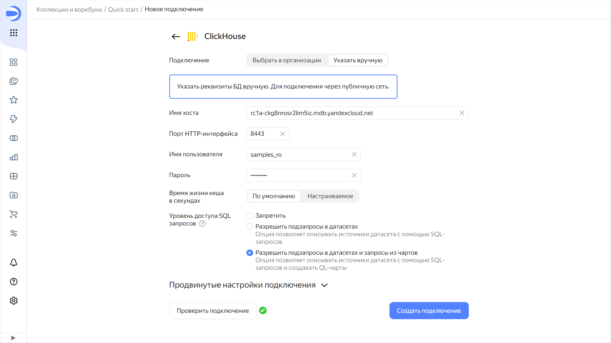

   1. В открывшемся окне нажмите кнопку **Создать воркбук**.

      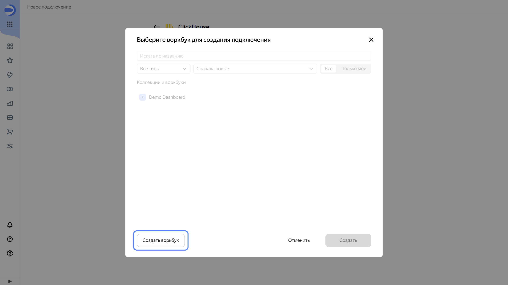

   1. Введите название [воркбука](./workbooks-collections/index.md) `Quick start` и нажмите кнопку **Создать**.
   1. Выберите созданный воркбук и нажмите кнопку **Создать**.
   1. Введите название подключения `Sample ClickHouse` и нажмите кнопку **Создать**.

Дождитесь сохранения подключения.

## Создайте датасет {#create-dataset}

[Датасет](./dataset/index.md) описывает набор данных и его структуру. Он создается на основе подключения к источнику данных. Набор данных датасета используется при создании виджетов:

* [чартов](./concepts/chart/index.md) — для визуализации данных;
* [селекторов](./dashboard/selector.md) — для фильтрации данных.

Чтобы создать датасет на базе подключения `Sample ClickHouse`:

1. На странице подключения в правом верхнем углу нажмите кнопку **Создать датасет**.

1. Перенесите на рабочую область таблицу `MS_SalesMiniTable`.

   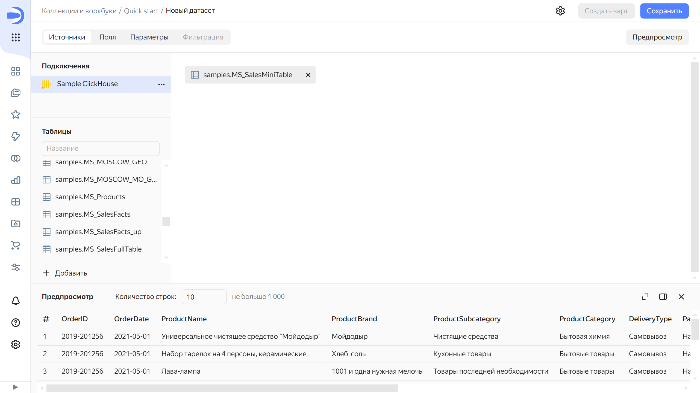   

1. Перейдите на вкладку **Поля**.

1. Создайте показатель с суммой заказа. Для этого в столбце **Агрегация** для поля `Sales` выберите значение **Сумма**.

   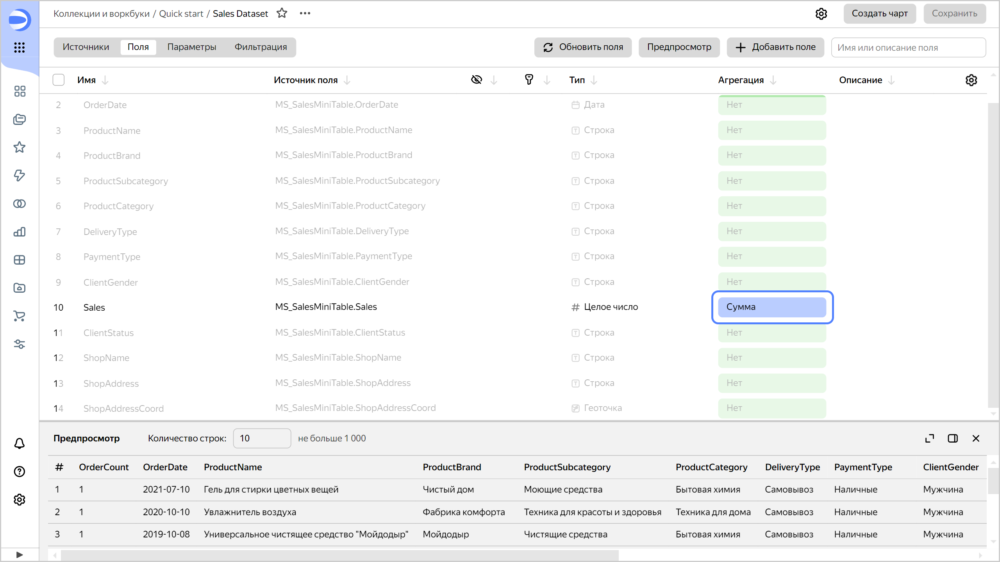      

1. Создайте показатель с количеством заказов:

   1. Переименуйте поле `OrderID` в `OrderCount`: нажмите на имя поля, удалите текущее имя и введите новое.
   1. В столбце **Агрегация** для поля `OrderCount` выберите значение **Количество уникальных**.

1. Для поля `ShopAddressCoord` измените тип данных: в столбце **Тип** выберите значение **Геоточка**.

   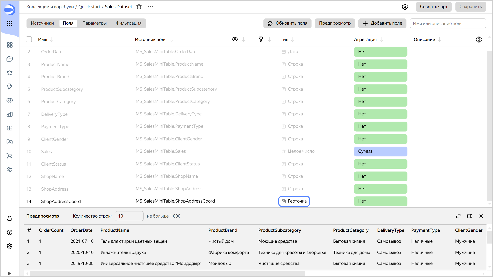      

1. Сохраните датасет:

   1. В правом верхнем углу нажмите кнопку **Сохранить**.
   1. Введите название датасета — `Sales Dataset` и нажмите кнопку **Создать**.

      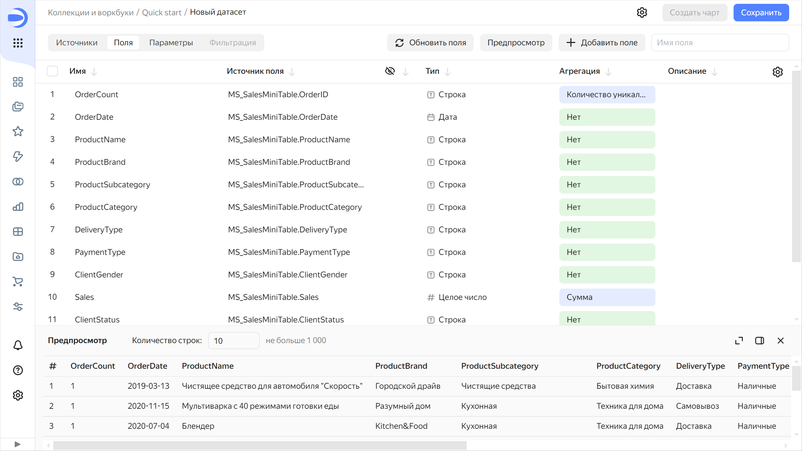            

## Создайте чарт — столбчатая диаграмма {#create-column-chart}

[Чарт](./concepts/chart/index.md) — это визуализация данных из датасета в виде таблицы, диаграммы или картограммы.

Чтобы создать чарт на основе датасета `Sales Dataset`:

1. На странице датасета в правом верхнем углу нажмите кнопку **Создать чарт**.
1. Добавьте в чарт подкатегорию товаров. Для этого из раздела **Измерения** перетащите поле `ProductSubcategory` в секцию **X**.
1. Добавьте в чарт показатель продаж. Для этого из раздела **Показатели** перетащите поле `Sales` в секцию **Y**.
1. Отсортируйте чарт по убыванию показателя продаж — из раздела **Показатели** перетащите поле `Sales` в секцию **Сортировка**.
1. Сохраните чарт:

   1. В правом верхнем углу нажмите кнопку **Сохранить**.
   1. В открывшемся окне введите название чарта `Продажи по подкатегориям` и нажмите кнопку **Сохранить**.

      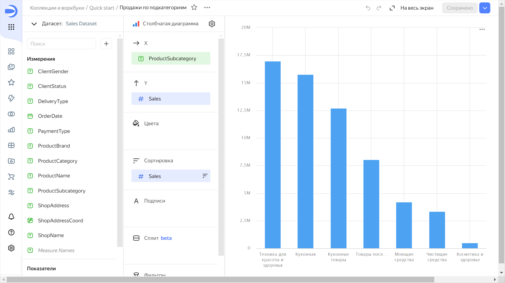            

## Создайте чарт — накопительная диаграмма с областями {#create-area-chart}

1. Создайте копию чарта, созданного на предыдущем шаге:

   1. В правом верхнем углу нажмите значок  → **Сохранить как копию**.

      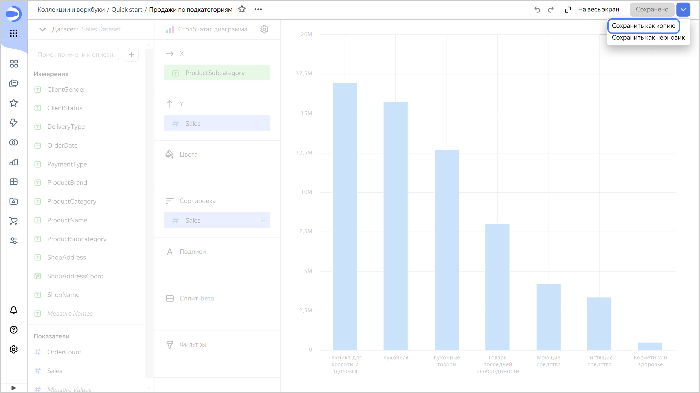            

   1. В открывшемся окне введите название нового чарта `Продажи по неделям` и нажмите кнопку **Сохранить**.

1. Выберите тип визуализации **Накопительная диаграмма с областями**.

   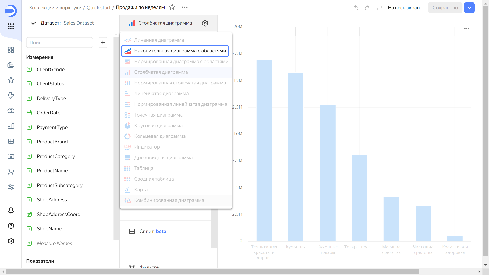      

1. Замените подкатегории товаров на дату заказа на оси X. Для этого из раздела **Измерения** перетащите поле `OrderDate` в секцию **X** и наведите его над полем `ProductSubcategory`, пока то не станет красным.
1. Добавьте в чарт категорию товаров. Для этого из раздела **Измерения** перетащите поле `ProductCategory` в секцию **Цвета**.
1. Отобразите чарт по неделям:

   1. В секции **X** нажмите на иконку с календарем у поля `OrderDate`.
   1. В поле **Группировка** выберите **Округление** → **Неделя**.

                  

   1. Нажмите кнопку **Применить**.

1. Уберите сортировку по показателю продаж — в секции **Сортировка** напротив поля `Sales` нажмите значок  (значок появляется при наведении указателя на поле).
1. В правом верхнем углу нажмите кнопку **Сохранить**.

   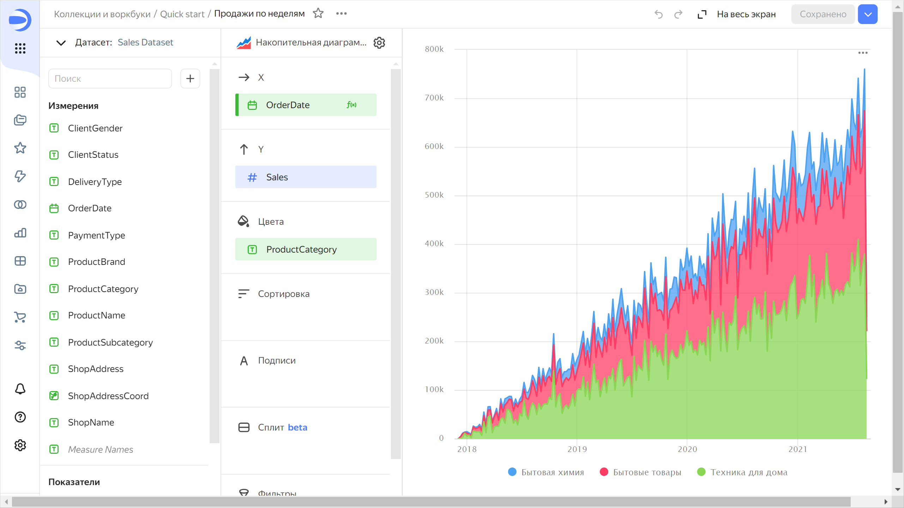      

## Создайте чарт — карта {#create-map-chart}

1. Создайте копию чарта, созданного на предыдущем шаге:

   1. В правом верхнем углу нажмите значок  → **Сохранить как копию**.
   1. В открывшемся окне введите название нового чарта `Карта продаж` и нажмите кнопку **Сохранить**.

1. Выберите тип визуализации **Карта**.
1. Добавьте на карту координаты точек продаж. Для этого из раздела **Измерения** перетащите поле `ShopAddressCoord` в секцию **Точки (Геоточки)**.
1. Измените размер точек относительно показателя количества заказов. Для этого из раздела **Показатели** перетащите поле `OrderCount` в секцию **Размер точек**.
1. Измените цвет точек относительно показателя продаж. Для этого из раздела **Показатели** перетащите поле `Sales` в секцию **Цвета**.
1. Добавьте в секцию **Тултипы** поля:

    * `ShopAddress`
    * `ShopName`
    * `Sales`
    * `OrderCount`

1. В правом верхнем углу нажмите кнопку **Сохранить**.

   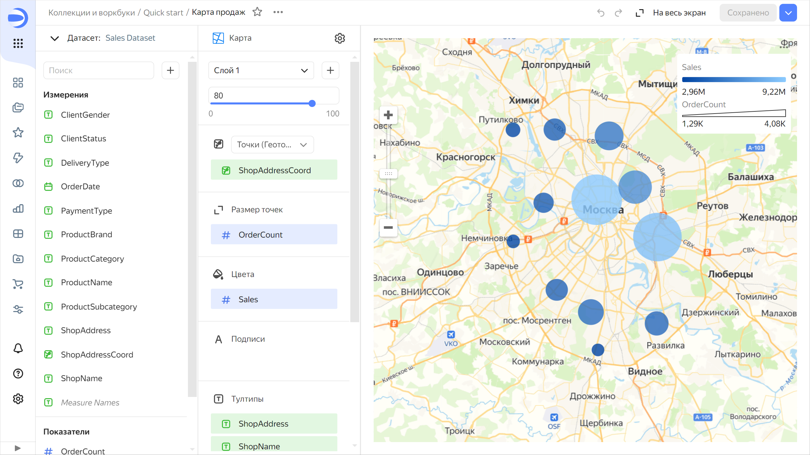   

## Создайте дашборд и добавьте на него чарты {#create-dashboard}

[Дашборд](./concepts/dashboard.md) — страница или набор страниц, на которых размещены виджеты. Позволяет собрать в одном месте чарты, добавить к ним поясняющие [надписи](./dashboard/widget.md#text) и [заголовки](./dashboard/widget.md#title).

Чтобы создать дашборд:

1. Перейдите в воркбук `Quick start` — нажмите его название в пути до чарта.

   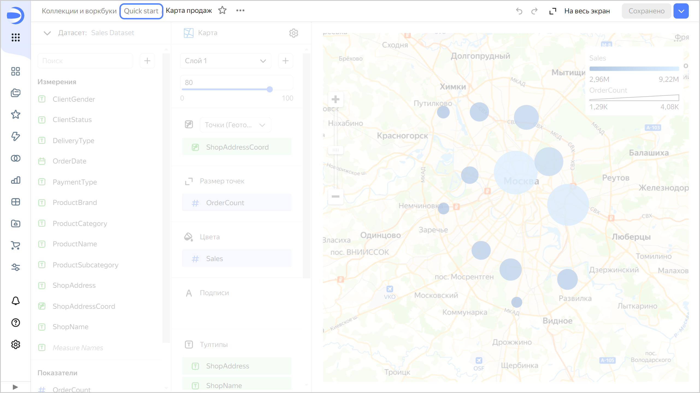   

1. В правом верхнем углу нажмите **Создать** →  **Дашборд**.

1. На панели в нижней части страницы выберите виджет **Чарт**.
1. В открывшемся окне нажмите кнопку **Выбрать**.
1. Выберите чарт `Карта продаж`.

   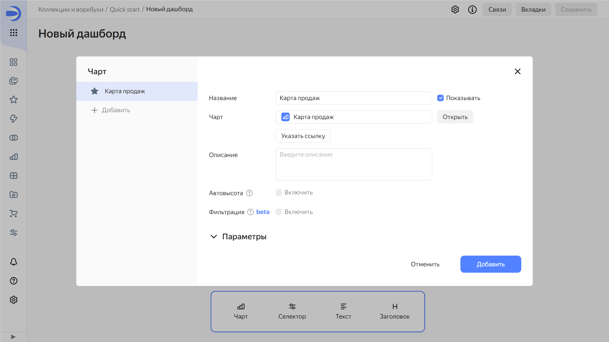      

1. Нажмите кнопку **Добавить**.
1. Повторите шаги 3-6, чтобы добавить чарты `Продажи по подкатегориям` и `Продажи по неделям`.
1. Установите размеры чартов с помощью мыши и расположите их на дашборде в удобном для вас порядке.

   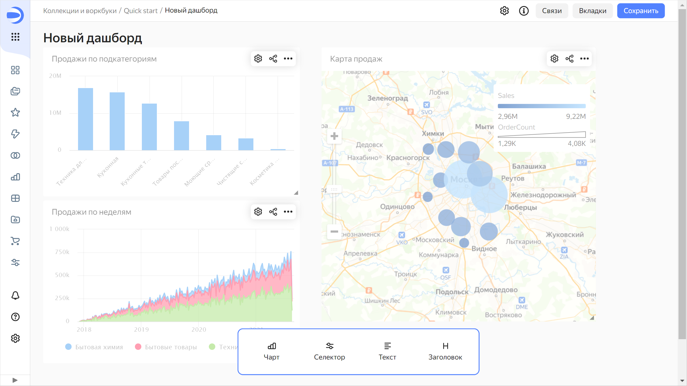      

## Настройте фильтрацию чартов {#add-chart-chart-filtration}

Добавьте на дашборде [фильтрацию](./dashboard/chart-chart-filtration.md) чартом `Карта продаж` других чартов:

1. В правом верхнем углу чарта `Карта продаж` нажмите значок .

   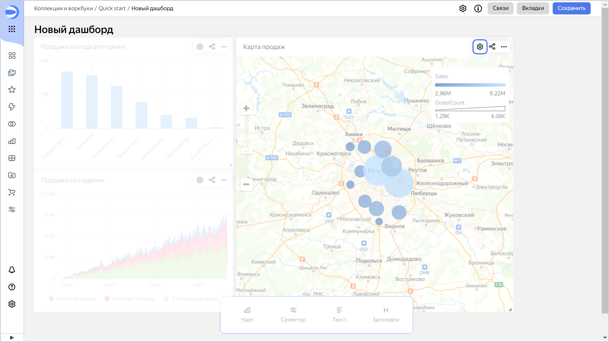   

1. Включите опцию **Фильтрация**.

   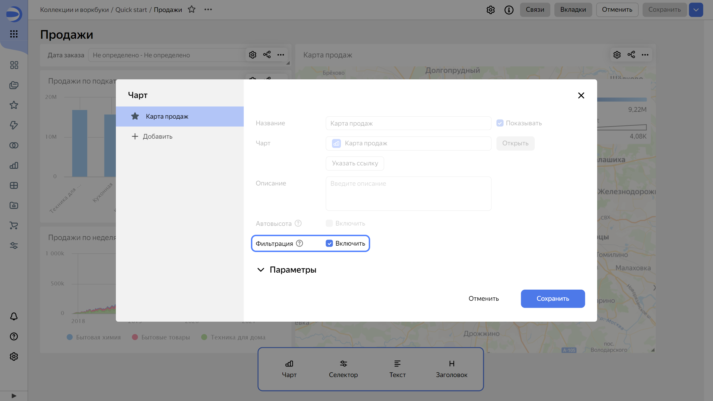   

1. Нажмите кнопку **Сохранить**.

По умолчанию фильтрующий чарт фильтрует данные во всех чартах текущей вкладки дашборда, которые построены по тому же датасету.

## Добавьте селектор на дашборд {#add-selectors}

[Селектор](./dashboard/selector.md) — это фильтр, который влияет на результаты запросов на связанных с ним виджетах.

Чтобы добавить селектор на дашборд:

1. На панели в нижней части страницы выберите виджет **Селектор**.
1. Добавьте селектор с календарем по датам заказа:

   1. Выберите датасет `Sales Dataset`.
   1. Выберите поле `OrderDate`.
   1. В поле **Заголовок** введите `Дата заказа`.
   1. Включите опцию **Диапазон**.

      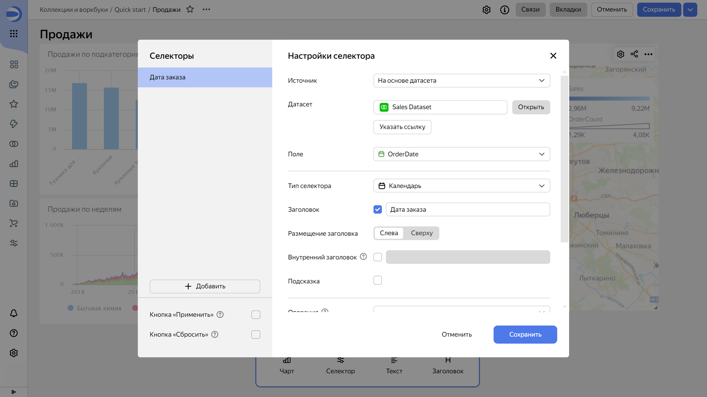            

   1. Нажмите кнопку **Сохранить**.

1. Расположите селектор на дашборде в удобном для вас месте.
1. Сохраните дашборд:

   1. В правом верхнем углу дашборда нажмите кнопку **Сохранить**.
   1. Введите название дашборда `Продажи` и нажмите кнопку **Создать**.

      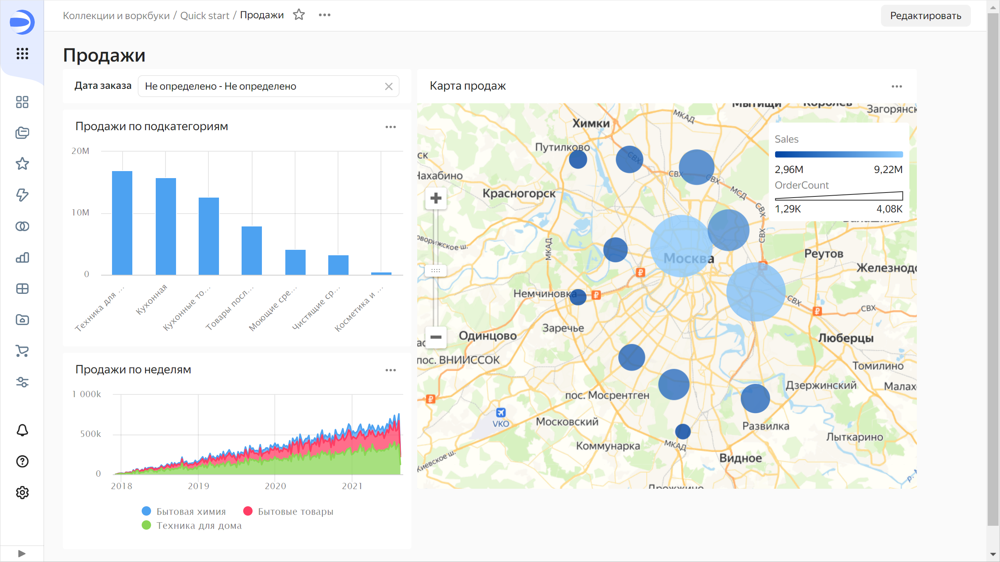            

## Изучите, как работает дашборд {#dashboard-work}

1. Примените фильтрацию чартов другими чартами на дашборде:

   1. В чарте `Карта продаж` нажмите точку на карте. Связанные чарты отфильтруются по выбранному измерению.

      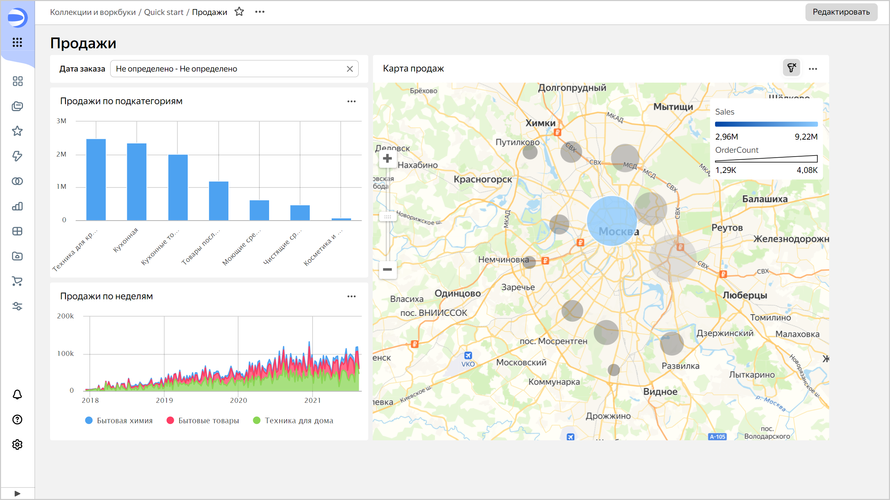      

   1. Сбросьте фильтрацию чартом: повторно нажмите на выбранную точку или в правом верхнем углу чарта нажмите значок .

1. Воспользуйтесь селектором по дате заказа:

   1. В селекторе `Дата заказа` введите даты начала и конца периода: `01.01.2019 - 31.01.2019`.
   1. Данные отфильтруются по полю `OrderDate` во всех чартах текущей вкладки дашборда, которые построены по тому же датасету.

      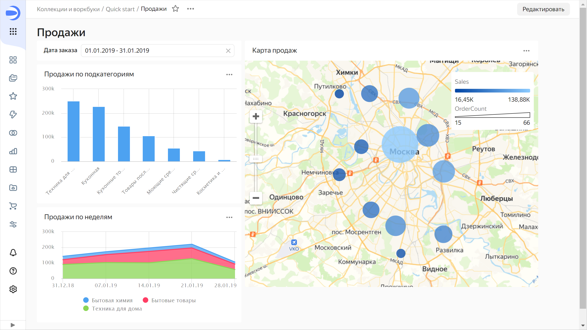      

   1. Сбросьте фильтрацию селектором: в правом углу селектора нажмите значок 

## Поделитесь дашбордом {#share}

Вы можете предоставить доступ к вашему дашборду другим пользователям:

1. [Добавьте](./security/add-new-user.md) в {{ datalens-short-name }} пользователей с аккаунтами на Яндексе:

   1. На панели слева выберите  **Настройки сервиса**.
   1. В разделе **Управление пользователями** нажмите кнопку **Пригласить пользователей**.

      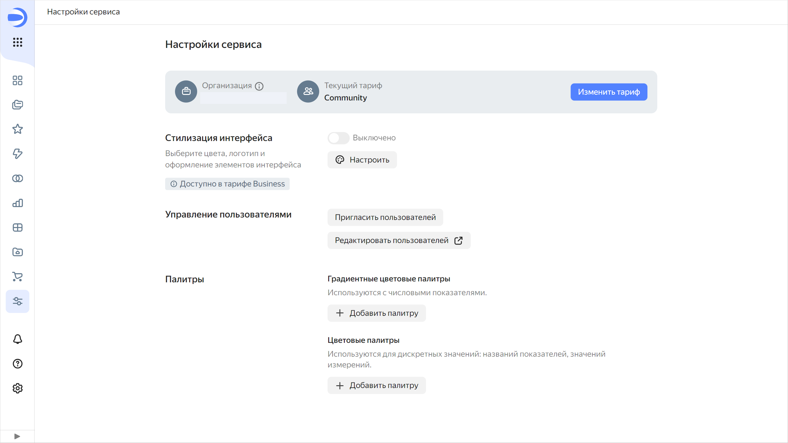

   1. Введите почтовые адреса пользователей, которых вы хотите пригласить (например, `{{login-example}}`).

      Приглашения можно отправлять на любые адреса электронной почты. Приглашенный пользователь сможет выбрать нужный аккаунт на Яндексе, когда примет приглашение.

   1. Нажмите кнопку **Отправить приглашение**.

   Приняв приглашение и выбрав аккаунт для входа, пользователь сможет войти в вашу организацию и начать пользоваться {{ datalens-short-name }}. Пользователь получит роль `{{ roles-datalens-creator }}` в организации с текущим экземпляром {{ datalens-short-name }}.

1. [Настройте права доступа](./workbooks-collections/security.md) на воркбук:

   1. На панели слева выберите  **Коллекции и воркбуки**.
   1. Нажмите значок  у воркбука `Quick start` и выберите **Доступ**.

      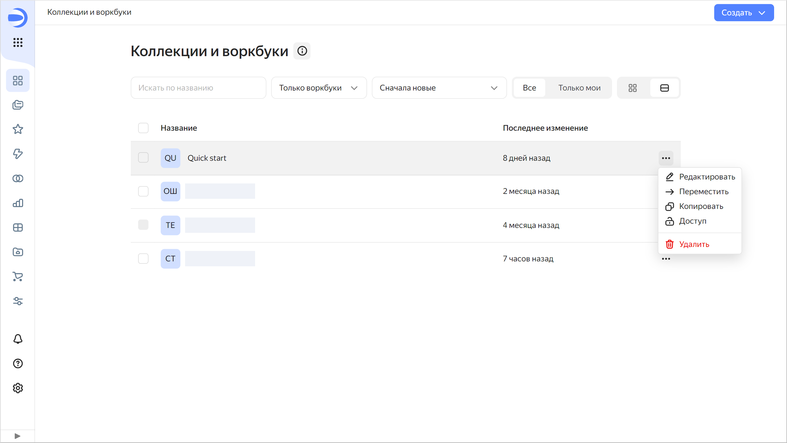

   1. Нажмите кнопку **Добавить пользователя**.

      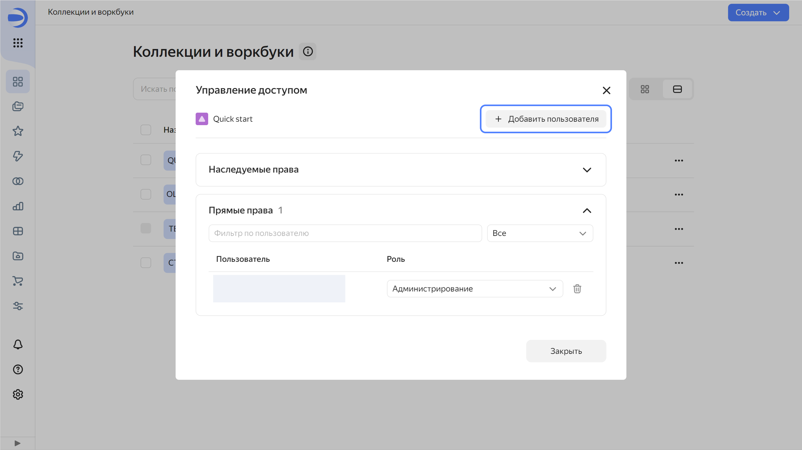

   1. В открывшемся окне выберите пользователя или группу, укажите право доступа и нажмите кнопку **Сохранить**. Пользователю или группе будут назначены права на данный объект.

Также вы можете предоставить [публичный доступ](./concepts/datalens-public.md) к созданным чартам и дашбордам: у любого пользователя будет возможность пройти по ссылке и посмотреть опубликованный объект без авторизации. Опубликованные дашборды и чарты можно [встроить](./security/embedded-objects.md) на сайт или в приложение с помощью элемента `iframe`.

## Что дальше {#whats-next}

* Изучите [руководства](tutorials/index.md) с примерами использования сервиса.
* Ознакомьтесь с [концепциями сервиса](./concepts/index.md).
* Посмотрите [пример готового дашборда](https://datalens.yandex/9fms9uae7ip02).


