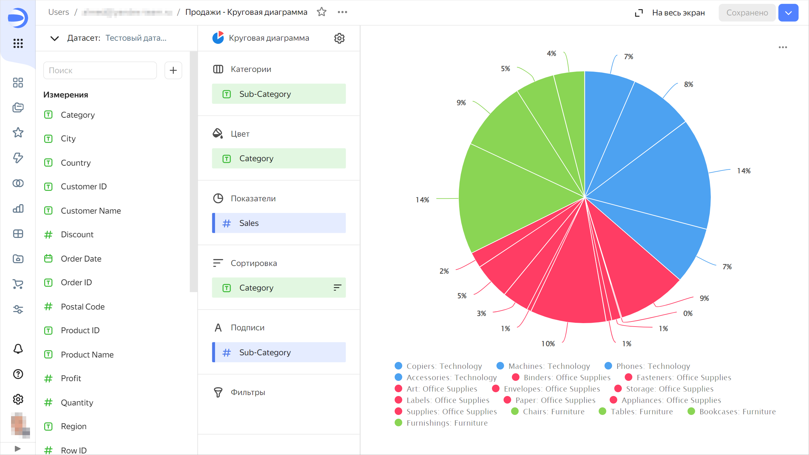

# История изменений в {{ datalens-full-name }} в феврале 2024

* [Обновления](#top-news)
* [Исправления и улучшения](#fixes)

## Обновления {#top-news}

### Секция «Категории» для круговых и кольцевых диаграмм {#category-pie-ring-charts}

Добавлена секция **Категории** для [круговых](../visualization-ref/pie-chart.md) и [кольцевых](../visualization-ref/ring-chart.md) диаграмм. Теперь по секции **Категории** производится группировка данных, а по секции **Цвет** — раскрашивание сегментов диаграммы.





### Кнопка «Повторить» в виджетах с ошибкой {#repeat-button}

Добавлена кнопка **Повторить** для чартов, которые отображаются с ошибкой. С помощью этой кнопки можно выполнить повторный запрос к источнику. Кнопка доступна для большинства типов ошибок.

### Открытие якорных ссылок в текущем окне браузера {#link-target-self}

Реализовано открытие якорных ссылок (начинаются с `#`) в текущем окне браузера. Теперь в текстовых виджетах можно ссылаться на заголовок дашборда из оглавления. При нажатии на ссылку страница будет прокручиваться к этому заголовку.

### Сортировка перетаскиванием в ручных селекторах {#drap-drop-params}

В настройках селектора с ручным вводом теперь можно менять порядок возможных значений перетаскиванием.

## Исправления и улучшения {#fixes}

### Применение цветов из пользовательской палитры в комбинированной диаграмме {#user-palette}

Исправлена ошибка при применении цветов из пользовательской палитры в [комбинированной](../visualization-ref/combined-chart.md) диаграмме.

### Заливка ячеек таблицы со значениями null {#null-color-fill}

Исправлена проблема, при которой не происходила заливка ячеек [таблицы](../visualization-ref/table-chart.md) с пустыми (`null`) значениями.

### Градиентная заливка столбцов таблицы {#gradient-fill-columns}

Исправлена проблема, при которой некорректно работала раскраска по трехцветному градиенту в столбцах, содержащих как отрицательные, так и положительные значения.

### Отображение ошибок для полей датасета в визарде {#error-message-field-ds}

Исправлена проблема, при которой после замены датасета в чарте оставались поля со ссылкой на старый датасет и отображалась ошибка `Измерение не участвует в связи датасетов`.

### Форматирование оси в линейчатой диаграмме {#bar-chart-format}

Исправлено форматирование оси в процентах для [линейчатой](../visualization-ref/bar-chart.md) диаграммы. Чтобы подписи на оси отображались в процентах:

1. Перетащите числовой показатель из датасета в секцию **X**. В настройке поля **Формат** выберите `Процент`.
1. Для секции **X** в настройке **Форматирование оси** выберите `По первому полю на оси X`. Подписи на оси X отобразятся в процентах.

Аналогично можно настроить отображение процентов для оси Y.

### Выбор цвета для null значений в столбчатой диаграмме {#column-chart-null-color}

Исправлена ошибка выбора цвета для пустых (`null`) значений в [столбчатой](../visualization-ref/column-chart.md) диаграмме.

### Сортировка графиков при сплите {#split-sorted}

Исправлена сортировка графиков при использовании секции **Сплит**.

### Включение/отключение отображения суммы в тултипах QL-чартов {#ql-charts-summa}

Исправлена проблема, при которой было невозможно отключить отображение суммы в тултипах [QL-чартов](../concepts/chart/ql-charts.md).

### Связь по параметрам чарта {#link-chart-params}

Исправлена проблема, при которой в настройках связи на дашборде не отображалась связь виджетов по [параметру](../concepts/parameters.md), созданному на уровне чарта.

