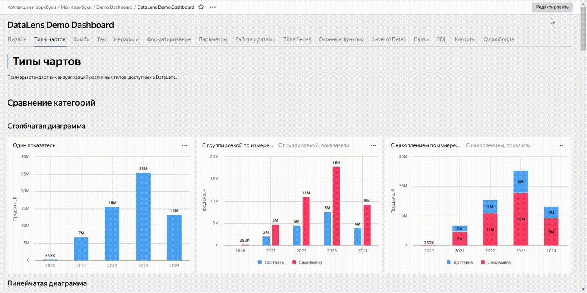

# История изменений в {{ datalens-full-name }} в мае 2024

* [Изменения базовых возможностей](#base)
* [Изменения, доступные в тарифном плане Business](#business)

## Изменения базовых возможностей {#base}

### Просмотр прав доступа к дашборду {#view-dashboard-access}

Теперь посмотреть права доступа для дашборда, в котором настроено сообщение при [ошибке доступа](../operations/dashboard/add-access-message.md), могут только пользователи с правами [{{ permission-write }}](../security/manage-access.md#permission-write) или [{{ permission-admin }}](../security/manage-access.md#permission-admin) на этот дашборд.

Пользователи с правом [{{ permission-read }}](../security/manage-access.md#permission-read) не могут просмотреть список прав доступа на этот дашборд или запросить изменение доступа к нему через интерфейс {{ datalens-short-name }}.

### Отображения описания дашборда при его открытии {#dashboard-opened-info}

Добавлена возможность при открытии дашборда показывать во всплывающем окне его [описание](../dashboard/settings.md#message-settings), если оно заполнено. Для этого добавьте к адресу дашборда параметр `_opened_info=1`.

### Фон для виджетов «Текст» и «Заголовок» {#background-for-text-title}

Для виджетов [{#T}](../dashboard/widget.md#text) и [{#T}](../dashboard/widget.md#title) появилась возможность добавить фон. Для этого в окне настройки виджета включите опцию **Фон** и выберите необходимый цвет.

Доступны цвета из секции [Light Semantic](https://preview.gravity-ui.com/uikit/iframe.html?args=&id=colors--backgrounds&viewMode=story) дизайн-системы [Gravity UI](https://gravity-ui.com/).

### Отключение оптимизации связи {#join-optimization-off}

Добавлена возможность отключать оптимизацию связи при использовании нескольких таблиц в [источнике данных](../dataset/data-model.md#source). Для этого используйте опцию **Оптимизировать связь** в настройках связи.

По умолчанию опция включена для всех связей в датасете — оператор `JOIN` применяется, когда в запросе участвуют поля из двух и более связанных таблиц. Вы можете отключить опцию для каждой конкретной связи, чтобы сделать связь обязательной. В этом случае операция объединения (оператор `JOIN`) будет выполняться, даже если выбираются поля только из одной таблицы.

### Изображения в таблицах {#table-image}

Появилась функция разметки [IMAGE](../function-ref/IMAGE.md), которая позволяет вставить изображение в ячейку таблицы.

### Перетаскивание при добавлении виджетов на дашборд {#drag-n-drop}

Теперь добавляемые виджеты можно сразу перетаскивать в нужное место. Работает для всех создаваемых и скопированных объектов, сохраняя их размеры. Старое поведение (при обычном нажатии на панель) — также осталось.





### Подсказка в селекторах и таблицах {#hint}

Появилась опция **Подсказка**, которая позволяет добавить текстовое пояснение к [селектору](../operations/dashboard/add-selector.md), а также заголовкам [обычной](../visualization-ref/table-chart.md#hint-column) и [сводной таблицы](../visualization-ref/pivot-table-chart.md#hint-column). По умолчанию текст пояснения подставляется из описания поля в датасете.

Когда опция включена, на дашборде рядом с селектором или заголовком столбца таблицы появляется значок .

### Выбор виджета в окне настройки связей {#link-settings-widget-select}

Теперь в окне настройки [связей](../dashboard/link.md) на дашборде можно выбирать настраиваемый виджет из раскрывающегося списка.

### Ссылка на датасет в селекторе {#selector-dataset-link}

При [добавлении](../operations/dashboard/add-selector.md) на дашборд селектора на основе датасета теперь можно указать ссылку на датасет. Для этого:

1. В окне настроек селектора нажмите кнопку **Указать ссылку**.
1. В поле ниже введите ссылку на датасет.
1. Нажмите кнопку **OK**.

Если ссылка указана верно, автоматически заполнится поле **Датасет**, иначе выйдет сообщение об ошибке.

## Изменения, доступные в тарифном плане Business {#business}

### Генерация цветовой палитры только для текущей темы {#color-palette-for-current-theme-only}

Добавлена возможность при [стилизации интерфейса](../settings/ui-customization.md) генерировать цветовую палитру только для выбранного сочетания темы и контрастности. Для этого при генерации палитры в окне выбора основного цвета включите опцию **Только для выбранной темы**. При выключенной опции палитра генерируется для всех тем.

### Сброс настроек стилизации {#customization-reset}

Настройки стилизации интерфейса теперь можно сбросить к системным значениям {{ datalens-short-name }}. Для этого:

1. В окне стилизации интерфейса нажмите кнопку **Сбросить**.
1. Включите опцию **Только для выбранной темы и контрастности**, чтобы сбросить настройки только для выбранной темы. При выключенной опции настройки сбросятся для всех тем.
1. Нажмите кнопку **Сбросить**.

