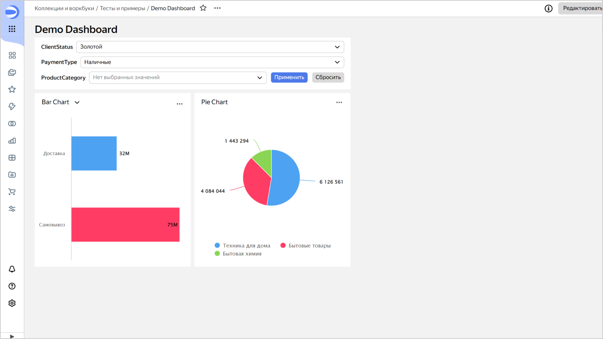
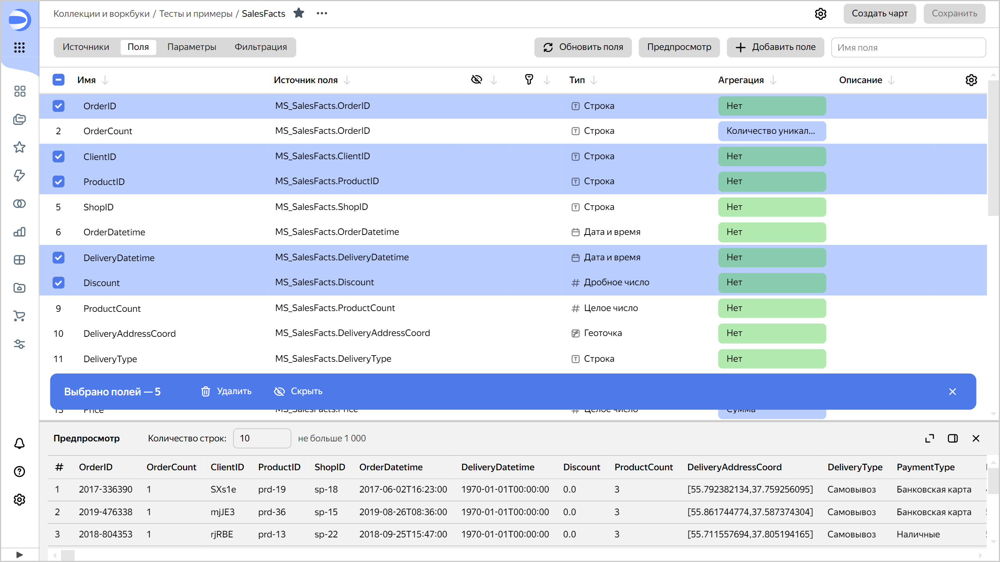

# История изменений в {{ datalens-full-name }} в июле 2024

* [Обновления](#updates)
* [Исправления и улучшения](#fixes)

## Обновления {#updates}

### Группировка селекторов на дашбордах {#group-controls}

Теперь можно группировать несколько [селекторов](../dashboard/selector.md) в одном виджете на дашборде.

В виджет с одним или несколькими селекторами можно добавить дополнительные кнопки управления:

* **Кнопка «Применить»** — позволяет применить значения всех селекторов в виджете. До нажатия кнопки значения селекторов не применяются.
* **Кнопка «Сбросить»** — позволяет сбросить значения всех селекторов в виджете до значений по умолчанию.

Для виджета с несколькими селекторами можно настроить порядок и расположение селекторов в виджете. Ширину каждого селектора можно зафиксировать в пикселях или процентах от общей ширины виджета. Если указать `100%` для каждого селектора — получится вертикальная группа. Подробнее читайте в разделе [{#T}](../operations/dashboard/add-selector.md).

### Массовые операции с полями в датасете {#bulk-changes}

В [датасете](../dataset/index.md) появилась возможность отметить сразу несколько полей, чтобы их удалить, скрыть или показать.

## Исправления и улучшения {#fixes}

### Форма линий для показателей в секции Y2 {#y2-forms}

В [линейной](../visualization-ref/line-chart.md) и [комбинированной](../visualization-ref/combined-chart.md) диаграммах теперь можно настроить форму линии для показателей из секции **Y2**.

### Настройка цвета для нулевых значений {#zero-colors}

В [сводной таблице](../visualization-ref/pivot-table-chart.md) исправлена проблема, при которой к нулевым значениям показателя не применялись настройки цвета.

### Отображение тултипа в картах {#map-tooltips}

Исправлена ошибка отображения тултипа на [картах](../visualization-ref/map-chart.md) в визарде.

### Поиск значений в селекторе-списке {#list-search}

Исправлена ошибка, которая возникала при поиске значений в селекторе типа **Список**.

### Добавление возможных значений селектора {#selector-values}

При добавлении возможных значений селектора с ручным вводом:

* курсор сразу устанавливается в поле ввода, позволяя вводить значение;
* введенное значение можно добавить с помощью нажатия клавиши **Enter**.

### Верстка подписи публичных дашбордов {#public-dash-footer}

Улучшена верстка подписи у [публичных дашбордов](../concepts/datalens-public.md): длинные подписи больше не перекрывают виджеты.

### Отображение тултипов встроенных чартов в мобильной версии {#mobile-tooltips}

Тултипы встроенных публичных и непубличных чартов в мобильной версии теперь всегда располагаются под чартом.

### Предупреждение при удалении ключей для встраивания {#delete-keys-warning}

Добавлено всплывающее окно с предупреждением при удалении ключей для [встраивания непубличных чартов](../security/private-embedded-objects.md), а также самих встраиваний.

### Отображение групповых селекторов в старом интерфейсе связей {#group-selectors-displaying}

Исправлена ошибка, из-за которой виджеты с группой селекторов не отображались в старом интерфейсе настройки [связей](../dashboard/link.md).

### Высота диалогового окна «Связанные объекты» {#linked-objects}

Увеличена высота диалогового окна **Связанные объекты**.
