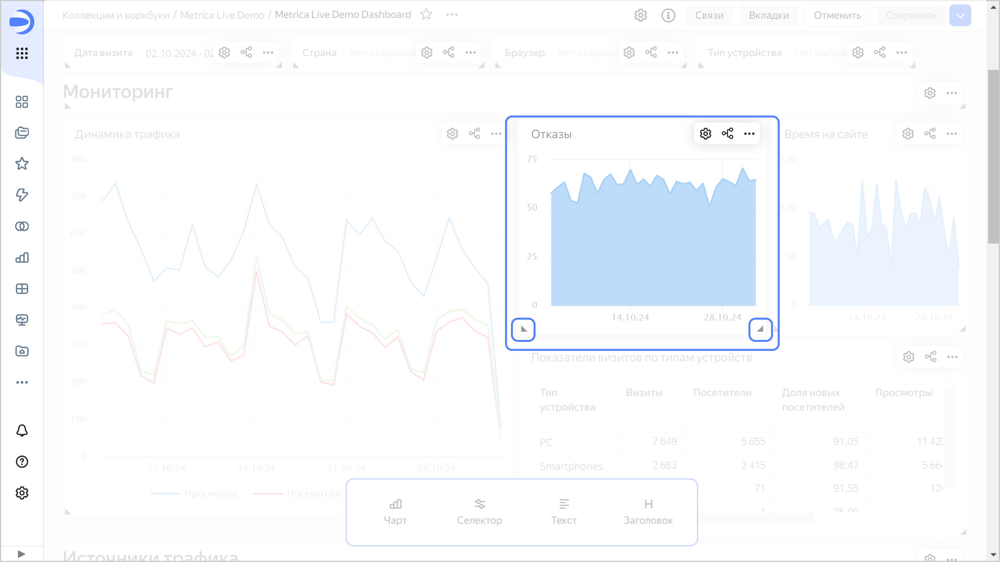

# История изменений в {{ datalens-full-name }} в октябре 2024

* [Изменения базовых возможностей](#base)
* [Изменения, доступные в тарифном плане Business](#business)

## Изменения базовых возможностей {#base}

### Копирование связей вместе с виджетом {#widget-links-copy}

Теперь виджет копируется вместе со связями, если его вставить на ту же вкладку дашборда. Недоступно при вставке селектора в группу.

### Размер виджета на дашборде {#dashboard-widget-resize}

Размер виджета на дашборде теперь можно менять, потянув за оба нижних угла.

### Тултипы в чартах {#tooltips}

* В чартах появилась [настройка](../concepts/chart/settings.md#common-settings) **Тултип**, которая позволяет включить или отключить всплывающие подсказки при наведении на элемент чарта.
* Добавлены настройки для кастомизации отображения тултипов в [картах](../visualization-ref/map-chart.md).

### Отключение связей на дашборде {#dashboard-links-off-error}

Исправлена проблема, при которой после нажатия кнопки `Отключить` → `все`/`чарты`/`селекторы` сбрасывались настройки связей, которые еще не применили.

### Автопрокрутка на дашборде {#autoscroll-dashboard}

* Исправлена автопрокрутка страницы при перетаскивании элементов на дашборде в режиме редактирования.
* Исправлена проблема автопрокрутки дашборда в мобильной версии браузера `Safari` при возврате из режима просмотра чарта обратно на дашборд.

### Исправления в воркбуках {#workbook-errors-fix}

* Скрыта некорректно работающая кнопка **Запросить права** для объектов воркбука, к которому нет доступа.
* Исправлена ошибка, при которой в окне воркбука вместо чартов отображались подключения, а вместо подключений — чарты.

### Операции сравнения для селектора {#selector-compare-operations}

Для селектора `Поле ввода`, который фильтрует по текстовому полю из датасета, добавили операции сравнения `Больше`, `Меньше`, `Больше или равно` и `Меньше или равно`.

### Отображение осей X и Y в чартах {#axis-visible-chart-settings}

Добавлена [настройка](../concepts/chart/settings.md#axis-settings) **Ось на графике**, которая позволяет скрыть все, что относится к оси X и Y. Доступно для [чартов в визарде](../concepts/chart/dataset-based-charts.md) и [QL-чартов](../concepts/chart/ql-charts.md).

### Улучшения линейной диаграммы {#line-chart-improves}

Для [линейной диаграммы](../visualization-ref/line-chart.md) теперь доступно:

* использование непрерывной оси;
* сортировка по показателю, если в секции **Цвета** указано измерение.

### Раскраска точек в точечной диаграмме {#scatter-chart-color}

Исправлена раскраска точек в [точечной диаграмме](../visualization-ref/scatter-chart.md) при переименовании поля.

### Исправления в QL-чартах типа «Индикатор» {#ql-charts-indicator}

* Исправлено отображение QL-чарта при изменении набора полей.
* Исправлена ошибка, при которой в окне создания связей на дашборде у QL-чартов не отображались правильные алиасы в списке выбора.

### Отображение слоев в картах {#old-maps-layers}

Исправлена ошибка, при которой некорректно отображались слои в картах, которые давно созданы или не обновлялись.

### Исправления в таблицах {#table-fixes}

Исправлены ошибки в [таблицах](../visualization-ref/table-chart.md), при которых:

* нарушалась раскраска и градиентная заливка таблицы для пустых (null) значений;
* в QL-чарте некорректно отображалась таблица при отсутствии данных;
* неправильно рассчитывалась ширина столбцов в таблицах с большим числом строк;
* неправильно рассчитывалась ширина столбцов для ячеек, в которых используются [функции разметки](../function-ref/markup-functions.md);
* некорректно сортировались даты с пустыми (null) значениями;
* нарушалось отображение таблицы при [закреплении](../visualization-ref/table-chart.md#column-fixation) двух и более столбцов;
* браузер зависал во время прокрутки таблицы;
* содержимое таблицы дублировалось при выделении всей страницы.

### Отключение сортировки по строкам в сводных таблицах {#pivot-table-sorting-off}

Добавлена возможность отключить сортировку по строкам в [сводных таблицах](../visualization-ref/pivot-table-chart.md).

### Отображение линейных индикаторов {#table-line-indicator}

Исправлены проблемы отображения линейных индикаторов, которые возникали:

* в таблице с масштабом, проставленным вручную;
* в таблице с заливкой столбца.

### Отображение комбинированных чартов с иерархией {#combined-charts}

Исправлено отображение [комбинированной диаграммы](../visualization-ref/combined-chart.md) с иерархией и непрерывной осью.

### Изменения на панели инструментов редактирования текста {#text-toolbar}

На панели инструментов в окне редактирования текста:

* исправлено отображение команд по нажатию `/`;
* восстановлено отображение кнопок для добавления формул;
* добавлена кнопка **Mermaid** для режима `Разметка Markdown`.

## Изменения, доступные в тарифном плане Business {#business}

### Изменения в отчетах {#report-changes}

* Улучшен экспорт [отчетов](../reports/index.md):

  * теперь имя файла при экспорте отчетов соответствует названию объекта в {{ datalens-short-name }};
  * оптимизирован размер экспортируемого в `pdf` файла;
  * теперь размеры страниц экспортируемого `pdf` файла соответствуют физическим размерам листа `А3`/`A4`;
  * исправлены ошибки прорисовки экспортируемого `pdf` файла;
  * исправлен порядок слоев в `pdf` файле.

* Добавлено окно подтверждения при попытке уйти из интерфейса редактирования отчета с несохраненными изменениями.
* Изменен минимальный размер виджета `Изображение`.
* В меню создания объекта на странице воркбука отчет и дашборд теперь находятся рядом.
* Появилась возможность мигрировать отчет в воркбук.
* Исправлена ошибка, при которой изменение фона чарта не отображалось в области предпросмотра.
* Исправлен текст в меню создания отчета.

### Изменения в непубличном встраивании {#embedded-changes}

* Тексты для ошибок токенов и зависимых объектов в [непубличном встраивании](../security/private-embedded-objects.md) стали более читаемыми. Теперь в них описывается возможная причина проблемы.
* Восстановлен текст ошибки `Настройки встраивания устарели` для виджетов в непубличном встраивании дашбордов.
* Исправлена ошибка на мобильных устройствах, при которой значения селекторов встроенного дашборда сбрасывались, если нажать на один из его чартов.

