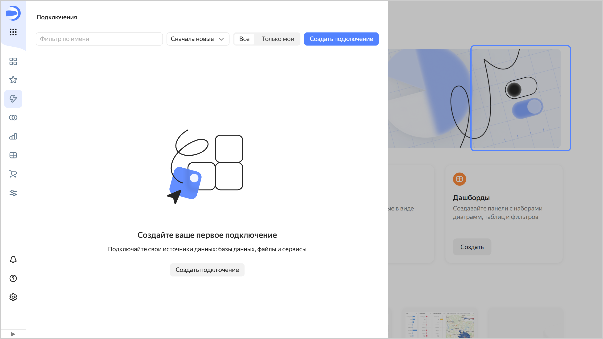

# История изменений в {{ datalens-full-name }} в апреле 2025

* [Изменения базовых возможностей](#base)
* [Изменения в мобильной версии](#mobile-version-changes)
* [Изменения, доступные в тарифном плане Business](#business)

## Изменения базовых возможностей {#base}

### Изменения интерфейса {#interface-changes}

* Добавили возможность скопировать id для всех типов объектов одним из способов:
  
  * на странице навигации или в окне редактирования объекта нажмите  → **Копировать ID**;
  * в окне **Связанные объекты** напротив объекта нажмите  → **Копировать ID**.
  
* Исправили проблему, при которой при нажатии на  **Уведомления** открывалась новая страница. Теперь открывается окно с сообщениями в {{ datalens-short-name }}.
* Обновили дизайн пустого списка объектов, который открывается через панель навигации слева.

  

  

  

### Изменения в подключениях {#connection-changes}

Добавили [подключение к {{ speechsense-full-name }}](../operations/connection/create-speechsense.md).

### Исправления в датасетах {#dataset-changes}

Теперь при [создании датасета](../dataset/create-dataset.md#create) открывается вкладка **Источники**, а при редактировании — вкладка **Поля**.

### Исправления в чартах {#charts-fixes}

* Добавили [настройки](../concepts/chart/settings.md#common-settings) **Центр** и **Масштаб**, позволяющие показать определенный участок [карты](../visualization-ref/map-chart.md).
* Исправили проблему, при которой в [комбинированной диаграмме](../visualization-ref/combined-chart.md) не работала сортировка на слое с [линейной диаграммой](../visualization-ref/line-chart.md).
* В [визарде](../concepts/chart/dataset-based-charts.md) исправили проблему, при которой после смены [настройки](../concepts/chart/settings.md#field-settings) типа поля с `Дата` на `Дата и время` или обратно сбрасывался формат даты.
* В чартах с [иерархией](../operations/chart/add-hierarchy.md) исправили некорректную работу фильтрующего запроса по клику на значение с кавычками.
* Исправили некорректное построение [полилинейной карты](../visualization-ref/polyline-map-chart.md) с пустыми (`null`) значениями.
* Оптимизировали время отрисовки в [сводных таблицах](../visualization-ref/pivot-table-chart.md) при использовании [фильтрации чартов чартами](../dashboard/chart-chart-filtration.md).
* Исправили неровное расположение текста в ячейках [таблицы](../visualization-ref/table-chart.md) в случае с [закрепленными столбцами](../visualization-ref/table-chart.md#column-fixation) и отсутствием пагинации.
* Исправили некорректное отображение [таблицы](../visualization-ref/table-chart.md) с [закрепленными столбцами](../visualization-ref/table-chart.md#column-fixation) и скроллом.
* Добавили кавычки для значений при экспорте чарта в формате CSV.

### Изменения в версионировании {#versioning-changes}

* Версионирование [чартов](../concepts/chart/versioning.md), [дашбордов](../dashboard/versioning.md) и отчетов доступно только пользователям с правами редактирования этих объектов. Сообщение о наличии черновика также доступно только для пользователей, имеющих право на редактирование объекта.
* При наличии черновой версии чарта можно сразу открыть ее, если добавить в URL параметр `unreleased=1`.

### Всплывающая подсказка в разметке {#tooltip-add}

Поддержали возможность с помощью функции разметки [TOOLTIP](../function-ref/TOOLTIP.md) добавлять небольшую всплывающую подсказку к тексту или результату выполнения других [функций разметки](../function-ref/markup-functions.md).

### Изменения в дашбордах {#dashboard-changes}

* Исправили некорректную работу параметра `state` в URL для [публичных](../concepts/datalens-public.md) дашбордов.
* Изменили внешний вид области [закрепления виджетов](../dashboard/settings.md#widget-fixation):
  
  * стали более заметными фон области закрепления и кнопка, позволяющая скрыть или показать нижнюю область;
  * область закрепления не показывается, если в ней нет виджетов;
  * верхняя область имеет ту же ширину, что и остальные;
  * в верхней области можно закреплять виджеты любой высоты (раньше туда помещались только однострочные виджеты).

* Исправили проблему, при которой нарушался порядок отображения [заголовков](../dashboard/widget.md#title) в оглавлении, если поместить заголовок в область закрепления виджетов.

### Изменения в настройках сервиса {#settings-changes}

Скрыли некоторые [настройки сервиса](../settings/ui-customization.md) для пользователей без [роли](../security/roles.md#datalens.admin) `datalens.admin`:

* Изменение [тарифного плана](../settings/service-plan.md).
* [Настройка стилизации](../settings/ui-customization.md).
* Добавление и редактирование цветовых палитр.
* [Отключение навигации по папкам](../settings/disable-folder-navigation.md).
* [Включение воркбуков](../workbooks-collections/index.md#enable-workbooks).
* [Управление возможностью](../concepts/datalens-public.md#publication-disable) настраивать публичный доступ.

Тарифные планы и цветовые палитры может просмотреть без внесения изменений любой пользователь.

## Изменения в мобильной версии {#mobile-version-changes}

Исправили проблему, при которой не скроллилась [легенда](../concepts/chart/settings.md#common-settings) чарта в мобильной версии.

## Изменения, доступные в тарифном плане Business {#business}

### Изменения в Editor {#editor-changes}

* Исправили проблему, возникающую при открытии на редактирование чарта в [Editor](../charts/editor/index.md) с параметром `_embedded` в URL. Ранее, если в URL присутствовал параметр `_embedded=1`, в чарте не отображалось содержимое вкладок.
* Перевели Editor в таймзону UTC. Это позволит пользователям получать предсказуемый результат, возвращаемый функцией `new Date()`.
* В функции [Editor.wrapFn](../charts/editor/methods.md#wrap) убрали ограничение вложенности для пользовательских аргументов.
* Исправили ошибку обработки нестроковых параметров в Editor.

### Изменения в отчетах {#reports-changes}

* В [отчетах](../reports/index.md) добавили автопрокрутку секции селекторов при добавлении виджета.
* Для тарифа [Community](../settings/service-plan.md) в интерфейсе [воркбука](../workbooks-collections/index.md) на вкладке **Все объекты** исправили отображение кнопки **Создать отчёт**.

