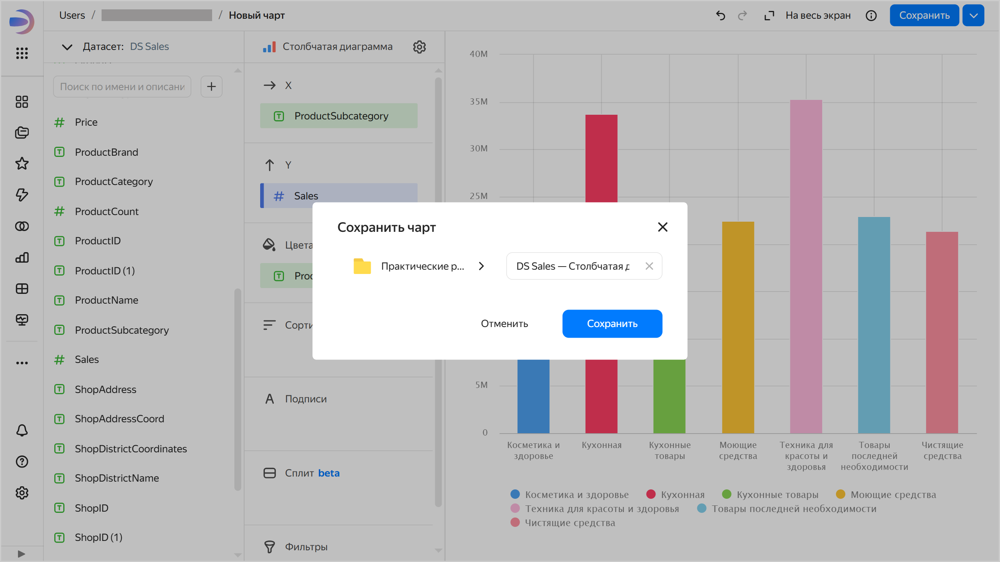
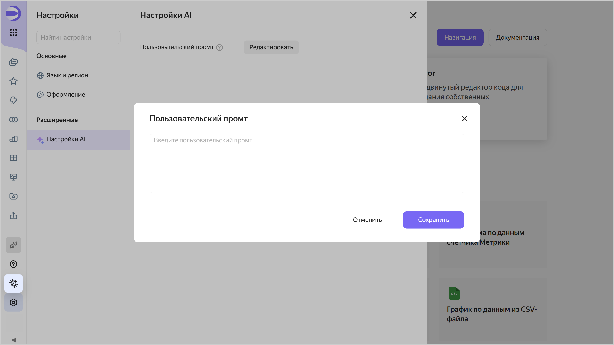

# История изменений в {{ datalens-full-name }} в октябре 2025

* [Изменения базовых возможностей](#base)
* [Исправления и улучшения](#fixes)
* [Изменения, доступные в тарифном плане Business](#business)

## Изменения базовых возможностей {#base}

* Добавили [версионирование подключений](../concepts/connection/versioning.md). Теперь можно увидеть список ранее сохраненных изменений подключения, а также откатиться к прежней версии.
  Ограничения:

  * Версионирование недоступно для подключений: [Файлы](../operations/connection/create-file.md), [Яндекс Документы](../operations/connection/create-yadocs.md) и [Google Sheets](../operations/connection/create-google-sheets.md).
  * Не версионируются чувствительные данные подключений (пароли, токены).
  * Версии подключений не содержат изменений данных в источнике (добавление, обновление или удаление строк в источнике данных).
  * История изменений доступна только за последние три месяца.

* В датасете добавили возможность [настроить](../dataset/create-dataset.md#setup-fields) отображение поля. Для измерений вы можете выбрать цвет и задать формат отображения для числовых типов, для показателей — только задать формат отображения чисел. Настройки применяются при использовании этих полей в чартах, построенных на основе данного датасета.

  

  

  

* Добавили возможность [выбора палитры по умолчанию](../operations/chart/create-palette.md#default-palette) в настройке цветов чарта.

* Добавили возможность открывать чат с поддержкой прямо из интерфейса {{ datalens-full-name }}. Чтобы открыть чат, на боковой панели нажмите  и в блоке **Поддержка** выберите  **Открыть чат**.

* Появились новые работы в [{{ datalens-gallery }}]({{ link-datalens-main }}/gallery). Подробнее см. в чате [{{ datalens-short-name }}](https://t.me/YandexDataLens/28631/140855) в Telegram.

### Изменения в интерфейсе {#interface-changes}

* В диалоговом окне создания, сохранения и дублирования сущностей в навигации по папкам кнопку подтверждения сделали более заметной.

  

  

  

* Цвет фона дашборда и области [закрепления виджетов](../dashboard/settings.md#widget-fixation) сделали более контрастным.

* Для [встраивания непубличных объектов](../security/private-embedded-objects.md) в окне с настройками добавили подсветку, что функциональность доступна в [тарифном плане](../concepts/service-plans-comparison.md) Business.

  

  

  

### Изменения в мобильной версии {#mobile-version-changes}

* Добавили область закрепления виджетов на дашборде.
* Просмотр содержимого и описания дашборда, а также кнопка  теперь доступны на панели внизу экрана.

## Исправления и улучшения {#fixes}

* Реализовали использование параметра `_autoupdate` для [непубличного встраивания](../security/private-embedded-objects.md), позволяющего контролировать автообновление чартов и дашбордов.
* Для чартов и дашбордов исправили открытие [настроек встраивания](../security/private-embedded-objects.md#how-to-private-embed) в боковой навигации. Чтобы перейти к настройкам, на боковой панели нажмите  **Чарты** или  **Дашборды** и в строке с нужным объектом нажмите значок  → **Настройки встраивания**.
* Исправили отображение итогов в тултипе диаграммы Waterfall ([Gravity UI Charts](../charts/editor/widgets/chart.md)).

* Исправили ошибку [экспорта данных из чарта](../concepts/chart/data-export.md) в файл `XLSX`, при которой в колонке с типом `Дата и время` вместо **Итого** отображалась дата экспорта.

### Исправления в чартах {#chart-fixes}

* Запретили возможность сортировки для [мультидатасетных чартов](../concepts/chart/multidataset-chart.md).
* Исправили работу кнопки [отмены изменений](../concepts/chart/settings.md#undo-redo) при смене типа чарта на [комбинированную диаграмму](../visualization-ref/combined-chart.md).
* В [таблице](../visualization-ref/table-chart.md#set-field-color) и [сводной таблице](../visualization-ref/pivot-table-chart.md#set-field-color) исправили раскраску полей с палитрой по умолчанию.
* Исправили отображение [индикатора](../visualization-ref/indicator-chart.md), в котором используются [функции разметки](../function-ref/markup-functions.md) вместе с некоторыми другими функциями.
* В [сводной таблице](../visualization-ref/pivot-table-chart.md#set-field-color) исправили отображение [функций разметки](../function-ref/markup-functions.md) в итогах.
* Для [таблиц с деревьями](../dataset/data-types.md#how-to-use-tree) исправили отображение в [инспекторе](../concepts/chart/inspector.md) информации о запросе.

### Исправления в воркбуках {#workbook-fixes}

* В [воркбуке](../workbooks-collections/index.md) при добавлении на дашборд чарта или селектора в диалоговом окне выбора объекта добавили возможность сортировки по дате создания и названию.
* Теперь при [импорте воркбука](../workbooks-collections/export-and-import.md#import-workbook) после закрытия окна с отображением прогресса происходит обновление списка воркбуков.
* Добавили возможность удалять воркбук во время его создания (воркбук со статусом `Импортируется`). При этом на странице создания воркбука отображается ошибка.

### Обработка ошибок {#errors}

* Исправили ошибку `Minified error`, возникающую при работе на дашборде в некоторых браузерах.
* Исправили ошибку, возникающую при редактировании формулы [вычисляемого поля](../concepts/calculations/index.md#how-to-create-calculated-field) в чарте с уже добавленной группировкой.
* Исправили отображение ошибок валидации при создании [подключения](../concepts/connection.md).

* Ошибка при попытке создать воркбук или коллекцию с уже существующим именем теперь отображается более явным образом с учетом языка в настройках пользователя.
* Добавили обработку ошибки, возникающей при попытке развернуть из галереи воркбук с некорректными данными. Теперь отображается сообщение с рекомендацией обратиться в поддержку.

## Изменения, доступные в тарифном плане Business {#business}

* Исправили некорректное сворачивание AI-чата, возникающее в браузере Safari.

### Настройка промпта для AI {#ai-promt-setting}

Добавили возможность настройки пользовательского промпта для AI. Чтобы его настроить:

1. Откройте настройки: для этого на панели навигации слева нажмите  **Настройки**.
1. Перейдите на вкладку **Настройки AI**.
   
   

   

   

1. Нажмите кнопку **Редактировать**
1. Введите промпт в текстовое поле и нажмите кнопку **Сохранить**. Длина текста — до 2 000 символов.

При выполнении каждого запроса к AI пользовательский промпт добавляется к системному промпту, определенному в {{ datalens-short-name }}.



* Для предметной области:
  `Учитывай, что данные связаны с пищевым производством`
* Для роли пользователя:
  `Отвечай мне как маркетологу`
* Для расшифровки показателей и данных:
  `MAU - всегда считаем по числу уникальных пользователей, а не компаний-клиентов`


