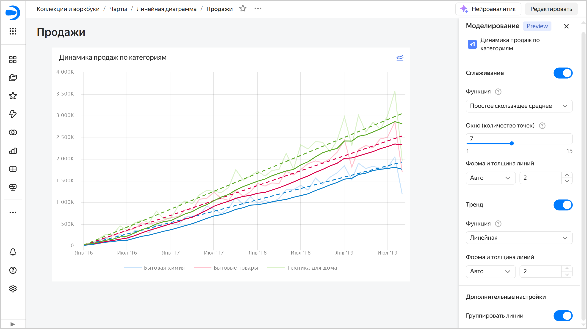
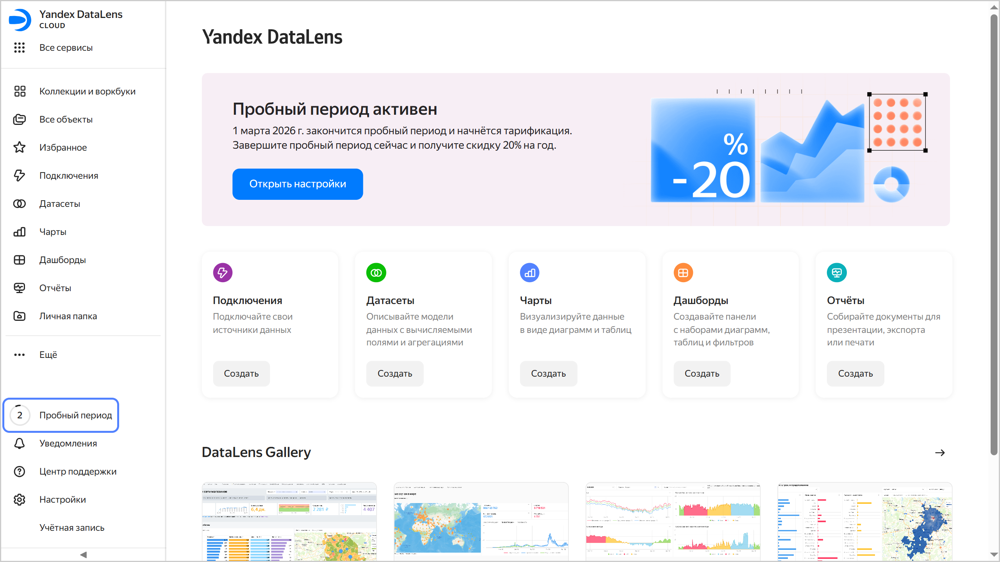

# История изменений в {{ datalens-full-name }} в феврале 2026

* [Изменения базовых возможностей](#base)
* [Исправления и улучшения](#fixes)

## Изменения базовых возможностей {#base}

* Для чартов на дашборде добавили возможность вывода дополнительных [линий тренда и сглаживания](../dashboard/trends-and-smoothing.md). Возможность позволяет временно изменить визуализацию без сохранения изменений в исходном чарте.

  

  На текущий момент:

  * Доступно только для линейных чартов (Wizard, QL-чарты или чарты в Editor).
  * Доступно только с дашбордов.
  * Недоступно для линейных чартов с дискретным режимом отображения оси `X`.
  * Состояние настроек не сохраняется.
  * Пока недоступно в публичных и встроенных дашбордах.

* В [настройке](../concepts/chart/settings.md#color-settings) цветов чарта добавили возможность задать цвет в шестнадцатеричном формате, выбрать цвет с помощью инструмента «пипетка» и настроить его прозрачность.

## Исправления и улучшения {#fixes}

* В [{{ datalens-gallery }}](../concepts/gallery.md) добавили возможность видеть список всех категорий и улучшили отображение названия в карточке категории.
* На боковой панели добавили индикатор, показывающий отсчет дней [пробного периода](../pricing.md#trial).

  

* Исправили ошибку [импорта воркбука](../workbooks-collections/export-and-import.md#import-workbook) из файла, содержащего в названии букву «й».

* Улучшили навигацию: последний элемент в хлебных крошках сделали ссылкой на текущую страницу без параметров.
* В истории изменений объекта ([подключения](../concepts/connection/versioning.md), [датасета](../dataset/versioning.md), [чарта](../concepts/chart/versioning.md), [дашборда](../dashboard/versioning.md) и [отчета](../reports/versioning.md)) добавили возможность копирования ID ревизии из списка версий. Для этого в списке версий нажмите  → **Копировать ID**.
* Обновили дизайн чата с [Нейроаналитиком](../concepts/neuroanalyst.md).
* Исправили ошибку [создания датасета](../dataset/create-dataset.md#create) из навигации на боковой панели.
* В отчетах исправили работу ссылок на [заголовки](../reports/report-operations.md#header_1) при [предпросмотре отчета](../reports/report-operations.md#report-preview) в режиме **Презентация**.

### Исправления на дашборде {#dashboard-fixes}

* Исправили проблему, из-за которой [фильтрация чартов чартами](../dashboard/chart-chart-filtration.md) не влияла на глобальные селекторы на других вкладках дашборда.
* Улучшили внешний вид окна настройки селекторов, сделали элементы интерфейса более компактными.
  
  

### Исправления в чартах {#chart-fixes}

* Изменили окно настроек цвета и размера показателя в [Индикаторе](../visualization-ref/indicator-chart.md):

  * настройки размера перенесли в настройки индикатора;
  * настройки цветов перенесли в секцию **Цвета**, как в других чартах.

* В чартах добавили возможность [настройки осей](../concepts/chart/settings.md#axis-settings) **X** и **Y** без указания поля в секции.
* Изменили подтверждение сохранения чарта при попытке экспорта:
  
  * окно подтверждения отображается после выбора параметров для [фонового экспорта](../concepts/chart/data-export.md#background-export);
  * окно подтверждения не отображается для [прямого экспорта](../concepts/chart/data-export.md#save-data).
  
* Для чартов в Editor поддержали [запрет экспорта](../concepts/chart/data-export.md#data-export-disable) на уровне подключения.

### Исправления в подключениях {#connections-fixes}

* При создании подключения [API Connector](../operations/connection/create-api-connector.md) добавили новые заголовки: `X-Org-ID` и `X-Cloud-Org-ID`.

* В секции `ELSE` блока `CASE` при подключении к [{{ CH }}](../operations/connection/create-clickhouse.md) `NULL` больше не подменяется значением типа по умолчанию.
* Исправили некорректное поведение предупреждения о несохраненных данных при создании подключения к [{{ ydb-short-name }}](../operations/connection/create-ydb.md).
* Добавили поддержку колоночных таблиц и функции `DB_CAST` для подключения к {{ ydb-short-name }}.
* В дополнительных настройках подключения к [{{ MY }}](../operations/connection/create-mysql.md) добавили возможность указать `collate` для запросов.
* Для подключения к [{{ prometheus-name }}](../operations/connection/create-prometheus.md) добавили режим авторизации с помощью заголовка `Authorization`.
* Для подключения к [{{ GP }}](../operations/connection/create-greenplum.md) добавили поддержку версии `Greenplum 7`.
* Исправили ошибку, при которой в датасетах с подключением к [{{ PG }}](../operations/connection/create-postgresql.md) не отображались схемы, начинающиеся с `pg`.


