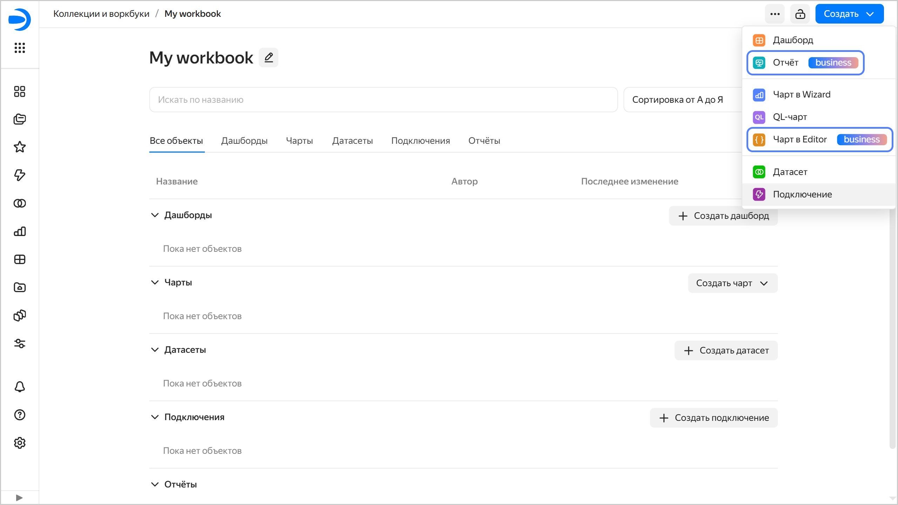
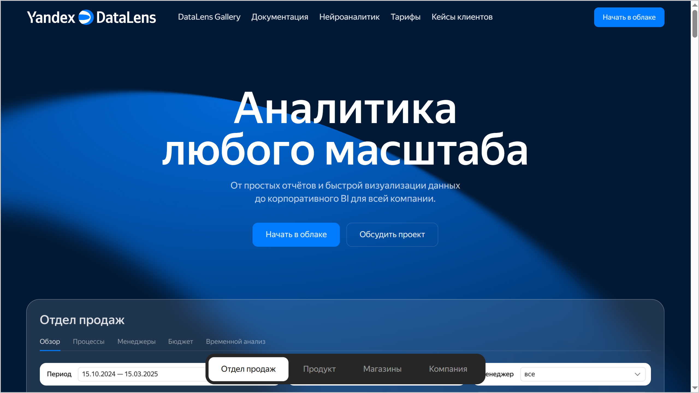

# История изменений в {{ datalens-full-name }} в сентябре 2025

* [Изменения базовых возможностей](#base)
* [Исправления и улучшения](#fixes)
* [Изменения, доступные в тарифном плане Business](#business)

## Изменения базовых возможностей {#base}

* Добавили [версионирование датасетов](../dataset/versioning.md). Теперь можно увидеть список ранее сохраненных изменений датасета, а также откатиться на прежнюю версию.
* В [настройках осей](../concepts/chart/settings.md#axis-settings) в чарте добавили возможность выбора форматирования подписей `Вручную`.
* При использовании подключения к [{{ PG }}](../operations/connection/create-postgresql.md) добавили возможность передачи `TODAY()` в качестве первого аргумента [функции](../function-ref/DATEADD.md) `DATEADD`.
* Изменили форму настроек вычисляемого поля в датасете и чарте: теперь название поля размещается на отдельной строке.

* В некоторых меню сервиса добавили подсветку возможностей, доступных в [тарифном плане](../concepts/service-plans-comparison.md) Business.

  

  

  

* Добавили политику конфиденциальности — на панели навигации слева нажмите  **Центр поддержки** → **Политика конфиденциальности**.
* Реализовали возможность [добавить информацию о чарте](../operations/chart/add-description.md) в визарде, Editor и к QL-чарту.
* Добавили кнопку **Повторить** в окне связанных объектов, которая отображается, если при открытии окна возникает ошибка.
* Теперь создать подключение [{{ datalens-short-name }} Usage Analytics](../operations/connection/create-usage-tracking.md) может только пользователь с [ролью](../security/roles.md#service-roles) `{{ roles-datalens-instances-admin }}` или `{{ roles-datalens-admin }}`. Чтобы другие пользователи могли просматривать подключение и выполнять запросы к нему, администратор подключения может настроить [права доступа к объекту](../security/manage-access.md).
* Добавили подключение к [{{ TR }}](../operations/connection/create-trino.md). Коннектор позволяет установить подключение как к управляемой БД в текущей организации {{ yandex-cloud }}, так и к внешней БД со своими реквизитами и выбором типа аутентификации.
* Изменили поведение [подписанных параметров](../security/private-embedded-objects.md#signed-parameters) при непубличном встраивании:

  * Теперь значения подписанных параметров приоритетны. Если в виджет прокидываются одновременно подписанный параметр и внешний параметр с тем же именем, применяется подписанный.
  * Селекторы по подписанным параметрам не влияют на чарты дашборда.

### Обновление {{ datalens-full-name }} {#datalens-update}

Выпустили масштабное обновление {{ datalens-full-name }}:

* Изменили домен на `datalens.ru`. Теперь это единая точка входа — здесь можно скачать on-premises-дистрибутив, познакомиться с продуктом или открыть готовый дашборд.

  Обратите внимание:

  * Промостраница и сервис теперь доступны по адресу `datalens.ru`.
  * Новый URL для безопасного встраивания — `datalens.ru/embeds/*`. 9 октября будет включен редирект со старых URL для безопасного встраивания на новые. Убедитесь, что домен `datalens.ru` разрешен в настройках безопасности сайта или приложения с встроенными объектами.
  * Публичные чарты и дашборды, как и раньше, доступны на домене `datalens.yandex`.

* Обновили дизайн и содержимое промо-страницы {{ datalens-short-name }}.

  

## Исправления и улучшения {#fixes}

* Восстановили возможность открыть чарт как таблицу. Чтобы открыть чарт в виде таблицы, в верхнем правом углу чарта нажмите  →  **Открыть как таблицу**.
* Исправили некорректное закрытие окна с настройками при редактировании ошибки доступа на дашборде.
* Исправили ошибку, при которой при редактировании датасета неявно [отключалась возможность экспорта данных](../dataset/create-dataset.md#data-export-disable).
* Исправили ошибку, возникающую при попытке сохранить селектор, в котором не проходила валидация поля.
* Исправили некорректное сохранение названия при [создании вычисляемого поля](../concepts/calculations/index.md#how-to-create-calculated-field) в чарте.
* Исправили проблему, при которой [отключение экспорта](../concepts/chart/data-export.md#data-export-disable) на уровне подключения или датасета не приводило к запрету экспорта из QL-чартов на их основе. Теперь запрет экспорта работает для всех чартов.
* Исправили некорректное поведение при добавлении и удалении из избранного в датасетах и дашбордах.

## Изменения, доступные в тарифном плане Business {#business}

* Реализовали возможность [добавить описание к отчету](../reports/report-operations.md#report-add-description).

### Нейроаналитик в {{ datalens-short-name }} {#ai-datalens}

Нейроаналитик в {{ datalens-short-name }} теперь доступен всем пользователям в тарифном плане Business, в том числе в течение 30‑дневного пробного периода.

Нейроаналитик — это несколько AI-помощников:

* [Нейроаналитик для создания вычисляемых полей](../concepts/calculations/formulas-helper.md) — помощь при создании вычисляемых полей.
* [Нейроаналитик на дашборде](../dashboard/insights.md) — нейроаналитика на дашборде.
* [Нейроаналитик в Editor](../charts/editor/code-helper.md) — помощь в написании кода и поиске ответов на вопросы.
* [Нейроаналитик в отчете](../reports/insights.md) — нейроаналитика в отчете.

Безопасность и обработка данных:

* Нейроаналитик основан на базе облачного сервиса [{{ foundation-models-full-name }}](../../ai-studio).
* Ваши данные и запросы не покидают контура {{ yandex-cloud }}, не логируются и не используются для дообучения.
* Пользователь с ролью `{{ roles-datalens-admin }}` может [отключить](../concepts/neuroanalyst.md#prohibit) эту возможность на уровне экземпляра {{ datalens-short-name }} или точечно на уровне настроек дашборда.

### Фоновый экспорт данных {#data-export}

Добавили в {{ datalens-short-name }} [фоновый экспорт данных](../concepts/chart/data-export.md#background-export). Теперь можно сохранять из чартов данные большого объема.

* Доступен только для созданных в [визарде](../concepts/chart/dataset-based-charts.md) [таблиц](../visualization-ref/table-chart.md) с включенной пагинацией.
* Формат выгрузки: файл `CSV`.
* Минимальное количество страниц для выгрузки — 2.
* Максимальное количество строк в таблице — 1 000 000.
* Максимальный размер файла выгрузки — 1 ГБ.

Подробнее об ограничениях см. в [разделе](../concepts/chart/data-export.md#restrictions).

Чтобы экспортировать данные в фоновом режиме:

1. Откройте окно экспорта данных одним из способов:
   
   * Откройте чарт, из которого требуется экспортировать данные, и в правом верхнем углу чарта нажмите  →  **Сохранить как** → **CSV**.
   * На дашборде у чарта, из которого требуется экспортировать данные, вверху справа нажмите  →  **Сохранить как** → **CSV**.

1. В окне экспорта для настройки **Страницы** укажите `Все`. При необходимости измените параметры файла экспорта: **Разделитель значений**, **Десятичный разделитель** и **Кодировка**.
1. Нажмите кнопку **Сохранить**. Внизу отобразится сообщение, что экспорт запущен и ссылка на страницу экспорта, на которой отображается статус операции и ее подробности. После завершения экспорта отобразится сообщение **Экспорт чарта завершён** и появятся ссылки для скачивания файла и на страницу экспорта.

Историю экспорта и готовые для скачивания файлы можно найти в разделе [Фоновый экспорт данных]({{ link-datalens-main }}/exports).

