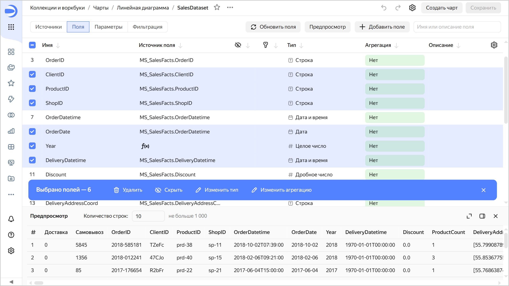

# История изменений в {{ datalens-full-name }} в июле 2025

* [Изменения базовых возможностей](#base)
* [Исправления и улучшения](#fixes)
* [Изменения, доступные в тарифном плане Business](#business)

## Изменения базовых возможностей {#base}

* Добавили возможность указывать подсказку для заголовков на [дашборде](../operations/dashboard/add-title.md).
* Для заголовков на дашборде теперь можно задать не только цвет фона, но и цвет текста.

  

* Добавили [множественное выделение полей](../dataset/create-dataset.md#bulk-changes) в [датасете](../dataset/index.md) с помощью зажатия клавиши **Shift** и последовательного нажатия полей.

  

* Появились новые работы в [{{ datalens-gallery }}]({{ link-datalens-main }}/gallery). Подробнее см. в чате [{{ datalens-short-name }}](https://t.me/YandexDataLens/28631/136577) в Telegram.
* Добавили возможность выбора [коллекции или воркбука](../workbooks-collections/index.md) при разворачивании продукта из {{ datalens-gallery }}. Также можно создать новую коллекцию или воркбук на этом этапе.

  

* Добавили возможность включить [пробный период](../pricing.md#prices) тарифа [Business](../concepts/service-plans-comparison.md) на 30 дней.

## Исправления и улучшения {#fixes}

### Исправления в чартах {#chart-fixes}

* Исправили порядок отображения объектов в слое **Полилинии** на [картах](../visualization-ref/polyline-map-chart.md).
* Исправили автоматическую подстановку [Measure Names](../concepts/chart/measure-values.md) в [QL-чартах](../concepts/chart/ql-charts.md).
* Исправили ошибку экспорта данных в формате CSV в чартах на странице предпросмотра чарта.
* Исправили отображение линейного [индикатора](../visualization-ref/indicator-chart.md) для null-значений.
* Исправили изменение структуры таблицы при смене типа таблицы на [сводную таблицу](../../datalens/visualization-ref/pivot-table-chart.md).
* Исправили отображение скролла в таблице с линейными индикаторами.

### Исправления в дашбордах {#dashboard-fixes}

* Всплывающие подсказки в закрепленных областях дашборда теперь отображаются полностью, не обрезаются по границам закрепленной области.
* Исправили добавление параметров `_no_controls` и `_embedded` при вставке виджета по ссылке.
* В селекторах на дашбордах теперь вставляется несколько значений из буфера.

### Исправления в мобильной версии {#mobile-version-fixes}

В мобильной версии исправили отображение пунктов меню [чарта](../concepts/chart/index.md).

## Изменения, доступные в тарифном плане Business {#business}

* Исправили отображение вкладок в [Editor](../charts/editor/index.md).
* В Editor появилась панель с отображением переопределенных параметров из URL.

  

* Исправили скругление в цветовой палитре при включенном скруглении в брендировании.
* Для заголовков в отчетах теперь можно задать не только цвет фона, но и цвет текста.
* Добавили возможность указывать подсказку для заголовков в [отчетах](../reports/report-operations.md#report-widget-settings).

  

