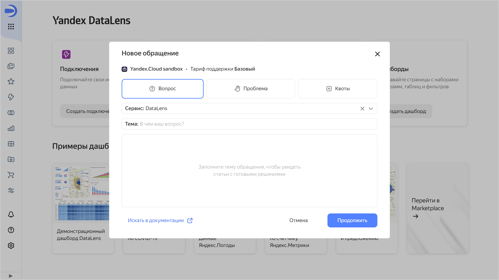

# История изменений в {{ datalens-full-name }} в августе 2024

* [Изменения базовых возможностей](#base)
* [Изменения, доступные в тарифном плане Business](#business)

## Изменения базовых возможностей {#base}

### Поиск по полям в визарде и датасете {#search-in-wizard}

В визарде и датасете появилась возможность поиска не только по названию, но и по описанию поля.

### Список опубликованных объектов {#public-objects-list}

Теперь [администратор](../security/roles.md#datalens-admin) экземпляра {{ datalens-short-name }} может [посмотреть список](../concepts/datalens-public.md#public-objects-list) всех опубликованных объектов.

### Форма создания обращения в службу поддержки {#support-form}

Обновлена форма создания обращения в службу технической поддержки.

### Расположение заголовка селектора {#selector-title-position}

Добавлена настройка селектора, которая позволяет выбрать расположение заголовка: `Слева` (по умолчанию) или `Сверху`.

### Улучшения виджета «Селектор» {#group-selectors-fix}

Исправлены ошибки при работе с групповыми селекторами, при которых:

* высота виджета не возвращалась в исходное положение после отмены редактирования селектора;
* нарушалась работа дашборда после отмены удаления селектора в виджете с двумя селекторами и автообновлением;
* окно навигации открывалось повторно после выбора датасета в виджете;
* ширина виджета становилась некорректной после добавления к нему в группу других селекторов.

### Отображение тултипа у заголовка селектора {#selector-tooltips}

Исправлена ошибка, при которой системный тултип у заголовка селектора продолжал отображаться при наведении на значок .

### Текст подсказки в селекторе {#selector-hint-text}

В настройке селектора **Подсказка** исправлена ошибка, при которой текст из описания поля датасета не добавлялся в текстовое поле подсказки селектора.

### Автообновление селекторов на публичном дашборде {#selector-auto-update}

Исправлена ошибка, при которой нарушалась работа публичного дашборда после включения настройки **Автообновление зависимых селекторов** у селектора на этом дашборде.

### Название SQL-источника в датасете {#dataset-sql-source-name}

Исправлена ошибка, при которой в датасете в диалоге [добавления источника SQL](../dataset/create-dataset.md#add-data) название источника сбрасывалось на стандартное при каждом редактировании подзапроса.

### Отображение чарта «Тепловая карта» {#heat-map-fix}

Исправлено отображение чарта [Тепловая карта](../visualization-ref/heat-map-chart.md) в визарде.

### Ссылка на документацию в блоке миграции {#migrate-link}

Исправлена ссылка на [документацию](../concepts/organizations.md#migration) в описании блока миграции из каталога в организацию.

### Имена пользователей в {{ datalens-short-name }} Usage Analytics Light {#usage-analytics-light-user-name}

Исправлено отображение имен пользователей в [{{ datalens-short-name }} Usage Analytics Light](../operations/connection/create-usage-tracking.md#light-dash).

## Изменения, доступные в тарифном плане Business {#business}

### Запрет публикации объектов {#publication-disable}

Добавлена возможность [запрета публикации](../concepts/datalens-public.md#publication-disable) чартов и дашбордов на уровне экземпляра {{ datalens-short-name }}.

### Встраивание непубличных объектов {#private-embedded-hints}

Улучшен интерфейс [встраивания непубличных объектов](../security/private-embedded-objects.md):

* В диалоговых окне **Ключи для встраивания** добавлены подсказки о встраивании непубличного объекта со ссылками на документацию.
* В диалоговом окне **Создание встраивания** поле **Ключ** блокируется, если для объекта в воркбуке нет возможных ключей.
* В диалоговом окне **Настройки встраивания**:
  
  * добавлены подсказки о встраивании непубличного объекта со ссылками на документацию;
  * в таблице со списком встраиваний:

    * при наведении на строку появляются кнопки копирования id и названия встраивания;
    * при нажатии на строку открывается окно с информацией о встраивании в режиме просмотра;
    * изменен цвет показа зависимых объектов и параметров;
    * параметры и зависимые объекты теперь выносятся в кнопку с указанием количества непоместившихся объектов, когда их больше трех.

