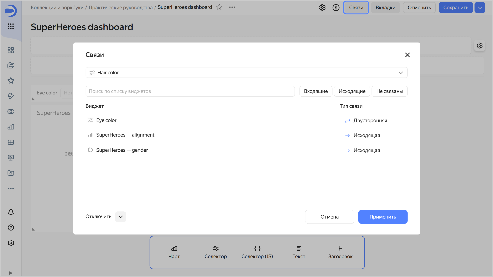
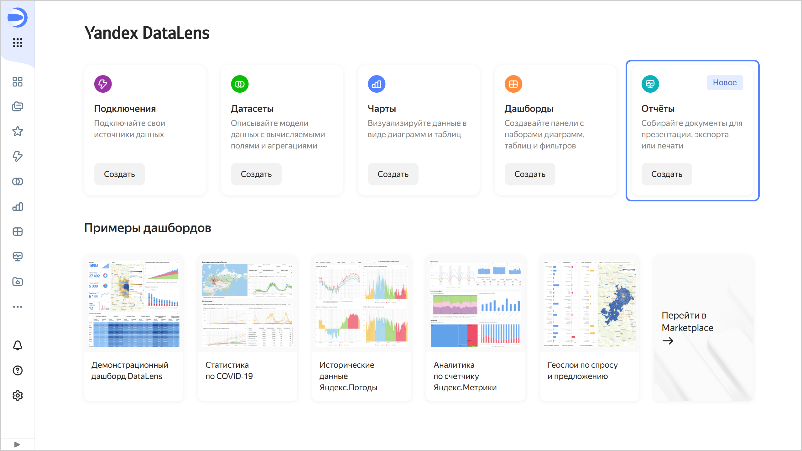

# История изменений в {{ datalens-full-name }} в марте 2025

* [Изменения базовых возможностей](#base)
* [Изменения, доступные в тарифном плане Business](#business)

## Изменения базовых возможностей {#base}

### Связи на дашборде {#dashboard-link}

В режиме редактирования дашборда обновили модальное окно настройки [связей](../dashboard/link.md) виджетов.





### Исправления в чартах {#charts-fixes}

* Исправили проблему, при которой в [древовидной диаграмме](../visualization-ref/tree-chart.md) не работала [иерархия](../operations/chart/add-hierarchy.md) в секции **Цвета**.
 
* Убрали возможность настройки цветов по текстовому [показателю](../concepts/chart/settings.md#indicator-settings). Теперь, если в секцию **Цвета** добавлен текстовый показатель, то значок настройки  не отображается. Раньше в окне настроек отображалась ошибка `Не удалось загрузить значения фильтра`.
* Скрыли секцию **Подписи** в [QL-чартах](../concepts/chart/ql-charts.md), использующих библиотеку [Gravity yagr](https://github.com/gravity-ui/yagr).

### Разметка для строковых полей {#markup-chart-setting}

Добавили [настройку](../concepts/chart/settings.md), позволяющую выбрать тип разметки для строковых полей некоторых визуализаций. Досутпные значения: `HTML`, `Markdown` или `Нет`.

### Меню «Центр поддержки» {#support-menu}

Обновили структуру меню **Центр поддержки** из боковой навигации.

## Изменения, доступные в тарифном плане Business {#business}

### Изменения в отчетах {#reports-changes}

* Добавили блок с [отчетами](../reports/index.md) на [главную страницу]({{ link-datalens-main }}) {{ datalens-short-name }}.

  

  

  

### Файловые подключения в безопасных встраиваниях {#files-secure-embeddings}

При [встраивании непубличных объектов](../security/private-embedded-objects.md) теперь поддержаны следующие подключения:

* [Файлы](../operations/connection/create-file.md) (CSV и `xsls` из Excel);
* [Яндекс Документы](../operations/connection/create-yadocs.md);
* [Google Sheets](../operations/connection/create-google-sheets.md).

