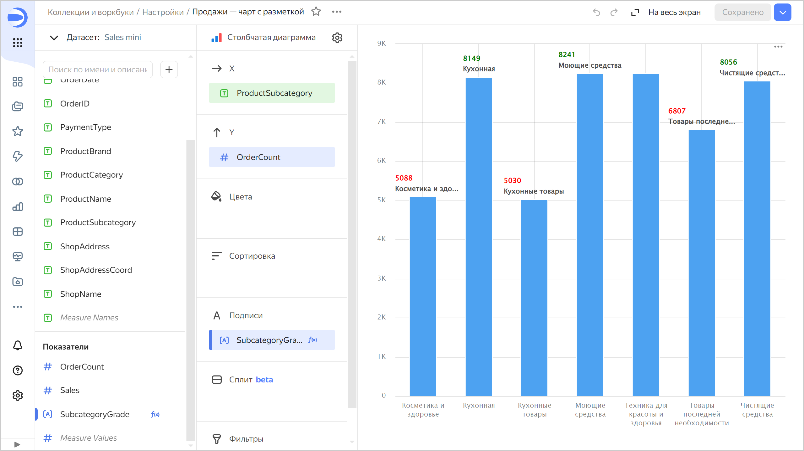
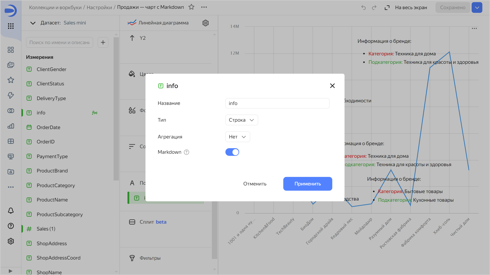
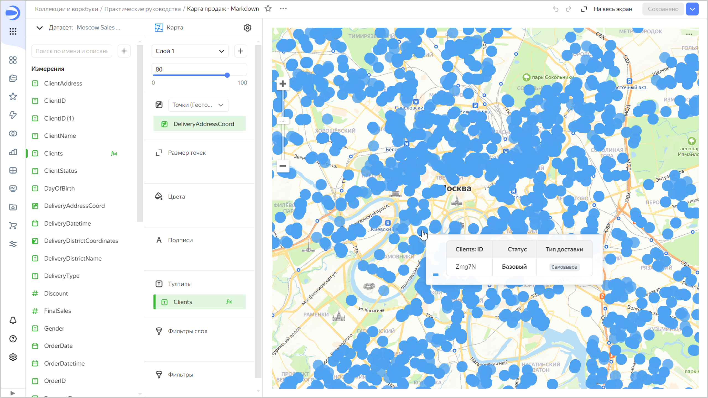

# История изменений в {{ datalens-full-name }} в сентябре 2024


* [Изменения базовых возможностей](#base)
* [Изменения, доступные в тарифном плане Business](#business)

## Изменения базовых возможностей {#base}


### Особые FQDN в подключениях {#special-fqdns}

В подключениях к [{{ CH }}](../operations/connection/create-clickhouse.md), [{{ PG }}](../operations/connection/create-postgresql.md), [{{ MY }}](../operations/connection/create-mysql.md), [{{ GP }}](../operations/connection/create-greenplum.md) добавлена возможность выбирать особый FQDN, который указывает на текущий мастер или наименее отстающую реплику.

Для обычных FQDN теперь можно указать несколько хостов для подключения.

### Интеграция с {{ connection-manager-name }} {#dash-link-settings}

Добавлена интеграция с сервисом [{{ connection-manager-name }}](../../metadata-hub/concepts/connection-manager.md) для подключений:

* [{{ CH }}](../operations/connection/create-clickhouse.md)
* [{{ PG }}](../operations/connection/create-postgresql.md)
* [{{ MY }}](../operations/connection/create-mysql.md)


### Закрепление виджетов {#widget-fixation}

Добавлена возможность [закрепления виджетов](../dashboard/settings.md#widget-fixation) в специальных областях вверху дашборда. Эти области фиксируются при прокрутке страницы, и закрепленные в них виджеты остаются на месте.

### Закрепление столбцов в таблицах {#column-fixation}

Для [простой](../visualization-ref/table-chart.md#column-fixation) и [сводной](../visualization-ref/pivot-table-chart.md#column-fixation) таблиц добавлена возможность закрепить один или несколько столбцов. После закрепления эти столбцы остаются на месте при горизонтальной прокрутке.

### Новые массовые операции с полями {#bulk-changes}

В [датасете](../dataset/index.md) стали доступны новые массовые операции с отмеченными полями. Теперь у них можно также изменить тип или агрегацию.


### Поддержка функций разметки в чартах {#markup-support}

В чартах добавлена возможность использования [функций разметки](../function-ref/markup-functions.md) в подписях.

Например, можно добавить в секцию **Подписи** поле с формулой:

```markdown
MARKUP(
    COLOR(STR([OrderCount]), IF ([OrderCount] < 7000) THEN 'red' ELSE 'green' END),
    BR(),
    IF(LEN([ProductSubcategory]) > 15) THEN LEFT([ProductSubcategory],15) +'...' ELSE [ProductSubcategory] END
)
```



### Использование Markdown для подписей чартов и тултипов карт {#markdown-sign-map-tooltips}

Теперь в [подписях](../concepts/chart/settings.md#sign) чартов и [тултипах карт](../concepts/chart/settings.md#map-settings) для полей с типом `Строка` можно настроить форматирование с использованием базового синтаксиса [Markdown](../dashboard/markdown.md): нажмите на значок перед названием поля и включите опцию **Markdown**.













### Настройка RLS для групп пользователей {#group-rls}

Добавлена возможность в датасете настраивать [RLS для групп пользователей](../security/row-level-security.md#group-rls).

### Фильтрация чартов чартами для карт {#chart-chart-map-filtration}

Добавлена возможность [фильтрации чартов чартами](../dashboard/chart-chart-filtration.md) для [карт](../visualization-ref/map-chart.md). При нажатии на элемент карты фильтр устанавливается по всем измерениям, которые используются в чарте, кроме самих координат.


### Подсказки полей в чарте {#hint-fields}

Исправлена ошибка, при которой пропадали подсказки полей после замены датасета в чарте.

### Ошибка при отсутствии прав доступа к датасету {#dataset-access-error}

Исправлена проблема, при которой вместо сообщения об отсутствии прав доступа к датасету отображался другой тип ошибки.

### Отображение чартов в виде таблиц {#chart-as-table}

Исправлено отображение чартов в виде таблиц. Чтобы открыть чарт в виде таблицы, в верхнем правом углу чарта нажмите  →  **Открыть как таблицу**.

### Исправления в таблицах {#table-fix}

Исправлены ошибки при работе с таблицами, при которых:

* некорректно отображались старые даты;
* нарушалось применение цвета в таблице при обновлении фильтров;
* некорректно отображалась строка **Итоги**;
* в таблице с иерархией при включенной пагинации отображались только первые строки и отсутствовал навигатор для перемещения по страницам.

### Отображение чарта «Тепловая карта» {#heat-map-fix}

Исправлено отображение чарта [Тепловая карта](../visualization-ref/heat-map-chart.md) в визарде.


### Настройка ссылки для доступа к дашборду {#dash-link-settings}

В дашбордах при настройке ссылки для доступа добавлена опция сохранения состояния селекторов и возможность поделиться ссылкой с федерацией:

1. В верхней части дашборда нажмите значок  и выберите  **Поделиться**.
1. В открывшемся окне настройте:

   * Язык, тему, отображение меню.
   * (опционально) Сохраните значения селекторов.
   * (опционально) Если у вас настроена [федерация удостоверений](../../organization/concepts/add-federation.md), сохраните федерацию, чтобы поделиться ссылкой с пользователями федерации.

1. Скопируйте ссылку с заданными параметрами оформления: нажмите кнопку **Скопировать и закрыть**.

## Изменения, доступные в тарифном плане Business {#business}

### Отчеты {#reports}

В {{ datalens-short-name }} появились [отчеты](../reports/index.md) — многостраничные документы, которые можно экспортировать в PDF и распечатать. На страницы отчета можно добавлять чарты, текстовые блоки, заголовки и изображения.

### Ограничение для встраивания непубличных объектов {#private-embedded-connections}

Теперь нельзя создать [непубличное встраивание](../security/private-embedded-objects.md) для объекта, если у него есть зависимые объекты, которые построены на основе следующих подключений:

* [Google BigQuery](../operations/connection/create-big-query.md)
* [Snowflake](../operations/connection/create-snowflake.md)
* [Metrica](../operations/connection/create-metrica-api.md)
* [AppMetrica](../operations/connection/create-appmetrica.md)
* [{{ yandex-cloud }} Billing](../operations/connection/create-cloud-billing.md)
* [{{ datalens-short-name }} Usage Analytics](../operations/connection/create-usage-tracking.md)

### Настройки встраивания {#private-embedded-setings}

Появилась возможность редактировать встраивания непубличных объектов. Чтобы перейти к настройкам, в воркбуке в строке с нужным объектом нажмите значок  и выберите **Настройки встраивания**.

