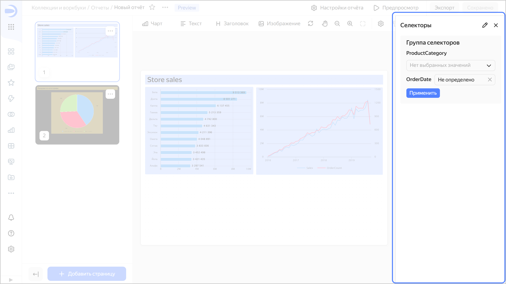
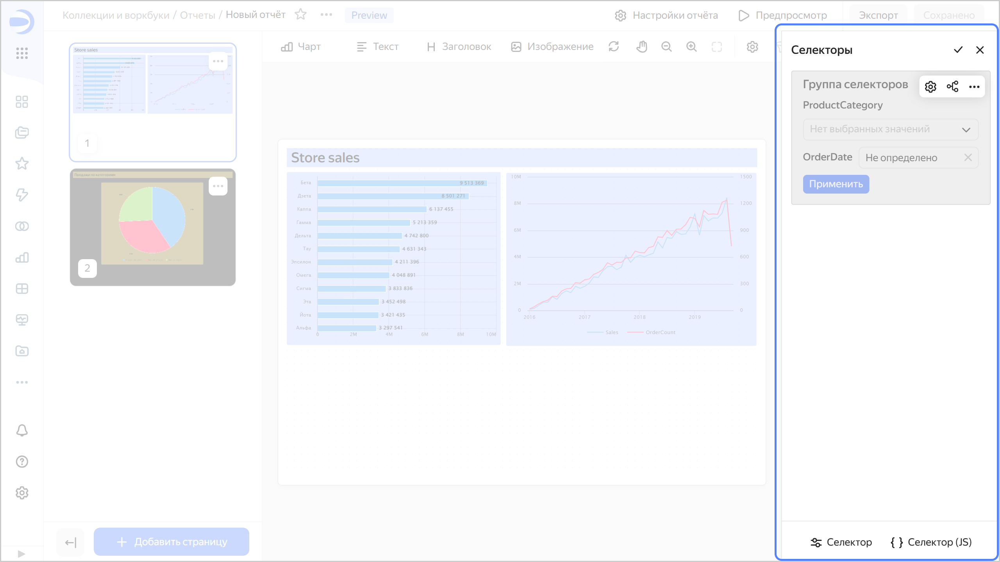
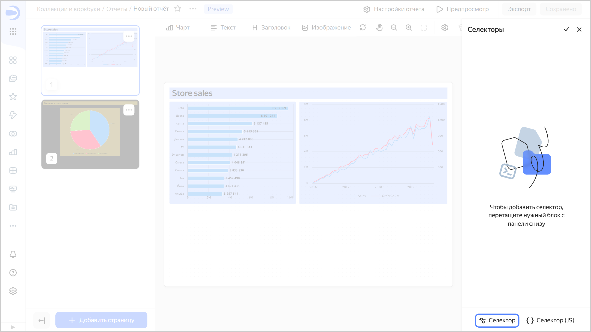
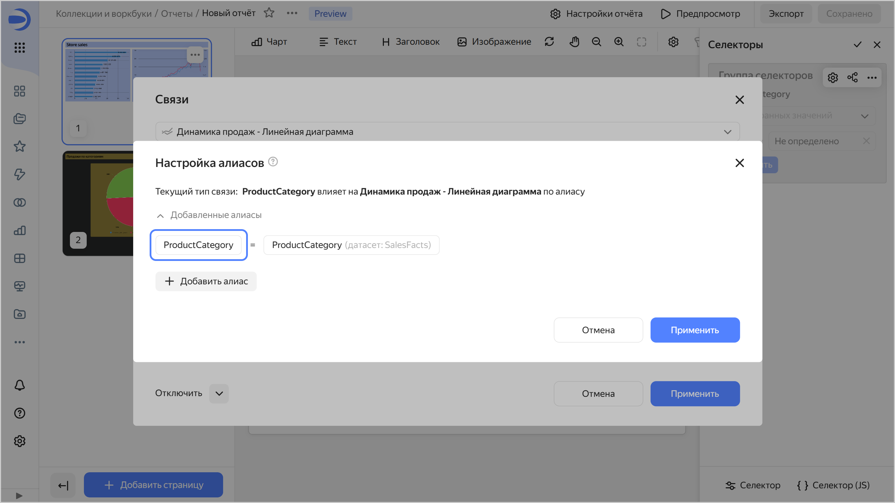
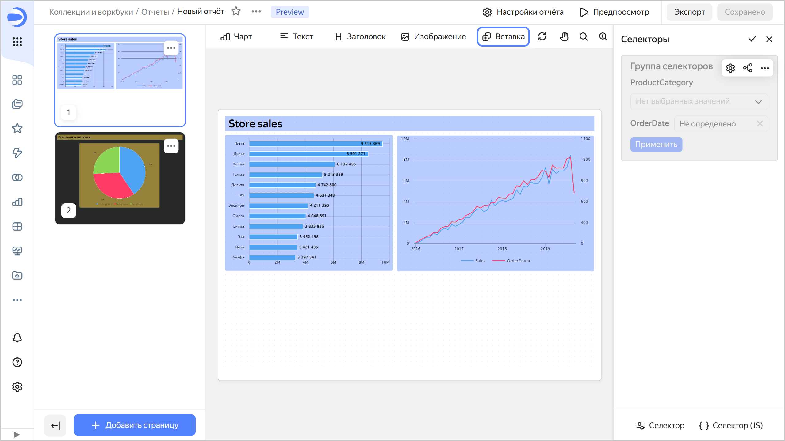
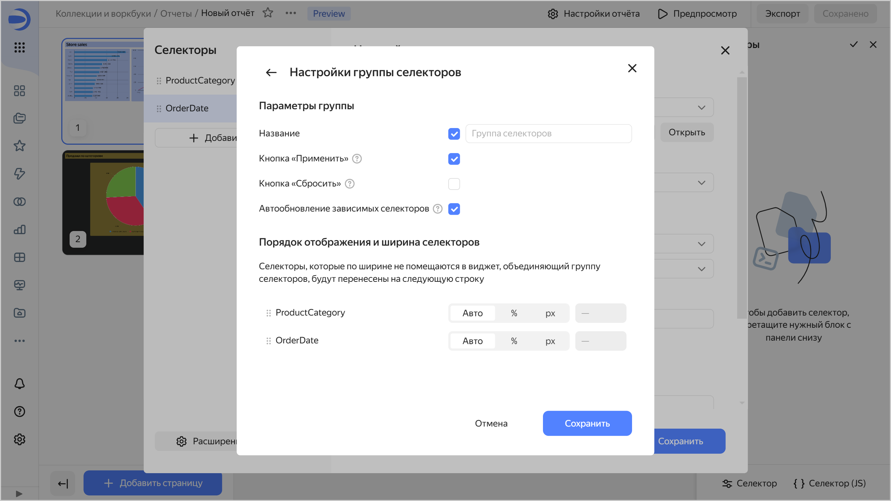
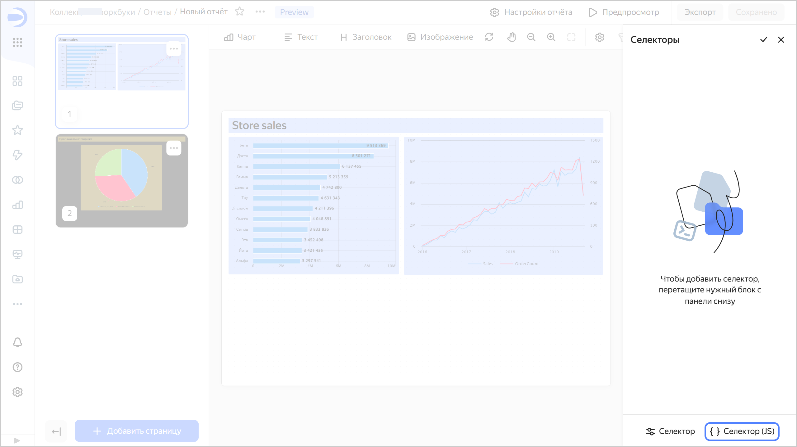
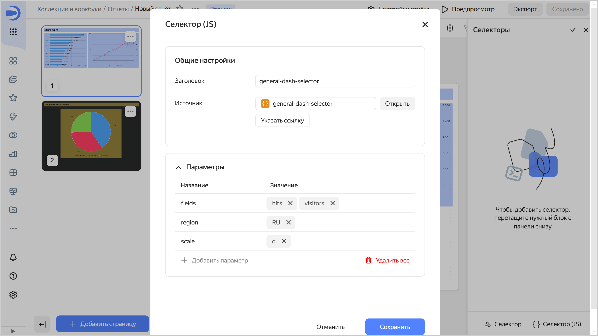

# Селекторы в отчетах

[Селектор](../dashboard/selector.md) — это фильтр, который влияет на результаты запросов на связанных с ним виджетах.

Вы можете [добавить](#add-selector), [настроить или удалить](#selector-edit) селектор в отчете.

Вы также можете [добавить внешний селектор](#add-js-selector) в отчет.

Перед добавлением селектора убедитесь, что у вас есть право доступа `{{ permission-write }}` или `{{ permission-admin }}` в отчете. Подробнее в разделе [{#T}](../security/manage-access.md).

Чтобы перейти к работе с [селекторами](../dashboard/selector.md):

1. Откройте отчет, в котором находится нужный селектор, одним из способов:

   

   - Воркбук

     1. Перейдите на [страницу коллекций и воркбуков]({{ link-datalens-main }}/collections).
     1. Откройте [воркбук](../workbooks-collections/index.md) с нужным отчетом и выберите его.
 
   - Панель навигации

     1. Перейдите на [главную страницу]({{ link-datalens-main }}) {{ datalens-short-name }}.
     1. На панели слева выберите  **Отчёты** и выберите нужный отчет.

   

1. Вверху справа нажмите .

   

   Справа откроется окно **Селекторы**:

   * чтобы перейти в режим редактирования, нажмите ;
   * чтобы вернуться в режим фильтрации, нажмите ;
   * чтобы скрыть окно **Селекторы**, нажмите .

   

   

   

   

   

   

## Добавление селектора {#add-selector}

Чтобы добавить [селектор](../dashboard/selector.md) в отчет:

1. Откройте окно **Селекторы**. Для этого вверху справа нажмите .
   Если в отчете уже есть селекторы, перейдите в режим редактирования. Для этого нажмите .
1. С панели снизу перетащите виджет **Селектор** в секцию **Селекторы**.
   
   
     
   
     
   

1. В блоке **Настройки селектора** выберите источник и укажите настройки селектора:

   

   - На основе датасета

     * **Датасет** — датасет с данными для селектора. Можно выбрать датасет из списка объектов или указать ссылку. Обязательно для заполнения.
     * **Поле** — поле датасета со значениями селектора. Может быть как измерением, так и показателем (подробнее см. [{#T}](../dataset/data-model.md#field)). Обязательно для заполнения.
     * **Тип селектора** — выпадающий список, поле ввода, календарь или чекбокс.

       

       * **Календарь** доступен только для полей с типом `Дата` или `Дата и время`.
       * **Чекбокс** доступен только для полей с типом `Логический`.
       * Для показателей доступен только тип селектора **Поле ввода**.

       

     * **Операция** — операция сравнения, по которой селектор фильтрует значения чарта (например, **Равно**, **Больше** или **Меньше**). Если оставить поле пустым, селектор по умолчанию будет фильтровать по операции **Равно**. Список доступных операций зависит от типа поля. Не указывайте операцию, если селектор будет фильтровать QL-чарт.
     * **Множественный выбор** — опция позволяет выбирать несколько значений в селекторе. Доступно только для селекторов типа **Список**.
     * **Диапазон** — опция позволяет выбирать временной промежуток в селекторе. Доступно только для селекторов типа **Календарь**.
     * **Обязательное поле** — делает значение селектора обязательным для заполнения. При включенной опции в конце названия селектора добавляется `*`. Недоступно для селектора типа **Чекбокс**.
     * **Значение по умолчанию** — применяется изначально при открытии отчета. Обязательно для заполнения при включенной опции **Обязательное поле**.

     * **Заголовок** — используется для выбора селектора при установлении связи с другими виджетами. По умолчанию при добавлении селектора текст названия подставляется из названия поля в [датасете](../dataset/index.md). Обязательно для заполнения.
       
       Ниже выберите расположение заголовка: `Слева` (по умолчанию), `Сверху` или `Скрыт`, чтобы не отображать его в окне настройки селекторов отчета. Недоступно в селекторах типа **Чекбокс**.

     * **Внутренний заголовок** — позволяет указать текст внутри селектора. Например, его можно использовать для отображения операции внутри селектора. Недоступен в селекторах типа **Чекбокс**.
     * **Цветовой акцент** — опция позволяет выделить цветом важные селекторы. Недоступно в селекторах типа **Чекбокс**.
     * **Подсказка** — опция позволяет добавить текстовое пояснение к селектору. По умолчанию при включении опции текст пояснения подставляется из описания поля в датасете. Вы можете изменить текст подсказки и использовать для этого визуальный редактор или разметку [Markdown](../dashboard/markdown.md). При изменении описания поля в датасете текст не обновляется автоматически.

       Когда опция включена, в окне настройки селекторов отчета рядом с селектором появляется значок . При наведении курсора на значок отображается всплывающая подсказка.

   - Ручной ввод

     * **Поле или параметр** — имя поля, по которому можно установить связь селектора с другими виджетами в окне настройки [алиаса](../dashboard/link.md#alias). Обязательно для заполнения.

       

     * **Тип селектора** — выпадающий список, поле ввода, календарь или чекбокс.

       

       * **Календарь** доступен только для полей с типом `Дата` или `Дата и время`.
       * **Чекбокс** доступен только для полей с типом `Логический`.
       * Для показателей доступен только тип селектора **Поле ввода**.

       

     * **Операция** — операция сравнения, по которой селектор фильтрует значения чарта (например, **Равно**, **Больше** или **Меньше**). Если оставить поле пустым, селектор по умолчанию будет фильтровать по операции **Равно**. Список доступных операций зависит от типа поля. Не указывайте операцию, если селектор будет фильтровать QL-чарт.
     * **Обязательное поле** — делает значение селектора обязательным для заполнения. При включенной опции в конце названия селектора добавляется `*`. Недоступно для селектора типа **Чекбокс**.
     * **Множественный выбор** — опция позволяет выбирать несколько значений в селекторе. Доступно только для селекторов типа **Список**.
     * **Возможные значения** — список значений для выбора. Доступно только для селекторов типа **Список**.
     * **Диапазон** — опция позволяет выбирать временной промежуток в селекторе. Доступно только для селекторов типа **Календарь**.
     * **Время** — опция позволяет указывать время. Доступно только для селекторов типа **Календарь**.
     * **Значение по умолчанию** — применяется изначально при открытии отчета. Обязательное поле для селектора типа **Список**: если его не заполнить, в селекторе не будет доступно ни одного значения. Обязательно для заполнения при включенной опции **Обязательное поле**.

     * **Заголовок** — используется для выбора селектора при установлении связи с другими виджетами. Обязательно для заполнения.
       
       Ниже выберите расположение заголовка: `Слева` (по умолчанию), `Сверху` или `Скрыт`, чтобы не отображать его в окне настройки селекторов отчета. Недоступно в селекторах типа **Чекбокс**.

     * **Внутренний заголовок** — позволяет указать текст внутри селектора. Например, его можно использовать для отображения операции внутри селектора. Недоступен в селекторах типа **Чекбокс**.
     * **Цветовой акцент** — опция позволяет выделить цветом важные селекторы. Недоступно в селекторах типа **Чекбокс**.
     * **Подсказка** — опция позволяет добавить текстовое пояснение к селектору. По умолчанию при включении опции текст пояснения подставляется из описания поля в [датасете](../dataset/index.md). Вы можете изменить текст подсказки. При изменении описания поля в датасете текст не обновляется автоматически.

       Когда опция включена, в окне настройки селекторов отчета рядом с селектором появляется значок . При наведении курсора на значок отображается всплывающая подсказка.

   

   Для [QL-чартов](../concepts/chart/ql-charts.md) в области редактирования чарта на вкладке **Параметры** можно управлять [параметрами селектора](../operations/chart/create-sql-chart.md#selector-parameters), а на вкладке **Запрос** указывать переменную в самом запросе в `not_var{{variable}}` формате.

1. (опционально) Добавьте еще один селектор в виджет. Для этого слева в блоке **Селекторы** нажмите кнопку  **Добавить селектор** и повторите действия из предыдущего шага. Также вы можете продублировать созданный селектор или скопировать его в буфер обмена. Для этого в блоке **Селекторы** напротив селектора нажмите значок  и выберите:

   * **Дублировать** — в виджет добавится новый селектор с такими же параметрами;
   * **Скопировать в буфер** — вы можете вставить скопированный селектор в другой виджет с помощью кнопки **Вставить** в блоке **Селекторы** или в отчет с помощью кнопки **Вставка** на панели в верхней части страницы отчета.
   
     
     
     
     
     

1. (опционально) Нажмите  **Расширенные настройки** и укажите настройки виджета:

   * **Название** — при включении опции вверху виджета будет отображаться название `Группа селекторов`. В поле справа вы можете ввести свой текст названия.
   * **Кнопка «Применить»** — добавляет для виджета кнопку, которая применяет значения всех селекторов в виджете. До нажатия кнопки значения селекторов не применяются.
   * **Кнопка «Сбросить»** — добавляет для виджета кнопку, которая сбрасывает значения всех селекторов в виджете до значений по умолчанию.
   * **Автообновление зависимых селекторов** — позволяет включить для зависимых селекторов влияние друг на друга до нажатия кнопки **Применить**. Доступно для виджета с несколькими селекторами и включенной опцией **Кнопка «Применить»**.
   * (опционально) Для виджета с несколькими селекторами настройте расположение селекторов. Для этого расположите селекторы в нужном порядке, перетаскивая их, и настройте ширину для каждого селектора:

      * `Авто` — автоматическая ширина селектора;
      * `%` — ширина селектора в процентах от общей ширины виджета;
      * `px` — ширина селектора в пикселях.

   Нажмите кнопку **Сохранить**.

   

1. Нажмите кнопку **Сохранить**. Виджет отобразится в окне **Селекторы**. Секция селекторов автоматически прокрутится к добавленному виджету.
1. (опционально) Добавьте еще виджет в отчет. Для этого повторите шаги 4-7.
1. Вернитесь в режим фильтрации. Для этого нажмите .
1. В правом верхнем углу нажмите кнопку **Сохранить**.

Теперь можно управлять фильтрацией в отчете, выбирая значения в селекторах.



Если добавить в отчет селектор по полю, фильтры, которые были добавлены на уровне чарта, перестанут применяться к графику в отчете.



## Добавление внешнего селектора {#add-js-selector}

Чтобы добавить [внешний селектор](../charts/editor/widgets/controls.md) в отчет:

1. Откройте окно **Селекторы**. Для этого вверху справа нажмите .
   Если в отчете уже есть селекторы, перейдите в режим редактирования. Для этого нажмите .
1. С панели снизу перетащите виджет **Селектор (JS)** в секцию **Селекторы**.
   
   
   
   
     
   

1. В блоке **Настройки селектора** выберите источник и укажите настройки селектора:

   * **Заголовок** — используется для выбора селектора при установлении связи с другими виджетами. По умолчанию при добавлении селектора текст названия подставляется из названия объекта. Обязательно для заполнения.
   * **Источник** — задает селектор, созданный в ChartEditor. Выберите селектор:

     

     - Из списка объектов

       Нажмите кнопку **Выбрать** и выберите селектор из списка объектов. Если селектор уже выбран, вы можете перейти к его редактированию. Для этого нажмите кнопку **Открыть** справа от селектора.

     - По ссылке

       Нажмите кнопку **Указать ссылку**. В поле ввода вставьте ссылку на нужный селектор и ниже нажмите **OK**.

     

   * **Параметры** — устанавливает список параметров селектора и их значения по умолчанию. Для корректной работы виджета укажите здесь параметры селектора, перечисленные на вкладке [Params](../charts/editor/tabs.md#params).

   

1. Нажмите кнопку **Сохранить**. Виджет отобразится в окне **Селекторы**. Секция селекторов автоматически прокрутится к добавленному виджету.

## Настройка и удаление селектора {#selector-edit}

1. Откройте отчет, в котором нужно изменить настройки селектора.
1. Откройте окно **Селекторы**. Для этого вверху справа нажмите .
1. Перейдите в режим редактирования. Для этого нажмите .
1. Справа от нужного виджета выберите:
   
   *  — настройка виджета. Доступны параметры как при [добавлении](#add-selector) селектора.
   *  — настройка [связей](../dashboard/link.md).
   *  — копирование или удаление виджета. Вы можете вставить скопированный виджет в этот или другой отчет или на дашборд с помощью кнопки **Вставка** на панели виджетов.

1. Вернитесь в режим фильтрации. Для этого нажмите .
1. В правом верхнем углу отчета нажмите кнопку **Сохранить**.

## Ограничения {#restrictions}

* Селекторы можно добавить только в отдельную область отчета.
* Селекторы фильтруют данные на всех страницах отчета.
* Для селекторов по показателям доступен только один тип — **Поле ввода**.
* Селекторы по показателям рекомендуется делать только независимыми от других селекторов. Для этого задайте для них тип [связи](../dashboard/link.md) **Не связаны** с другими селекторами в разделе **Связи** при редактировании виджета селектор.
