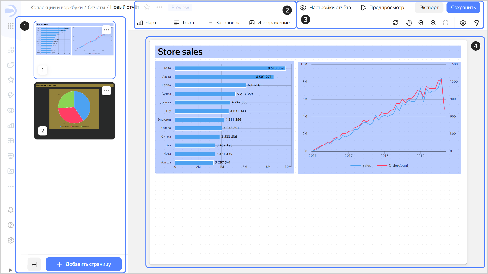

# Отчеты в {{ datalens-name }}



_Отчет_ — это многостраничный документ заданного формата, который можно экспортировать в PDF и распечатать. На страницы отчета можно добавлять [чарты](../concepts/chart/index.md), [текстовые блоки](../dashboard/widget.md#text), [заголовки](../dashboard/widget.md#title) и изображения.

В конструкторе отчетов выделяют следующие элементы:

1. Область предпросмотра страниц отчета. Здесь можно управлять страницами отчета: [добавлять, перемещать или удалять их](./report-operations.md#report-pages). Чтобы свернуть область предпросмотра, нажмите значок . Вместо страниц будут отображаться их порядковые номера. Чтобы развернуть область предпросмотра и отобразить страницы, нажмите значок .
1. Панель для [добавления виджетов](./report-operations.md#add-widget) в отчет.
1. Основные элементы управления:

   * **Настройки отчёта** — открывает окно [настроек отчета](./report-operations.md#report-settings).
   * **Настройки страницы** — открывает окно [настроек текущей страницы](./report-operations.md#page-settings).
   * Кнопка **Экспорт** — экспортирует отчет в формате `.pdf`.
   * Кнопка **Сохранить** — сохраняет отчет.

1. Область для работы с содержимым текущей страницы отчета.

   

## Особенности виджетов отчета {#report-widget-features}

Поведение и настройки виджетов отчета отличаются от [виджетов дашборда](../dashboard/widget.md):

* Высота виджета задается в окне редактирования отчета. Автоматическая настройка высоты не поддерживается.
* Виджеты можно накладывать друг на друга, [перемещать их на передний или задний план](./report-operations.md#move-widget-front-or-back).
* Для любого виджета можно задать фон.
* При вставке скопированного с дашборда виджета для него устанавливаются настройки по умолчанию.
* В чартах не поддерживаются вкладки и настройка фильтрации.

#### Что дальше {#see-also}

* [{#T}](./report-operations.md)
