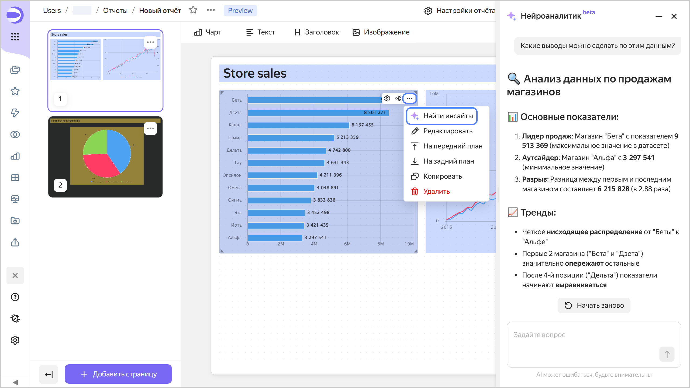

# Нейроаналитик в отчете



Функциональность находится на стадии бета-тестирования.





Нейроаналитик в отчете — инструмент, который анализирует выбранный чарт отчета, формирует выводы на основе данных и позволяет задавать уточняющие вопросы. К этим данным добавляются описание отчета и заголовок чарта в отчете. Для всех чартов также добавляются описание и подсказка чарта при их наличии.

Чтобы включить Нейроаналитик, в правом верхнем углу чарта в отчете нажмите  → **Найти инсайты**.





Все запросы к Нейроаналитику приватны — логи нигде не хранятся и не используются для дальнейшего дообучения или исследований.

## Ограничения {#restrictions}

* Пока учитываются данные только конкретного чарта.
* Выполнение анализа может занять длительное время.
* Для таблиц не добавляется описание и подсказка чарта.