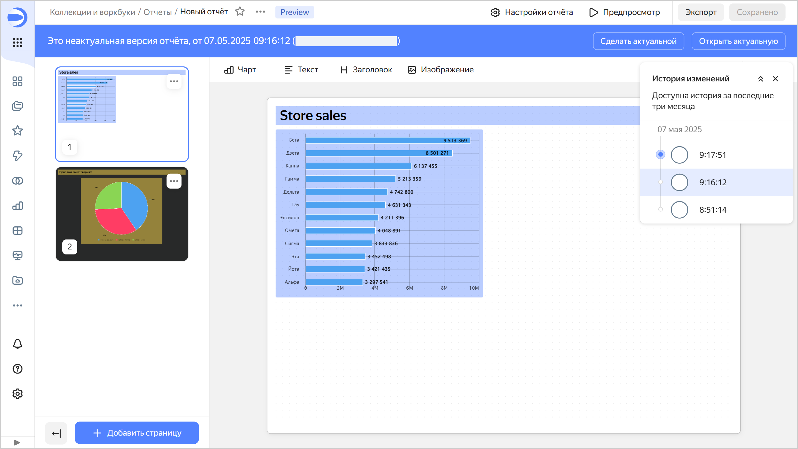
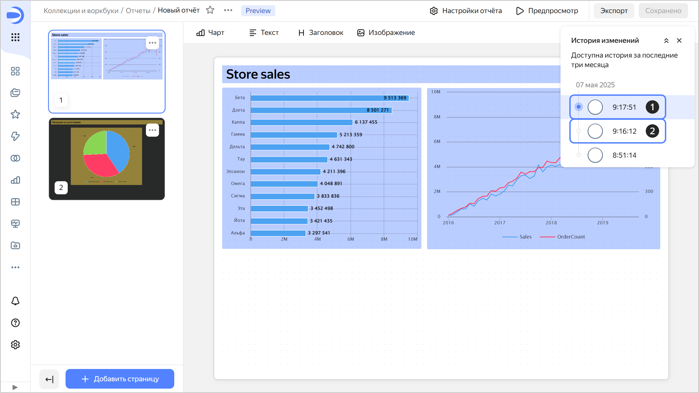

# Версионирование



Версионирование отчета — это возможность хранить историю изменений конфигурации отчета с помощью версий. Список версий доступен пользователям с минимальным правом редактирования на отчет.

Чтобы перейти к списку версий, в верхней части экрана нажмите на значок  и выберите  **История изменений**.

Чтобы перейти к выбранной версии, нажмите на нее в списке. Номер версии отобразится в значении параметра `revId` строки адреса отчета. При переходе по ссылке, содержащей номер версии в параметре `revId`, сразу откроется эта версия отчета.

Несохраненные изменения в текущей версии сбрасываются:

* при обновлении страницы;
* при сохранении отчета;
* при переключении на другую версию.

## Виды версий {#version-types}

Различают следующие версии:

1. **Актуальная**. Последняя сохраненная версия отчета.

   Версия отображается:
   
   * всем пользователям на дашбордах;
   * при переходе в отчет из навигации;
   * при открытии отчета в воркбуке;
   * при открытии отчета из контекстного меню на редактирование с дашборда.
   
   Актуальной может быть только одна версия отчета.

   Если у пользователя есть право доступа **{{ permission-write }}**, он может сделать актуальной любую версию отчета.
  
   
  
   При актуализации любой версии создается новая версия отчета.

   
  
1. **Неактуальная**. Версия, которая не является актуальной.  
   При открытии неактуальной версии вверху отображается панель, на которой указаны: тип версии, дата и время создания и логин автора версии. Справа на панели кнопки:

   * **Сделать актуальной** — делает текущую неактуальную версию актуальной. Актуальная на текущий момент версия станет неактуальной.
   * **Открыть актуальную** — открывает актуальную версию.

   

   

   



Любой версией отчета можно поделиться: добавьте к ссылке на отчет параметр `revId` (например, `?revId=zac5m4edoaqqr`).



## Создание новой версии {#version-create}

Новая версия автоматически создается:

* в режиме редактирования актуальной или неактуальной версии отчета — после нажатия кнопки **Сохранить** (создается новая актуальная версия);
* в режиме просмотра неактуальной версии отчета — после нажатия кнопки **Сделать актуальной**.

Изменения конфигурации отчета, которые после сохранения приводят к созданию новой версии:

* изменение [настроек отчета](./report-operations.md#report-settings);
* изменение [настроек страницы](./report-operations.md#page-settings) отчета;
* [добавление](./report-operations.md#add-widget), редактирование и [удаление](./report-operations.md#delete-widget) виджетов;
* [перемещение](./report-operations.md#move-widget-front-or-back) виджетов на передний или задний план;
* добавление, удаление или изменение настроек селекторов.

## Редактирование версий {#version-edit}

Можно редактировать любую версию отчета.

### Редактирование актуальной версии {#actual-version-edit}

Актуальная версия открывается по умолчанию при редактировании отчета. Чтобы сохранить изменения, вверху справа нажмите кнопку **Сохранить** — будет создана новая актуальная версия, а текущая станет неактуальной.

### Редактирование неактуальной версии {#current-version-edit}

Для редактирования неактуальной версии выберите ее в списке версий. Чтобы сохранить изменения неактуальной версии, вверху справа нажмите кнопку **Сохранить** — будет создана новая актуальная версия, а текущая актуальная станет неактуальной.

## Ограничения {#restrictions}

* История изменений содержит только список версий отчета и включает: вид версии, дату и время сохранения и автора редактирования.
* Версии отчета не содержат изменений прав доступа (эта операция производится отдельно от редактирования самого отчета).
* В версиях не отображается список изменений. Доступен лишь просмотр сохраненного состояния конфигурации отчета.
