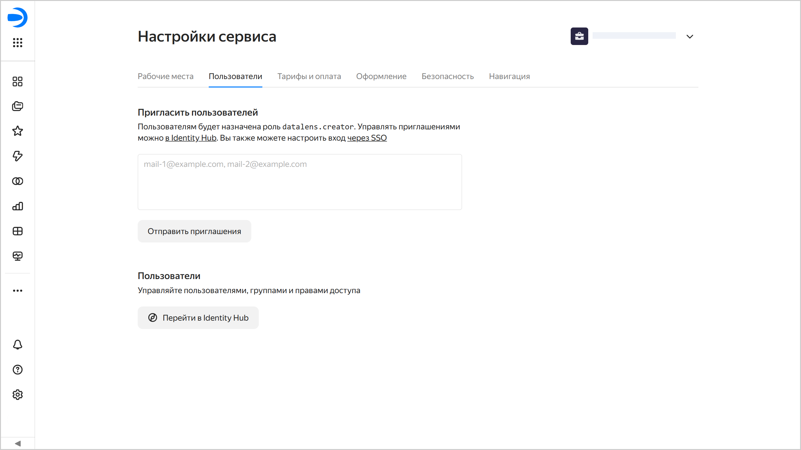

# Пользователи

Есть несколько способов, как добавить пользователя в {{ datalens-short-name }}:

1. [Через {{ datalens-short-name }}](#dl-user) — если пользователь не планирует пользоваться другими сервисами {{ yandex-cloud }}. Так можно добавлять пользователей с аккаунтами на Яндексе. Если у пользователя появится необходимость в использовании других сервисов {{ yandex-cloud }}, вы сможете [назначить ему дополнительную роль](../../organization/security/index.md#add-role) в организации с текущим экземпляром {{ datalens-short-name }}.

1. [Через {{ org-full-name }}](#org-user) — если пользователь планирует пользоваться и другими сервисами {{ yandex-cloud }}. В этом случае можно пригласить в организацию [пользователей с аккаунтом на Яндексе](#passport-user) или добавить [федеративных](#federated-user) и [локальных](../../organization/operations/add-account.md#local) пользователей.



Добавлять и приглашать пользователей может администратор (роль `organization-manager.admin`) или владелец (роль `organization-manager.organizations.owner`) организации.



### Добавить пользователя через {{ datalens-short-name }} {#dl-user}

Чтобы добавить пользователя в {{ datalens-short-name }}:

1. Перейдите на [главную страницу]({{ link-datalens-main }}) {{ datalens-short-name }}.
1. На панели слева выберите  **Настройки сервиса**.
1. Выберите вкладку **Пользователи**.
1. В разделе **Пригласить пользователей**:

   1. Введите почтовые адреса пользователей, которых вы хотите пригласить (например, `{{login-example}}`).

      Приглашения можно отправлять на любые адреса электронной почты. Приглашенный пользователь сможет выбрать нужный аккаунт на Яндексе, когда примет приглашение.
      
   1. Нажмите кнопку **Отправить приглашения**.

Пользователь получит на почту приглашение в {{ datalens-short-name }}. Приняв приглашение и выбрав аккаунт для входа, пользователь сможет войти в вашу организацию. Пользователь получит роль `{{ roles-datalens-creator }}` в организации с текущим экземпляром {{ datalens-short-name }}. Для входа в {{ datalens-short-name }} пользователю потребуется [рабочее место](../settings/seats.md).

### Добавить пользователя через {{ org-full-name }} {#org-user}

#### Пригласить пользователя с аккаунтом на Яндексе {#passport-user}

Чтобы пригласить в организацию пользователя с аккаунтом на Яндексе, воспользуйтесь [инструкцией](../../organization/operations/add-account.md#useraccount) из документации {{ org-full-name }}.



Пользователь сможет открыть {{ datalens-short-name }} только после получения роли для доступа к сервису. Поэтому дождитесь, когда он примет приглашение в организацию и [назначьте](../../organization/security/index.md#add-role) ему роль `{{ roles-datalens-visitor }}`.



#### Добавить федеративного пользователя {#federated-user}

Если у вас настроена [федерация удостоверений](../../organization/concepts/add-federation.md), добавьте федеративного пользователя по [инструкции](../../organization/operations/add-account.md#add-user-sso). После добавления [назначьте](../../organization/security/index.md#add-role) ему роль `{{ roles-datalens-visitor }}`.


