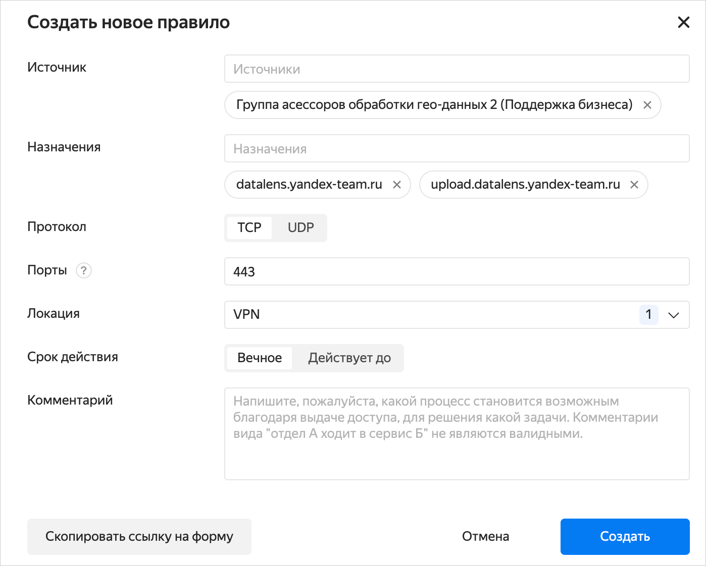
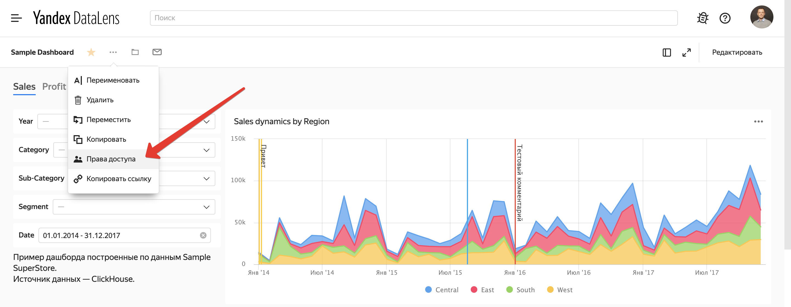
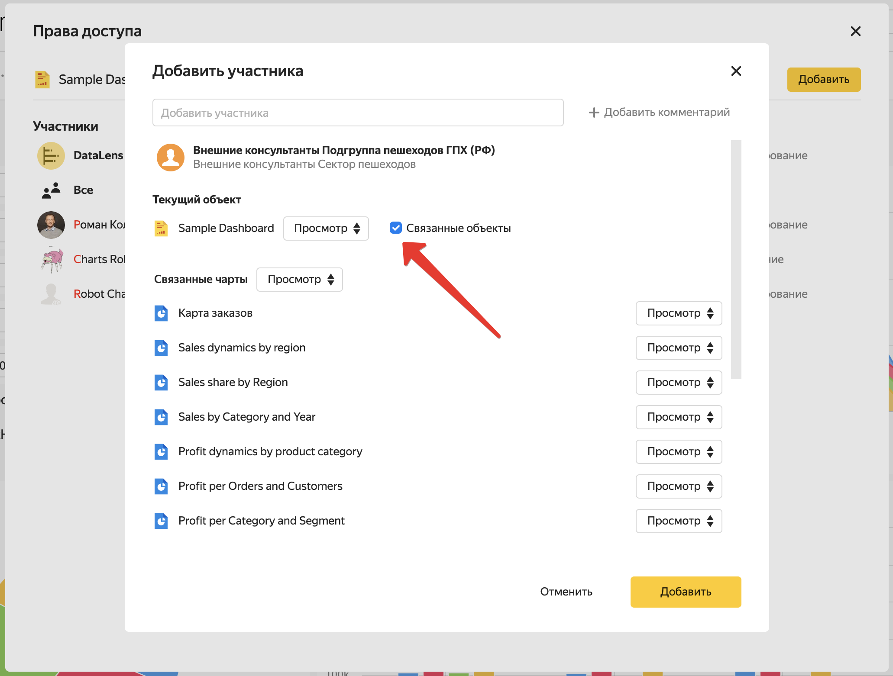

# Доступ для внешних сотрудников

У всех штатных сотрудников есть доступ к {{ datalens-short-name }} по умолчанию. Чтобы предоставить доступ внешним сотрудникам, воспользуйтесь инструкцией ниже.

## Доступ для внешних сотрудников {#access-for-external}

Доступ для внешних сотрудников закрыт на уровне сервиса {{ datalens-short-name }} и на уровне объектов {{ datalens-short-name }} (подключений, датасетов, чартов и дашбордов).

Чтобы у внешних сотрудников появился доступ к DataLens:
1. Запросите доступ к сервисам **datalens.yandex-team.ru** и **upload.datalens.yandex-team.ru** (для возможности загрузки CSV-файлов) в [Puncher](https://puncher.yandex-team.ru?create_destinations=datalens.yandex-team.ru&create_destinations=upload.datalens.yandex-team.ru&create_protocol=tcp&create_locations=office&create_locations=vpn&create_ports=443).
2. Запросите доступ к объектам к {{ datalens-short-name }}.



* Права выдаются только для [ABC-групп](https://wiki.yandex-team.ru/intranet/abc/archive/vodstvo/create/). Не согласуются права доступа для отдельных пользователей и Staff-групп. О правилах заказа сетевого доступа через ABC см. в [документации](https://wiki.yandex-team.ru/security/dostup/get_network_access/#abcrol).

* Доступ к сервисам {{ datalens-short-name }} осуществляется только через [VPN](https://diy-outstaff.daas.yandex-team.ru/common/auth/VPN.html).



### Пример запроса доступа к дашборду {{ datalens-short-name }} {#access-external-example}

Запрос прав доступа для группы, в которую входят внешние сотрудники.

1. Оформите заявку в [Puncher](https://puncher.yandex-team.ru?create_destinations=datalens.yandex-team.ru&create_destinations=upload.datalens.yandex-team.ru&create_protocol=tcp&create_locations=office&create_locations=vpn&create_ports=443) на доступ к сервису {{ datalens-short-name }}. Заполните поля заявки:

   * **Источник** — ABC-группа и несколько ABC-групп, которым предоставляется доступ.
   * **Назначения** — `datalens.yandex-team.ru`, `upload.datalens.yandex-team.ru`.
   * **Протокол** — **TCP**.
   * **Порты** — `443`.
   * **Локация** — **VPN**.
   * **Комментарий** — причина выдачи доступов.

   

   
  
   

   Заявку в Puncher утверждают последовательно сотрудники сервиса {{ datalens-short-name }} и СИБ.

1. Откройте дашборд. Нажмите значок  и выберите **Права доступа**.

   

1. Запросите доступ для групп на дашборд и связанные с ним объекты.

   1. Добавьте участников.
   1. Установите права доступа для каждого из объектов.
   1. Активируйте опцию **Связанные объекты**.
   1. Нажмите кнопку **Добавить**.

   

Доступы могут утвердить администраторы объектов. Если пользователь, который запрашивает доступ, является администратором — утверждение запроса происходит автоматически.

О возможных причинах отсутствия доступа читайте в разделе [{#T}](../faq.md#permissions).
